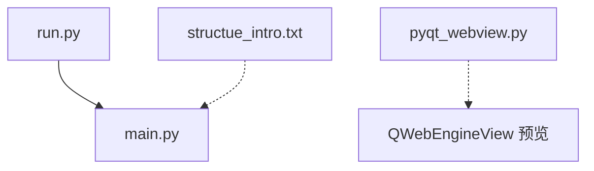
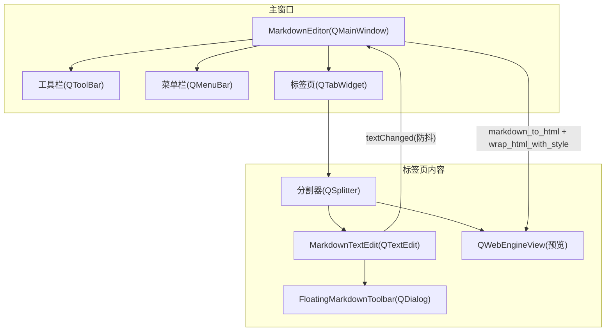
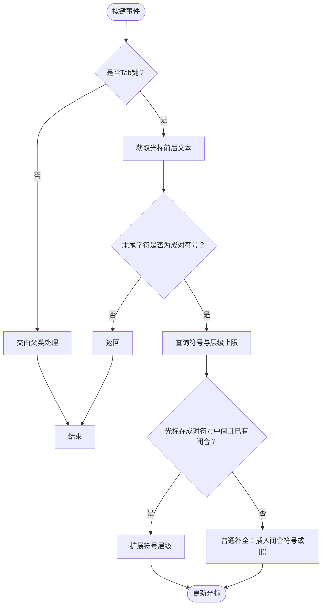
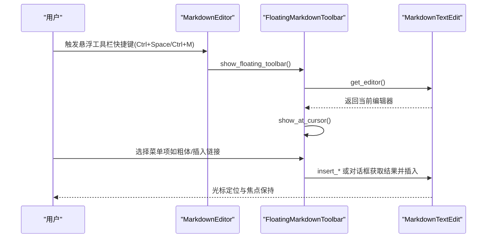
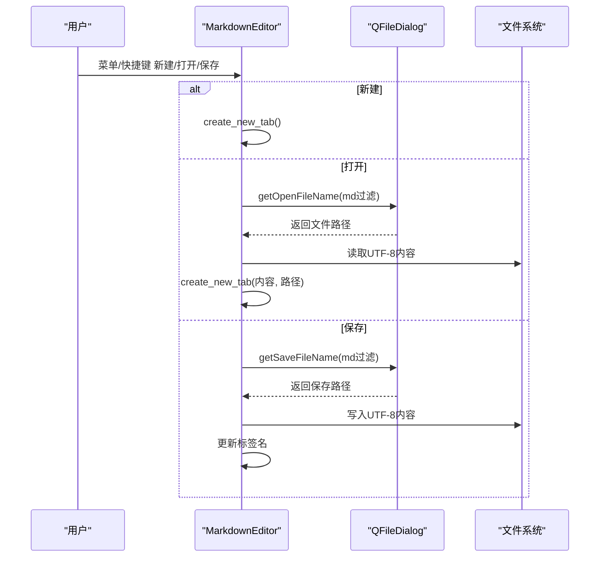
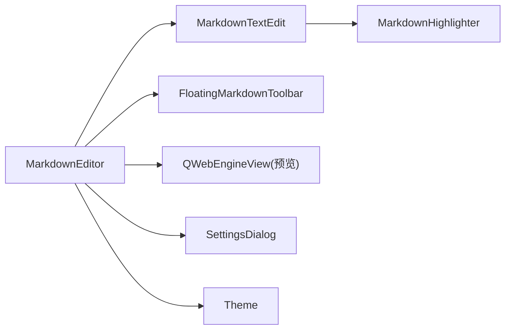

# 使用指南

<cite>
**本文引用的文件**
- [main.py](file://main.py)
- [run.py](file://run.py)
- [pyqt_webview.py](file://pyqt_webview.py)
- [structue_intro.txt](file://structue_intro.txt)
</cite>

## 目录
1. [简介](#简介)
2. [项目结构](#项目结构)
3. [核心组件](#核心组件)
4. [架构总览](#架构总览)
5. [详细组件分析](#详细组件分析)
6. [依赖关系分析](#依赖关系分析)
7. [性能与体验建议](#性能与体验建议)
8. [故障排查](#故障排查)
9. [结论](#结论)
10. [附录：快捷键与操作流程](#附录快捷键与操作流程)

## 简介
本指南面向日常使用用户，帮助您快速掌握 Markdo 的基本编辑、格式化、自动补全、文件操作、多标签页管理、悬浮工具栏使用以及主题与工具栏行为的设置。文档同时解释快捷键与菜单项背后的实现方式（基于 PyQt6 的 QShortcut/QAction），并提供实用技巧与常见问题排查建议。

## 项目结构
- 入口与主程序
  - run.py：直接运行启动应用
  - main.py：主程序逻辑、界面、菜单、快捷键、标签页、预览、悬浮工具栏、设置等
- 独立预览组件
  - pyqt_webview.py：独立的 QWebEngineView 预览窗口（用于 tkinter 编辑器场景）
- 架构说明
  - structue_intro.txt：核心类结构、数据流、技术栈概览

图表来源
- [run.py](file://run.py#L1-L11)
- [main.py](file://main.py#L1-L120)
- [pyqt_webview.py](file://pyqt_webview.py#L1-L60)
- [structue_intro.txt](file://structue_intro.txt#L1-L40)

章节来源
- [run.py](file://run.py#L1-L11)
- [structue_intro.txt](file://structue_intro.txt#L1-L40)

## 核心组件
- MarkdownEditor（主窗口）
  - 菜单栏（文件/编辑/帮助）
  - 工具栏（新建/打开/保存/Markdown工具/复制全文/清空）
  - 多标签页管理（新增/切换/关闭）
  - 快捷键系统（Ctrl+B/I/K/1~6等）
  - 主题切换（黑夜/白天）
  - 实时预览（QWebEngineView + MathJax）
  - 悬浮工具栏（4分页：基础/列表/插入/LaTeX）
- MarkdownTextEdit（自定义编辑器）
  - Tab 自动补全（渐进式补全，支持*、_、~、=、`、、{}等）
  - 列表自动续接（有序/无序/任务列表/引用）
  - 语法高亮（MarkdownHighlighter）
- FloatingMarkdownToolbar（悬浮工具栏）
  - 4个分组菜单：基础、列表、插入、LaTeX
  - 在光标处显示，自动避让文本与屏幕边界
- SettingsDialog（设置）
  - 主题切换（黑夜/白天）
  - 悬浮工具栏自动显示/隐藏
  - 自定义悬浮工具栏快捷键（默认 Ctrl+Space，也支持 Ctrl+M）

章节来源
- [main.py](file://main.py#L1861-L2895)

## 架构总览
Markdo 采用“编辑器 + 预览 + 工具栏”的左右分屏设计，编辑器实时将 Markdown 转换为 HTML 并注入样式与 MathJax，实现所见即所得的预览体验；悬浮工具栏提供高频格式与插入操作，菜单与快捷键统一由 QShortcut/QAction 驱动。

图表来源
- [main.py](file://main.py#L1861-L2399)

## 详细组件分析

### 编辑器与自动补全（Tab 自动补全）
- Tab 自动补全策略
  - 对光标前后文本进行判断，识别最近字符是否为成对符号
  - 支持的符号及层级上限：
    - *、_：最多 2 层（对应 Markdown 斜体/粗体）
    - ~：最多 1 层（删除线）
    - =：最多 1 层（高亮）
    - `：最多 1 层（行内代码）
    - ：一次性补全
    - {}：一次性补全
  - 当光标位于成对符号中间且已存在闭合符号时，会计算当前层级并决定是否继续扩展
- 列表自动续接
  - 支持无序列表（-、*、+）、有序列表（数字.）、任务列表（- [ ]/- [x]）与引用（>）
  - 回车时自动延续标记与缩进，空行结束列表
- 语法高亮
  - 使用 MarkdownHighlighter 对标题、粗体、斜体、行内代码、代码块、链接、列表、引用、删除线、高亮、分隔线、数学公式、脚注、目录、上下标、表格等进行着色

图表来源
- [main.py](file://main.py#L650-L826)

章节来源
- [main.py](file://main.py#L650-L826)

### 悬浮工具栏（FloatingMarkdownToolbar）
- 功能分组
  - 基础：标题（H1~H6）、粗体、斜体、删除线、高亮、行内代码
  - 列表：无序/有序/任务列表、各级引用
  - 插入：链接、图片、表格、代码块、分割线、时间戳、脚注、目录
  - LaTeX：行内/块级公式、常用符号、希腊字母、关系符号
- 交互特性
  - 在光标位置显示，自动避让屏幕边界
  - 支持菜单按钮与子菜单，点击不丢失编辑器焦点
  - 通过设置可启用“光标进入编辑区时自动显示”，失焦后延迟隐藏

图表来源
- [main.py](file://main.py#L1931-L2001)
- [main.py](file://main.py#L2549-L2560)
- [main.py](file://main.py#L1322-L1860)

章节来源
- [main.py](file://main.py#L1322-L1860)
- [main.py](file://main.py#L1931-L2001)
- [main.py](file://main.py#L2549-L2560)

### 文件操作与多标签页
- 新建标签页
  - 创建分割器，左侧编辑器（MarkdownTextEdit），右侧预览（QWebEngineView）
  - 初始化语法高亮、上下文菜单、光标位置变化事件
- 打开文件
  - 支持 .md/.markdown 过滤，UTF-8 读取，创建新标签页并填充内容
- 保存文件
  - 若未命名则弹出保存对话框，UTF-8 写入，更新标签页标题
- 多标签页管理
  - 可拖拽排序、关闭请求、自动创建新标签页（无标签页时）

图表来源
- [main.py](file://main.py#L2413-L2461)
- [main.py](file://main.py#L2107-L2163)

章节来源
- [main.py](file://main.py#L2107-L2163)
- [main.py](file://main.py#L2413-L2461)

### 设置与主题
- 设置对话框（SettingsDialog）
  - 主题：黑夜/白天
  - 悬浮工具栏：自动显示/隐藏
  - 快捷键：显示/隐藏悬浮工具栏（默认 Ctrl+Space，可重置）
- 主题应用
  - 通过 Theme.get_app_stylesheet 生成样式表并应用到主窗口

章节来源
- [main.py](file://main.py#L160-L210)
- [main.py](file://main.py#L160-L210)
- [main.py](file://main.py#L1924-L1930)

## 依赖关系分析
- 组件耦合
  - MarkdownEditor 是核心协调者，负责菜单、工具栏、快捷键、标签页、预览、悬浮工具栏生命周期
  - MarkdownTextEdit 与 MarkdownHighlighter 解耦，便于维护与扩展
  - FloatingMarkdownToolbar 通过 parent_editor 间接依赖 MarkdownEditor 的当前编辑器
- 外部依赖
  - PyQt6（GUI/WebEngine/Settings/Shortcuts）
  - python-markdown + pymdownx 扩展（Markdown解析）
  - MathJax（公式渲染）

图表来源
- [main.py](file://main.py#L1861-L2399)

章节来源
- [main.py](file://main.py#L1861-L2399)

## 性能与体验建议
- 预览渲染优化
  - 文本变更采用 500ms 防抖更新，避免频繁渲染导致卡顿
- 悬浮工具栏
  - 自动显示/隐藏可按需开启，减少遮挡
  - 快捷键可自定义，推荐使用 Ctrl+Space
- 预览窗口
  - 独立预览窗口（pyqt_webview.py）适合嵌入其他编辑器场景，注意 MathJax CDN 加载

章节来源
- [main.py](file://main.py#L2173-L2191)
- [pyqt_webview.py](file://pyqt_webview.py#L1-L120)

## 故障排查
- 打开/保存失败
  - 检查文件权限与路径编码（UTF-8）
  - 查看状态栏提示与错误对话框
- 预览空白或公式不显示
  - 确认网络可用（MathJax CDN）或离线环境
  - 检查 QWebEngineView 设置（JavaScript/本地资源访问）
- 悬浮工具栏不显示
  - 检查设置中的“自动显示”选项
  - 确认快捷键设置正确（默认 Ctrl+Space，也支持 Ctrl+M）

章节来源
- [main.py](file://main.py#L2413-L2461)
- [main.py](file://main.py#L2209-L2271)
- [main.py](file://main.py#L1986-L2001)

## 结论
Markdo 提供简洁高效的 Markdown 编辑体验：实时预览、语法高亮、列表自动续接、Tab 渐进式补全、悬浮工具栏快速插入、多标签页管理与灵活的主题/工具栏设置。通过菜单与快捷键统一入口，用户可在不同工作流中高效完成写作与排版。

## 附录：快捷键与操作流程

### 快捷键一览（基于实现）
- 文件操作
  - Ctrl+N：新建标签页
  - Ctrl+O：打开文件（.md/.markdown 过滤）
  - Ctrl+S：保存文件
  - Ctrl+Shift+C：复制全文
- 编辑操作
  - Ctrl+Z：撤销
  - Ctrl+Y：重做
  - Ctrl+Space：显示/隐藏 Markdown 工具栏（悬浮工具栏）
  - Ctrl+M：显示/隐藏 Markdown 工具栏（悬浮工具栏）
- 文本格式
  - Ctrl+B：加粗
  - Ctrl+I：斜体
  - Ctrl+D：删除线
  - Ctrl+H：高亮
  - Ctrl+`：行内代码
  - Ctrl+1~6：标题1~标题6
- 插入内容
  - Ctrl+K：插入链接
  - Ctrl+Shift+K：插入代码块
  - Ctrl+Q：插入引用
  - Ctrl+L：插入无序列表
  - Ctrl+Shift+L：插入有序列表

实现方式说明
- 菜单项与快捷键
  - 菜单项使用 QAction，快捷键通过 QKeySequence 设置
  - 示例：新建/打开/保存/设置/退出；撤销/重做；使用指南/快捷键/关于
- 全局快捷键
  - 通过 QShortcut 绑定，如 Ctrl+B、Ctrl+I、Ctrl+K、Ctrl+`、Ctrl+Shift+K、Ctrl+Q、Ctrl+L、Ctrl+Shift+L、Ctrl+D、Ctrl+H、Ctrl+1~6、Ctrl+M、Ctrl+Space
- 悬浮工具栏快捷键
  - 通过设置对话框保存快捷键字符串，MarkdownEditor 在启动时与每次设置变更后重建 QShortcut

章节来源
- [main.py](file://main.py#L1931-L2001)
- [main.py](file://main.py#L2002-L2066)
- [main.py](file://main.py#L2067-L2107)
- [main.py](file://main.py#L2626-L2811)

### 基本编辑与格式化
- 文本输入
  - 在 MarkdownTextEdit 中直接输入
- 格式化
  - 使用快捷键（Ctrl+B、Ctrl+I、Ctrl+D、Ctrl+H、Ctrl+`）
  - 使用悬浮工具栏“基础”分组快速插入
- 自动补全
  - 输入 * 后按 Tab，可渐进式补全为 **，再按可扩展为 ****
  - 支持 _、~、=、`、、{} 等符号的智能补全

章节来源
- [main.py](file://main.py#L650-L826)
- [main.py](file://main.py#L1440-L1514)

### 文件操作流程
- 新建
  - 菜单“文件/新建”或快捷键 Ctrl+N
- 打开
  - 菜单“文件/打开”或快捷键 Ctrl+O，选择 .md/.markdown 文件
- 保存
  - 菜单“文件/保存”或快捷键 Ctrl+S，未命名时弹出保存对话框

章节来源
- [main.py](file://main.py#L2413-L2461)

### 多标签页管理
- 新建标签页：Ctrl+N 或工具栏“新建”
- 切换标签页：鼠标点击标签页或 Ctrl+Tab（系统默认）
- 关闭标签页：点击标签页关闭按钮或 Ctrl+W（系统默认）
- 自动创建：关闭最后一个标签页时自动创建新标签页

章节来源
- [main.py](file://main.py#L2462-L2478)

### 设置与主题
- 打开设置
  - 菜单“文件/设置”或快捷键 Ctrl+Shift+P（不存在时可自定义）
- 主题
  - 黑夜/白天模式切换
- 悬浮工具栏
  - 自动显示/隐藏
  - 快捷键可自定义（默认 Ctrl+Space，也支持 Ctrl+M）

章节来源
- [main.py](file://main.py#L160-L210)
- [main.py](file://main.py#L1924-L1930)
- [main.py](file://main.py#L1986-L2001)

### 实用技巧
- 使用悬浮工具栏快速插入复杂元素
  - “插入”分组：链接、图片、表格、代码块、分割线、时间戳、脚注、目录
  - “LaTeX”分组：行内/块级公式、常用符号、希腊字母、关系符号
- 列表自动续接
  - 回车自动延续标记与缩进，空行结束列表
- Tab 自动补全
  - 输入 * 后按 Tab，可渐进式补全为 **，再按可扩展为 ****

章节来源
- [main.py](file://main.py#L1495-L1573)
- [main.py](file://main.py#L730-L826)
- [main.py](file://main.py#L650-L826)