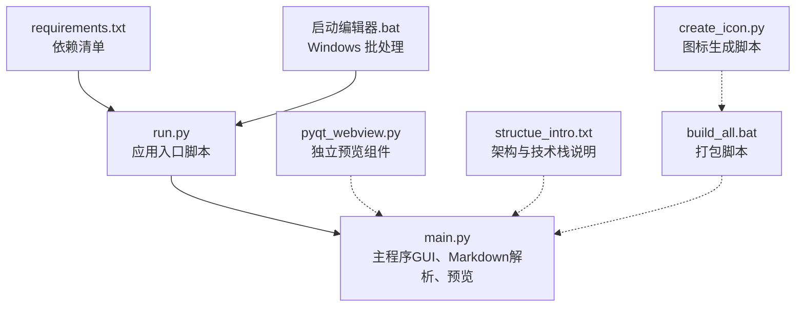
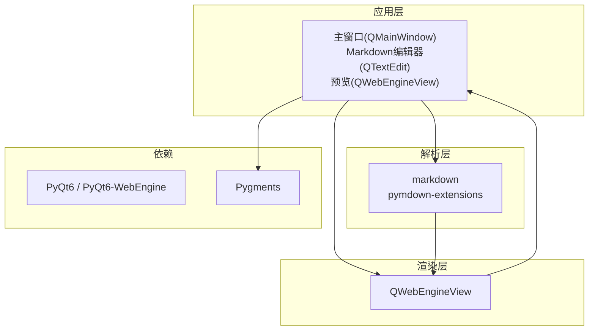
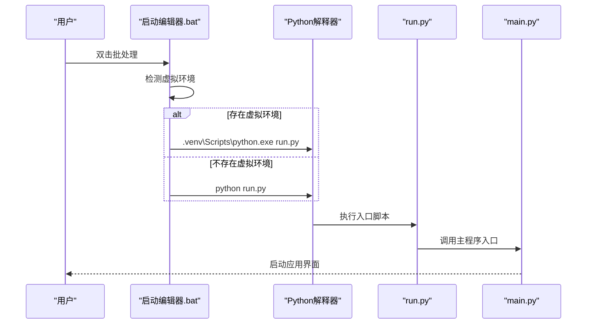
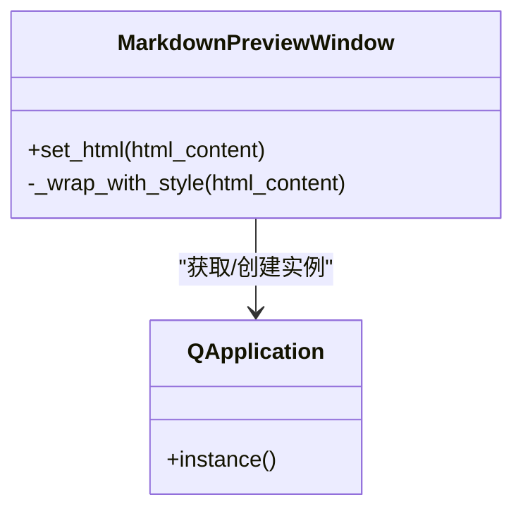
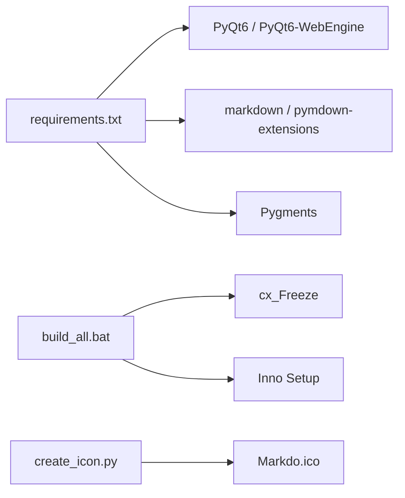

# 快速开始

<cite>
**本文引用的文件**
- [requirements.txt](file://requirements.txt)
- [run.py](file://run.py)
- [main.py](file://main.py)
- [启动编辑器.bat](file://启动编辑器.bat)
- [pyqt_webview.py](file://pyqt_webview.py)
- [structue_intro.txt](file://structue_intro.txt)
- [build_all.bat](file://build_all.bat)
- [create_icon.py](file://create_icon.py)
</cite>

## 目录
1. [简介](#简介)
2. [项目结构](#项目结构)
3. [核心组件](#核心组件)
4. [架构总览](#架构总览)
5. [详细组件分析](#详细组件分析)
6. [依赖关系分析](#依赖关系分析)
7. [性能与运行特性](#性能与运行特性)
8. [故障排查指南](#故障排查指南)
9. [结论](#结论)
10. [附录](#附录)

## 简介
本指南面向新用户与开发者，帮助您在本地快速搭建并运行基于 PyQt6 的 Markdown 编辑器。您将了解运行所需的 Python 版本与依赖、安装步骤、三种启动方式（脚本、批处理、直接入口）、开发者调试建议以及常见问题排查。

## 项目结构
该仓库采用“入口脚本 + 主程序 + 批处理启动 + 依赖清单”的组织方式，便于用户与开发者快速上手与二次开发。

图表来源
- [requirements.txt](file://requirements.txt#L1-L5)
- [run.py](file://run.py#L1-L11)
- [main.py](file://main.py#L1-L38)
- [启动编辑器.bat](file://启动编辑器.bat#L1-L23)
- [pyqt_webview.py](file://pyqt_webview.py#L1-L47)
- [structue_intro.txt](file://structue_intro.txt#L88-L93)
- [build_all.bat](file://build_all.bat#L1-L53)
- [create_icon.py](file://create_icon.py#L1-L23)

章节来源
- [requirements.txt](file://requirements.txt#L1-L5)
- [run.py](file://run.py#L1-L11)
- [main.py](file://main.py#L1-L38)
- [启动编辑器.bat](file://启动编辑器.bat#L1-L23)
- [pyqt_webview.py](file://pyqt_webview.py#L1-L47)
- [structue_intro.txt](file://structue_intro.txt#L88-L93)
- [build_all.bat](file://build_all.bat#L1-L53)
- [create_icon.py](file://create_icon.py#L1-L23)

## 核心组件
- 运行入口
  - run.py：作为应用入口脚本，直接调用主程序入口函数。
  - main.py：主程序，负责 GUI 初始化、Markdown 解析与实时预览、主题与设置、悬浮工具栏等。
  - 启动编辑器.bat：Windows 批处理，优先检测虚拟环境，若存在则使用虚拟环境中的 Python 启动，否则使用系统 Python。
- 依赖与技术栈
  - requirements.txt：声明 PyQt6、PyQt6-WebEngine、markdown、Pygments、pymdown-extensions 等依赖。
  - pyqt_webview.py：独立的预览窗口组件，供外部集成使用。
  - structue_intro.txt：项目架构与技术栈概览。
- 构建与打包
  - build_all.bat：完整打包流程，包含图标生成、清理构建目录、使用 cx_Freeze 打包、使用 Inno Setup 生成安装程序。
  - create_icon.py：将 PNG 图标转换为 ICO，供打包使用。

章节来源
- [run.py](file://run.py#L1-L11)
- [main.py](file://main.py#L1-L38)
- [启动编辑器.bat](file://启动编辑器.bat#L1-L23)
- [requirements.txt](file://requirements.txt#L1-L5)
- [pyqt_webview.py](file://pyqt_webview.py#L1-L47)
- [structue_intro.txt](file://structue_intro.txt#L88-L93)
- [build_all.bat](file://build_all.bat#L1-L53)
- [create_icon.py](file://create_icon.py#L1-L23)

## 架构总览
应用采用 PyQt6 构建桌面 GUI，使用 QWebEngineView 实现实时预览，结合 python-markdown 与 pymdown-extensions 进行 Markdown 解析与扩展渲染，Pygments 提供语法高亮。

图表来源
- [main.py](file://main.py#L1-L38)
- [pyqt_webview.py](file://pyqt_webview.py#L1-L47)
- [structue_intro.txt](file://structue_intro.txt#L88-L93)

## 详细组件分析

### 组件A：运行入口与启动方式
- 通过 run.py 启动
  - 优点：最直接，适合开发者调试与二次开发。
  - 适用场景：命令行环境、IDE 调试、开发模式。
- 通过 启动编辑器.bat 启动
  - 优点：自动检测虚拟环境，兼容系统 Python；失败时会暂停提示。
  - 适用场景：Windows 用户快速启动。
- 直接运行 main.py
  - 优点：无需额外脚本，直接调用主程序入口。
  - 注意事项：需确保依赖已安装且 Python 能正确导入模块。

图表来源
- [启动编辑器.bat](file://启动编辑器.bat#L1-L23)
- [run.py](file://run.py#L1-L11)
- [main.py](file://main.py#L1886-L1901)

章节来源
- [启动编辑器.bat](file://启动编辑器.bat#L1-L23)
- [run.py](file://run.py#L1-L11)
- [main.py](file://main.py#L1886-L1901)

### 组件B：依赖与环境要求
- Python 版本
  - 仓库未显式声明最低 Python 版本，但打包脚本目标平台为 Windows amd64，且批处理脚本中使用了特定路径与命令，建议使用较新的稳定版 Python（例如 3.10+）。
- 必需依赖
  - PyQt6>=6.4.0
  - PyQt6-WebEngine>=6.4.0
  - markdown>=3.4.0
  - Pygments>=2.15.0
  - pymdown-extensions>=10.0

安装步骤（推荐使用 pip）
- 在项目根目录执行安装命令，一次性安装所有依赖。
- 若网络较慢，可考虑使用国内镜像源加速安装。

章节来源
- [requirements.txt](file://requirements.txt#L1-L5)

### 组件C：开发者调试与开发模式建议
- 使用 run.py 启动
  - 适合在 IDE 中直接运行，便于断点调试与日志输出。
- 使用 main.py 直接运行
  - 适合快速验证修改后的主程序逻辑。
- 使用批处理启动
  - 适合模拟真实用户启动路径，检查虚拟环境与依赖加载情况。

章节来源
- [run.py](file://run.py#L1-L11)
- [启动编辑器.bat](file://启动编辑器.bat#L1-L23)
- [main.py](file://main.py#L1-L38)

### 组件D：独立预览组件（pyqt_webview.py）
- 用途：提供一个独立的预览窗口，便于在其他编辑器中集成 Markdown 预览。
- 关键点：内部维护 QApplication 单例，避免重复创建；提供 set_html 方法注入 HTML 内容并自动包裹样式。

图表来源
- [pyqt_webview.py](file://pyqt_webview.py#L1-L47)
- [pyqt_webview.py](file://pyqt_webview.py#L226-L242)

章节来源
- [pyqt_webview.py](file://pyqt_webview.py#L1-L47)
- [pyqt_webview.py](file://pyqt_webview.py#L226-L242)

## 依赖关系分析
- 运行时依赖
  - PyQt6 与 PyQt6-WebEngine：提供 GUI 与网页渲染能力。
  - markdown 与 pymdown-extensions：提供 Markdown 解析与扩展功能。
  - Pygments：提供语法高亮。
- 构建期依赖
  - cx_Freeze：用于打包可执行文件。
  - Inno Setup：用于生成安装程序。
  - Pillow：用于生成 ICO 图标（非必需，仅在打包流程中使用）。

图表来源
- [requirements.txt](file://requirements.txt#L1-L5)
- [build_all.bat](file://build_all.bat#L1-L53)
- [create_icon.py](file://create_icon.py#L1-L23)

章节来源
- [requirements.txt](file://requirements.txt#L1-L5)
- [build_all.bat](file://build_all.bat#L1-L53)
- [create_icon.py](file://create_icon.py#L1-L23)

## 性能与运行特性
- 实时预览
  - 编辑器通过信号与防抖机制触发 Markdown 解析与 HTML 渲染，保证流畅体验。
- 主题与样式
  - 支持黑夜/白天两种主题，样式表由主题类动态生成，减少硬编码。
- 悬浮工具栏
  - 支持快捷键唤起，内置基础、列表、插入、LaTeX 四个分页工具，提升编辑效率。
- 预览渲染
  - 使用 QWebEngineView 渲染 HTML，支持数学公式等高级特性。

章节来源
- [main.py](file://main.py#L1-L38)
- [main.py](file://main.py#L1868-L1885)
- [main.py](file://main.py#L1886-L1901)
- [pyqt_webview.py](file://pyqt_webview.py#L1-L47)

## 故障排查指南
- 依赖缺失
  - 现象：启动时报错，提示找不到模块。
  - 处理：确认已安装 requirements.txt 中列出的所有依赖；若使用虚拟环境，请先激活后再安装。
- PyQt6 导入错误
  - 现象：导入 PyQt6 或 PyQt6-WebEngine 失败。
  - 处理：检查 Python 版本与架构（32/64 位）是否匹配；确保 PyQt6 与 PyQt6-WebEngine 版本满足最低要求。
- markdown 或 Pygments 导入错误
  - 现象：解析 Markdown 或语法高亮失败。
  - 处理：确认 markdown 与 Pygments 版本满足最低要求；尝试重新安装。
- 批处理启动失败
  - 现象：双击启动编辑器.bat 后立即退出或报错。
  - 处理：批处理会在失败时暂停提示，查看屏幕输出；确认虚拟环境中 Python 路径是否存在；必要时改用 run.py 直接启动。
- 打包阶段图标生成失败
  - 现象：打包流程中图标生成失败。
  - 处理：安装 Pillow 后重试；或跳过图标生成，直接使用现有 ICO 文件。

章节来源
- [启动编辑器.bat](file://启动编辑器.bat#L1-L23)
- [requirements.txt](file://requirements.txt#L1-L5)
- [create_icon.py](file://create_icon.py#L1-L23)

## 结论
通过本指南，您可以快速完成环境准备与应用启动，并根据自身需求选择合适的启动方式与开发模式。遇到问题时，可依据故障排查指南定位并解决常见问题。随着对项目结构与依赖关系的进一步熟悉，您可以更高效地进行二次开发与定制。

## 附录
- 快速启动路径
  - 使用 run.py：在项目根目录执行入口脚本。
  - 使用 启动编辑器.bat：双击批处理，自动检测并启动。
  - 直接运行 main.py：在终端中执行主程序入口。
- 开发建议
  - 使用 run.py 启动以便于调试；
  - 修改依赖时同步更新 requirements.txt；
  - 打包前确保依赖齐全，按 build_all.bat 步骤执行。