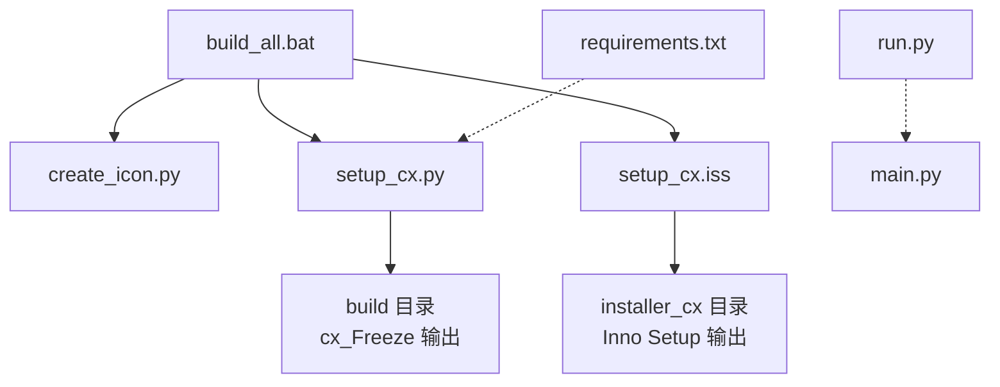
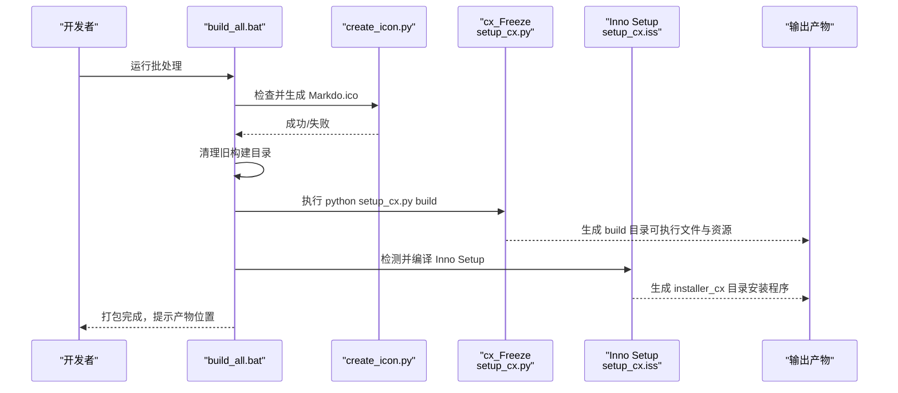
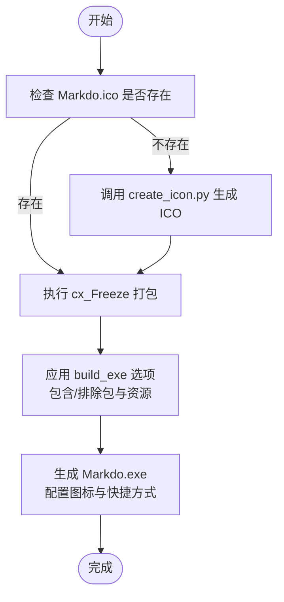
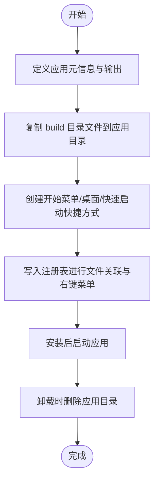
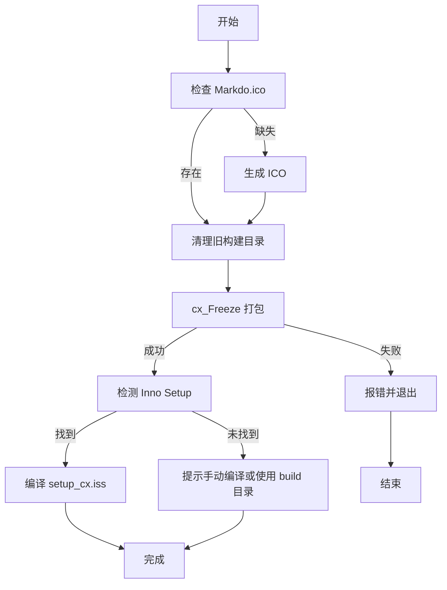
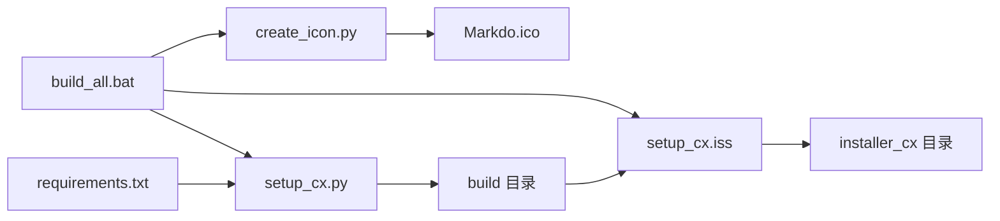

# 打包与分发

<cite>
**本文引用的文件**
- [setup_cx.py](file://setup_cx.py)
- [setup_cx.iss](file://setup_cx.iss)
- [build_all.bat](file://build_all.bat)
- [create_icon.py](file://create_icon.py)
- [requirements.txt](file://requirements.txt)
- [run.py](file://run.py)
- [main.py](file://main.py)
</cite>

## 目录
1. [简介](#简介)
2. [项目结构](#项目结构)
3. [核心组件](#核心组件)
4. [架构总览](#架构总览)
5. [详细组件分析](#详细组件分析)
6. [依赖关系分析](#依赖关系分析)
7. [性能考虑](#性能考虑)
8. [故障排查指南](#故障排查指南)
9. [结论](#结论)
10. [附录](#附录)

## 简介
本指南面向开发者，提供从源码到可分发安装包的完整打包与分发流程说明。内容涵盖：
- 如何使用 setup_cx.py（基于 cx_Freeze）将 Python 代码打包为独立可执行文件，包括依赖项的包含与入口点配置。
- setup_cx.iss 的作用：使用 Inno Setup 创建 Windows 安装程序，包含安装路径选择、快捷方式创建与卸载功能。
- build_all.bat 如何自动化整个打包流程，依次执行 Python 打包与 Inno Setup 编译。
- 版本更新与发布新版本的操作步骤。
- 打包过程常见问题与解决方案。

## 项目结构
该仓库采用“脚本驱动”的打包体系，关键文件如下：
- setup_cx.py：cx_Freeze 配置与可执行文件定义。
- setup_cx.iss：Inno Setup 安装脚本，负责安装路径、快捷方式、注册表文件关联与卸载。
- build_all.bat：批处理脚本，统一执行图标生成、清理、打包与安装程序编译。
- create_icon.py：将 PNG 图标转换为 ICO，供可执行文件与安装程序使用。
- requirements.txt：运行时依赖清单。
- run.py：开发调试入口。
- main.py：应用主逻辑与界面实现。

图表来源
- [build_all.bat](file://build_all.bat#L1-L53)
- [create_icon.py](file://create_icon.py#L1-L23)
- [setup_cx.py](file://setup_cx.py#L1-L82)
- [setup_cx.iss](file://setup_cx.iss#L1-L70)
- [requirements.txt](file://requirements.txt#L1-L5)
- [run.py](file://run.py#L1-L11)
- [main.py](file://main.py#L1-L120)

章节来源
- [build_all.bat](file://build_all.bat#L1-L53)
- [setup_cx.py](file://setup_cx.py#L1-L82)
- [setup_cx.iss](file://setup_cx.iss#L1-L70)
- [create_icon.py](file://create_icon.py#L1-L23)
- [requirements.txt](file://requirements.txt#L1-L5)
- [run.py](file://run.py#L1-L11)
- [main.py](file://main.py#L1-L120)

## 核心组件
- cx_Freeze 配置与可执行文件定义：通过 setup_cx.py 指定入口脚本、目标可执行文件名、图标、快捷方式、包含/排除的包与资源文件等。
- Inno Setup 安装脚本：通过 setup_cx.iss 定义安装目录、输出文件名、压缩与架构、安装图标、快捷方式、注册表文件关联与卸载行为。
- 自动化批处理：build_all.bat 统一执行图标生成、清理旧构建产物、调用 cx_Freeze 打包、检测并编译 Inno Setup 安装程序。
- 图标生成：create_icon.py 在缺少 ICO 时自动生成，确保可执行文件与安装程序具备图标。
- 运行时依赖：requirements.txt 明确应用运行所需的第三方库版本范围。

章节来源
- [setup_cx.py](file://setup_cx.py#L1-L82)
- [setup_cx.iss](file://setup_cx.iss#L1-L70)
- [build_all.bat](file://build_all.bat#L1-L53)
- [create_icon.py](file://create_icon.py#L1-L23)
- [requirements.txt](file://requirements.txt#L1-L5)

## 架构总览
下图展示了从源码到最终安装包的端到端流程，包括依赖解析、打包与安装程序生成的关键节点。

图表来源
- [build_all.bat](file://build_all.bat#L1-L53)
- [create_icon.py](file://create_icon.py#L1-L23)
- [setup_cx.py](file://setup_cx.py#L1-L82)
- [setup_cx.iss](file://setup_cx.iss#L1-L70)

## 详细组件分析

### 组件A：cx_Freeze 打包配置（setup_cx.py）
- 入口点与目标可执行文件
  - 入口脚本：main.py
  - 目标可执行文件名：Markdo.exe
  - 图标：Markdo.ico
  - 快捷方式：Program Menu 中创建，名称为 Markdo
- 包与资源管理
  - 包含：PyQt6 及其 WebEngine 组件、markdown 及其扩展、pymdown-extensions、pygments 等
  - 排除：tkinter、unittest、pydoc、doctest 等非必要模块
  - 资源文件：Markdo.png、pyqt_webview.py
- 构建选项
  - 优化级别：2
  - 二进制包含/排除与路径包含/排除：保持默认空集以便最小化差异
- 平台基座
  - Windows 平台使用 GUI 基座，避免弹出控制台窗口

图表来源
- [setup_cx.py](file://setup_cx.py#L1-L82)
- [create_icon.py](file://create_icon.py#L1-L23)

章节来源
- [setup_cx.py](file://setup_cx.py#L1-L82)

### 组件B：Inno Setup 安装程序（setup_cx.iss）
- 应用元信息
  - 名称、版本、发布者、主程序名
- 安装行为
  - 默认安装目录：用户程序文件夹下的应用名
  - 默认开始菜单组：应用名
  - 输出目录与文件名：installer_cx 与 Markdo_Setup_CX_{版本}.exe
  - 压缩：lzma2/max，固实压缩
  - 界面：modern 风格
  - 权限：需要管理员权限
  - 架构：x64 兼容
  - 安装图标：Markdo.ico
- 文件复制
  - 复制 cx_Freeze 打包输出的所有文件到应用目录
- 快捷方式
  - 开始菜单：应用与卸载
  - 桌面：可选创建桌面快捷方式
  - 快速启动：可选创建快速启动栏图标（受版本限制）
- 注册表与文件关联
  - 将 .md 文件与应用关联，设置默认图标与打开命令
  - 添加右键菜单“用 Markdo 打开”
- 启动与卸载
  - 安装完成后可自动启动应用
  - 卸载时删除应用目录

图表来源
- [setup_cx.iss](file://setup_cx.iss#L1-L70)

章节来源
- [setup_cx.iss](file://setup_cx.iss#L1-L70)

### 组件C：自动化打包流程（build_all.bat）
- 流程步骤
  - 检查并生成图标：若缺少 Markdo.ico，则调用 create_icon.py
  - 清理旧构建：删除 build 与 installer_cx 目录
  - cx_Freeze 打包：执行 python setup_cx.py build
  - Inno Setup 编译：检测 ISCC.exe 路径并编译 setup_cx.iss
  - 输出提示：打印可执行文件与安装程序的最终位置
- 错误处理
  - cx_Freeze 失败时中断并提示
  - 未找到 Inno Setup 时提示手动编译或直接使用 build 目录

图表来源
- [build_all.bat](file://build_all.bat#L1-L53)
- [create_icon.py](file://create_icon.py#L1-L23)

章节来源
- [build_all.bat](file://build_all.bat#L1-L53)

### 组件D：图标生成（create_icon.py）
- 功能：将 Markdo.png 转换为 Markdo.ico，包含多尺寸以适配不同显示密度
- 依赖：需要安装 Pillow 库
- 异常处理：导入失败、文件缺失、其他异常均给出明确提示

章节来源
- [create_icon.py](file://create_icon.py#L1-L23)

### 组件E：运行时依赖（requirements.txt）
- PyQt6 及 WebEngine
- markdown 与 Pygments
- pymdown-extensions
- 以上依赖在打包与运行时均需满足版本要求

章节来源
- [requirements.txt](file://requirements.txt#L1-L5)

### 组件F：开发调试入口（run.py）
- 直接运行 main.py，便于开发阶段调试

章节来源
- [run.py](file://run.py#L1-L11)

## 依赖关系分析
- 构建链路
  - build_all.bat 串联 create_icon.py、setup_cx.py、setup_cx.iss
  - setup_cx.py 依赖 requirements.txt 中的第三方库
  - setup_cx.iss 依赖 build 目录的打包产物
- 外部工具
  - cx_Freeze：将 Python 应用打包为独立可执行文件
  - Inno Setup：将可执行文件与资源打包为 Windows 安装程序
  - Pillow：生成 ICO 图标

图表来源
- [requirements.txt](file://requirements.txt#L1-L5)
- [create_icon.py](file://create_icon.py#L1-L23)
- [setup_cx.py](file://setup_cx.py#L1-L82)
- [setup_cx.iss](file://setup_cx.iss#L1-L70)
- [build_all.bat](file://build_all.bat#L1-L53)

章节来源
- [requirements.txt](file://requirements.txt#L1-L5)
- [create_icon.py](file://create_icon.py#L1-L23)
- [setup_cx.py](file://setup_cx.py#L1-L82)
- [setup_cx.iss](file://setup_cx.iss#L1-L70)
- [build_all.bat](file://build_all.bat#L1-L53)

## 性能考虑
- 构建体积
  - 通过排除非必要包（如 tkinter/unittest/pydoc/doctest）降低体积
  - 保留必要的 PyQt6 WebEngine 与 markdown 生态组件
- 优化级别
  - 使用优化级别 2，平衡可执行文件大小与运行效率
- 安装体积
  - Inno Setup 使用 lzma2/max 压缩与固实压缩，显著减小安装包体积
- 启动速度
  - 将图标与关键资源随可执行文件一起打包，避免运行时动态查找

[本节为通用建议，无需特定文件来源]

## 故障排查指南
- 图标缺失
  - 现象：可执行文件或安装程序缺少图标
  - 解决：确保 Markdo.png 存在；运行批处理会尝试生成 Markdo.ico；若失败，手动安装 Pillow 并运行 create_icon.py
  - 参考
    - [create_icon.py](file://create_icon.py#L1-L23)
    - [build_all.bat](file://build_all.bat#L1-L53)
- cx_Freeze 打包失败
  - 现象：批处理在执行 cx_Freeze 时中断
  - 解决：检查 Python 环境与依赖安装；确认 setup_cx.py 中的入口脚本与资源路径正确；查看控制台输出的错误信息
  - 参考
    - [build_all.bat](file://build_all.bat#L1-L53)
    - [setup_cx.py](file://setup_cx.py#L1-L82)
- Inno Setup 未找到
  - 现象：批处理提示未找到 ISCC.exe
  - 解决：手动安装 Inno Setup 6；或直接使用 build 目录中的可执行文件进行分发
  - 参考
    - [build_all.bat](file://build_all.bat#L1-L53)
    - [setup_cx.iss](file://setup_cx.iss#L1-L70)
- 依赖缺失导致运行异常
  - 现象：应用启动时报错或功能异常
  - 解决：根据 requirements.txt 安装所需依赖；确保 PyQt6、markdown、Pygments、pymdown-extensions 版本满足最低要求
  - 参考
    - [requirements.txt](file://requirements.txt#L1-L5)
- 文件路径错误
  - 现象：Inno Setup 复制文件失败或快捷方式无效
  - 解决：确认 build 目录结构与 setup_cx.iss 中的 Source 路径一致；确保输出目录权限充足
  - 参考
    - [setup_cx.iss](file://setup_cx.iss#L1-L70)
- 注册表文件关联失败
  - 现象：.md 文件无法关联到应用
  - 解决：以管理员权限重新安装；检查注册表写入是否被安全软件拦截
  - 参考
    - [setup_cx.iss](file://setup_cx.iss#L1-L70)

章节来源
- [create_icon.py](file://create_icon.py#L1-L23)
- [build_all.bat](file://build_all.bat#L1-L53)
- [setup_cx.py](file://setup_cx.py#L1-L82)
- [setup_cx.iss](file://setup_cx.iss#L1-L70)
- [requirements.txt](file://requirements.txt#L1-L5)

## 结论
通过 setup_cx.py、setup_cx.iss 与 build_all.bat 的协同工作，可以将 Python 应用稳定地打包为独立可执行文件，并进一步生成 Windows 安装程序。遵循本文档提供的步骤与排错建议，开发者可以高效完成版本迭代与发布。

[本节为总结性内容，无需特定文件来源]

## 附录

### 发布新版本操作步骤
- 更新版本号
  - 在 setup_cx.py 中更新版本字符串
  - 在 setup_cx.iss 中更新版本宏定义
- 准备资源
  - 确保 Markdo.png 存在并生成 Markdo.ico
- 执行打包
  - 运行 build_all.bat，完成图标生成、清理、打包与安装程序编译
- 校验产物
  - 检查 build 目录与 installer_cx 目录的产物完整性
  - 以管理员权限安装测试，验证文件关联与快捷方式
- 发布
  - 将安装程序与可执行文件上传至发布渠道

章节来源
- [setup_cx.py](file://setup_cx.py#L1-L82)
- [setup_cx.iss](file://setup_cx.iss#L1-L70)
- [build_all.bat](file://build_all.bat#L1-L53)
- [create_icon.py](file://create_icon.py#L1-L23)