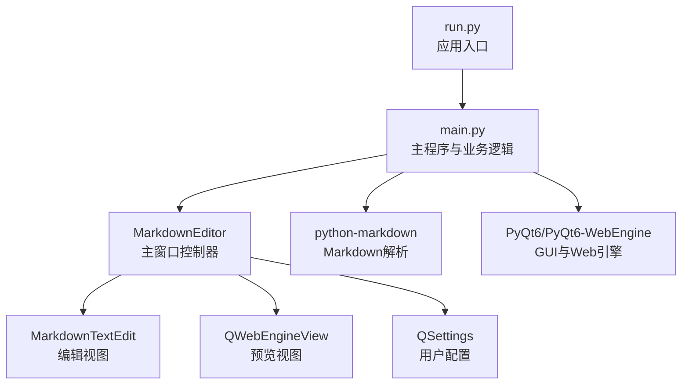
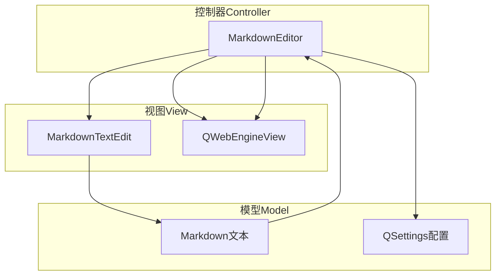
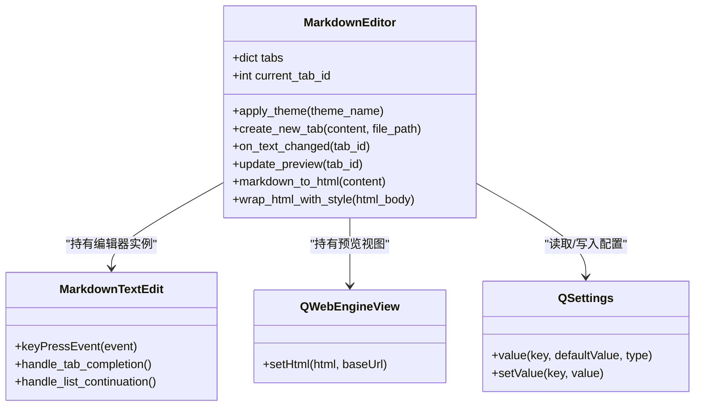
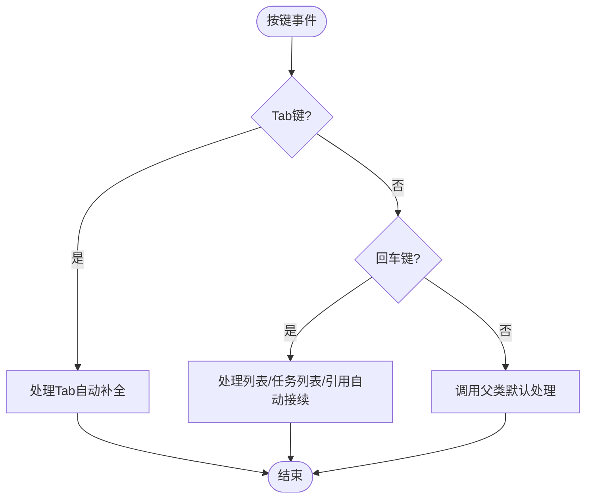
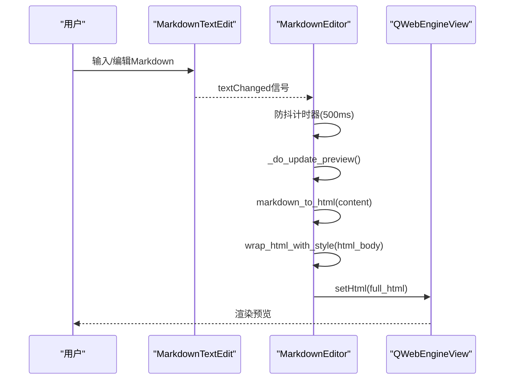
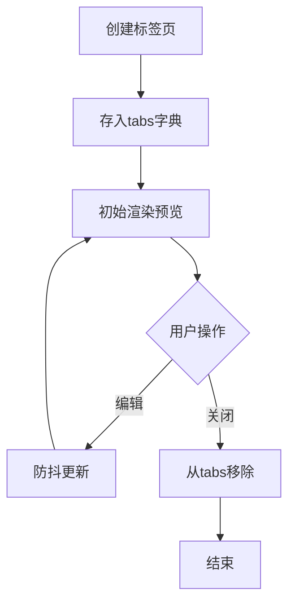
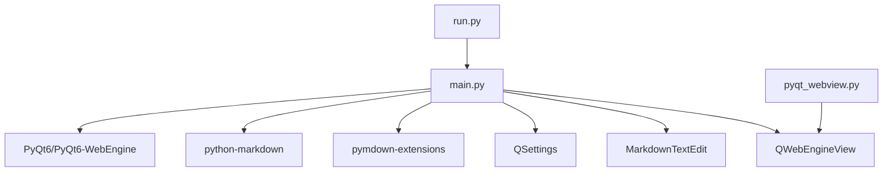

# 技术架构

<cite>
**本文引用的文件**
- [main.py](file://main.py)
- [pyqt_webview.py](file://pyqt_webview.py)
- [run.py](file://run.py)
- [requirements.txt](file://requirements.txt)
</cite>

## 目录
1. [引言](#引言)
2. [项目结构](#项目结构)
3. [核心组件](#核心组件)
4. [架构总览](#架构总览)
5. [详细组件分析](#详细组件分析)
6. [依赖关系分析](#依赖关系分析)
7. [性能考量](#性能考量)
8. [故障排查指南](#故障排查指南)
9. [结论](#结论)

## 引言
本文件面向Markdo项目的整体技术架构，基于MVC（Model-View-Controller）模式进行系统化梳理。Markdo采用PyQt6构建桌面应用，使用python-markdown库进行Markdown到HTML的转换，并通过QWebEngineView实现实时预览。数据模型包括Markdown文本与QSettings用户配置；视图层由MarkdownTextEdit与QWebEngineView组成；控制器为MarkdownEditor主窗口，负责协调视图与数据、处理用户交互与业务逻辑。

## 项目结构
- 入口脚本：run.py负责启动应用，调用main模块的入口函数。
- 主程序：main.py包含应用主体、界面组件、业务逻辑与Markdown解析流程。
- 独立预览窗口：pyqt_webview.py提供独立的Markdown预览窗口，便于在其他场景复用。
- 依赖声明：requirements.txt列出PyQt6、PyQt6-WebEngine、python-markdown及相关扩展。

图表来源
- [run.py](file://run.py#L1-L11)
- [main.py](file://main.py#L1860-L2895)
- [pyqt_webview.py](file://pyqt_webview.py#L1-L242)
- [requirements.txt](file://requirements.txt#L1-L5)

章节来源
- [run.py](file://run.py#L1-L11)
- [requirements.txt](file://requirements.txt#L1-L5)

## 核心组件
- 控制器（Controller）：MarkdownEditor主窗口，负责：
  - 维护tabs字典管理多标签页状态
  - 响应用户操作（菜单、工具栏、快捷键、上下文菜单）
  - 触发文本变更事件，执行防抖更新预览
  - 调用markdown_to_html与wrap_html_with_style进行渲染
- 视图（View）：
  - MarkdownTextEdit：自定义编辑器，支持列表自动接续、Tab自动补全、语法高亮
  - QWebEngineView：预览视图，承载HTML内容并启用MathJax渲染
- 模型（Model）：
  - Markdown文本：来自编辑器的纯文本
  - 用户配置：QSettings存储主题、悬浮工具栏设置等

章节来源
- [main.py](file://main.py#L1860-L2895)

## 架构总览
Markdo遵循MVC模式：
- Model：Markdown文本与QSettings配置
- View：MarkdownTextEdit与QWebEngineView
- Controller：MarkdownEditor主窗口，协调视图与模型，处理业务逻辑

图表来源
- [main.py](file://main.py#L1860-L2895)

## 详细组件分析

### MarkdownEditor（主窗口控制器）
职责与特性：
- 多标签页管理：通过tabs字典存储每个标签页的编辑器、预览视图、文件路径与分割器，支持新建、关闭、重命名标签页。
- 防抖更新：监听编辑器textChanged信号，使用单次定时器在500ms内合并多次变更，降低渲染压力。
- Markdown解析：调用markdown_to_html将Markdown转换为HTML，再通过wrap_html_with_style注入CSS与MathJax支持。
- 预览渲染：将最终HTML设置到QWebEngineView，启用JavaScript与远程资源访问。
- 用户交互：提供菜单、工具栏、快捷键、悬浮工具栏、右键菜单等。

图表来源
- [main.py](file://main.py#L1860-L2895)

章节来源
- [main.py](file://main.py#L1860-L2895)

### MarkdownTextEdit（编辑视图）
职责与特性：
- 键盘事件处理：拦截Tab键进行渐进式补全，回车键处理列表/任务列表/引用的自动接续。
- 语法高亮：内置MarkdownHighlighter，对标题、粗体、斜体、代码、链接、列表、引用、删除线、高亮、公式、脚注、目录、上/下标、表格等进行高亮。
- 光标与上下文菜单：支持光标位置变化事件，配合悬浮工具栏定位；提供右键菜单集成基础编辑与Markdown工具。

图表来源
- [main.py](file://main.py#L650-L826)

章节来源
- [main.py](file://main.py#L650-L826)

### QWebEngineView（预览视图）
职责与特性：
- 接收HTML内容并渲染，启用JavaScript与远程资源访问，确保MathJax正常工作。
- 作为预览容器，承载由MarkdownEditor生成的完整HTML文档（包含样式与MathJax脚本）。

章节来源
- [main.py](file://main.py#L2133-L2140)

### Markdown解析与渲染流程
用户输入通过MarkdownTextEdit触发textChanged信号，经防抖后调用markdown_to_html，再由wrap_html_with_style注入CSS与MathJax配置，最终在QWebEngineView中渲染。

图表来源
- [main.py](file://main.py#L2172-L2270)
- [main.py](file://main.py#L2271-L2375)

章节来源
- [main.py](file://main.py#L2172-L2375)

### tabs字典管理多标签页状态
- 结构：每个标签页以整数ID为键，值包含编辑器、预览视图、文件路径与分割器。
- 生命周期：创建新标签页时初始化编辑器与预览视图，关闭标签页时从tabs中移除并清理。
- 当前标签页：通过当前索引反查tabs字典获取当前tab_id，确保操作作用于正确的标签页。

图表来源
- [main.py](file://main.py#L2106-L2162)
- [main.py](file://main.py#L2461-L2477)

章节来源
- [main.py](file://main.py#L2106-L2162)
- [main.py](file://main.py#L2461-L2477)

### 技术选型说明
- GUI框架：PyQt6
  - 优势：成熟生态、跨平台、WebEngine支持、信号槽机制便于MVC解耦。
  - 适用性：桌面应用开发首选，与本项目实时预览需求契合。
- Markdown解析：python-markdown + pymdown-extensions
  - 优势：功能丰富、扩展性强、支持多种语法扩展（如tilde、caret、mark等）。
  - 适配：与MathJax结合良好，满足数学公式渲染需求。
- 预览引擎：QWebEngineView
  - 优势：基于Chromium，支持现代Web标准，启用JavaScript与远程资源访问。
  - 配置：启用JavaScript、允许本地访问远程资源、允许不安全内容，保障MathJax加载。

章节来源
- [requirements.txt](file://requirements.txt#L1-L5)
- [main.py](file://main.py#L2238-L2263)
- [main.py](file://main.py#L2133-L2140)

## 依赖关系分析
- 运行时依赖：PyQt6、PyQt6-WebEngine、markdown、Pygments、pymdown-extensions
- 模块间关系：
  - run.py -> main.main() -> MarkdownEditor
  - main.py -> MarkdownEditor -> MarkdownTextEdit/QWebEngineView/QSettings
  - main.py -> markdown库 -> HTML输出
  - pyqt_webview.py -> 独立预览窗口（可复用）

图表来源
- [run.py](file://run.py#L1-L11)
- [main.py](file://main.py#L1-L20)
- [requirements.txt](file://requirements.txt#L1-L5)
- [pyqt_webview.py](file://pyqt_webview.py#L1-L242)

章节来源
- [run.py](file://run.py#L1-L11)
- [requirements.txt](file://requirements.txt#L1-L5)

## 性能考量
- 防抖更新：通过单次定时器合并高频textChanged事件，降低HTML渲染次数，提升响应速度。
- 渲染范围：仅对当前标签页进行更新，避免全局刷新。
- 解析优化：使用pymdown扩展与占位符保护数学公式，减少解析错误与重复处理。
- 预览优化：启用WebEngine的JavaScript与远程资源访问，确保MathJax即时渲染。

章节来源
- [main.py](file://main.py#L2172-L2190)
- [main.py](file://main.py#L2208-L2270)
- [main.py](file://main.py#L2133-L2140)

## 故障排查指南
- 预览空白或无样式
  - 检查wrap_html_with_style是否正确返回完整HTML文档
  - 确认QWebEngineView已启用JavaScript与远程资源访问
- 数学公式不渲染
  - 确认MathJax脚本已注入且网络可达
  - 检查公式保护与恢复逻辑是否生效
- 预览卡顿
  - 检查防抖是否生效（500ms延迟）
  - 减少一次性大量输入，避免频繁触发渲染
- 配置不生效
  - 检查QSettings键值与读取逻辑
  - 确认设置对话框保存后通知主窗口更新

章节来源
- [main.py](file://main.py#L2271-L2375)
- [main.py](file://main.py#L2133-L2140)
- [main.py](file://main.py#L2172-L2190)
- [main.py](file://main.py#L160-L352)

## 结论
Markdo以清晰的MVC架构组织代码，通过MarkdownEditor统一调度视图与模型，利用防抖与扩展解析实现高性能实时预览。PyQt6与QWebEngineView提供了稳定的桌面GUI与Web渲染能力，python-markdown与pymdown-extensions保证了Markdown语法的完整性与可扩展性。建议在后续迭代中进一步完善错误日志与配置持久化策略，持续优化渲染性能与用户体验。