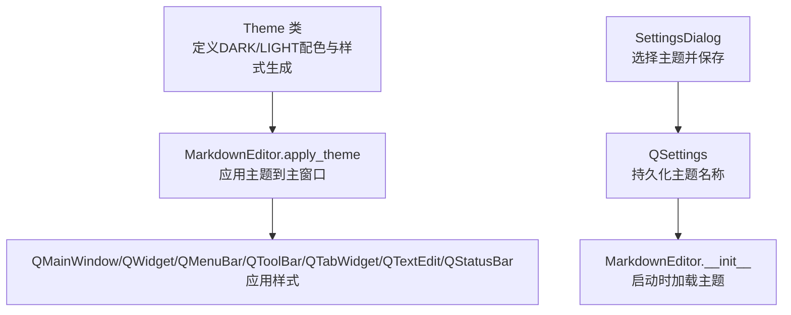
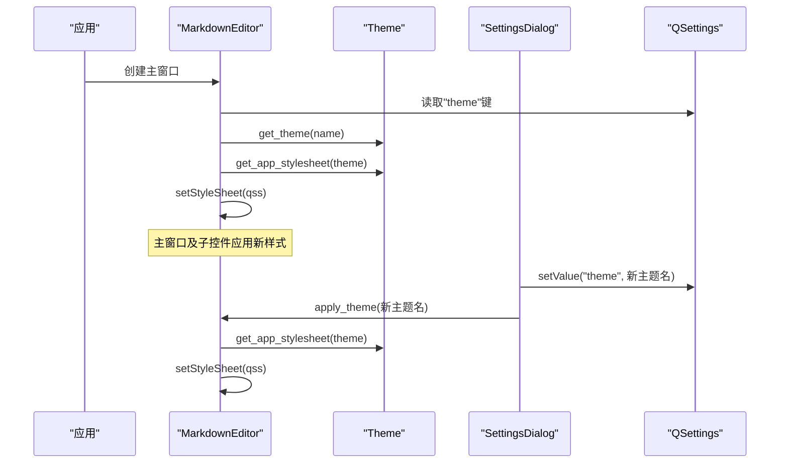
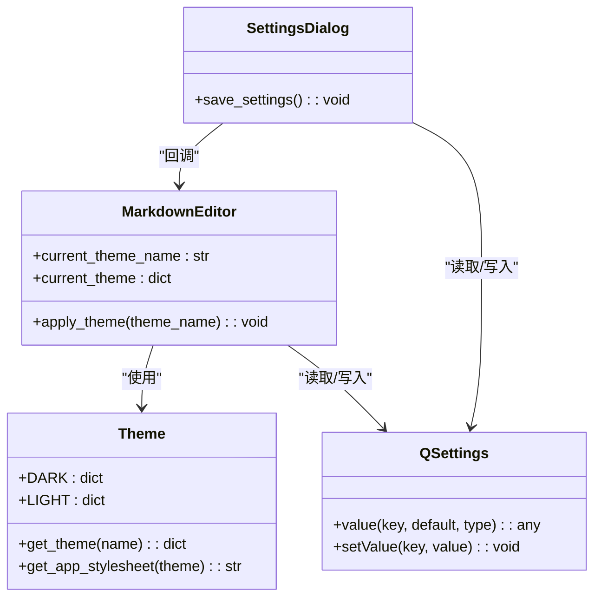

# 主题切换

<cite>
**本文引用的文件**
- [main.py](file://main.py)
</cite>

## 目录
1. [简介](#简介)
2. [项目结构](#项目结构)
3. [核心组件](#核心组件)
4. [架构总览](#架构总览)
5. [组件详解](#组件详解)
6. [依赖关系分析](#依赖关系分析)
7. [性能考量](#性能考量)
8. [故障排查指南](#故障排查指南)
9. [结论](#结论)
10. [附录](#附录)

## 简介
本文件系统性阐述本项目的主题切换功能，围绕以下目标展开：
- 解释 Theme 类如何定义 DARK 和 LIGHT 两种主题的配色方案（背景色、文字色、强调色等）。
- 说明 Theme.get_app_stylesheet 静态方法如何基于主题生成完整的 QSS 样式表。
- 结合 MarkdownEditor 的 apply_theme 方法，解释应用主题时如何调用 setStyleSheet 更新整个 UI 的外观。
- 描述主题设置如何通过 QSettings 持久化存储并在启动时加载。
- 覆盖主题切换对编辑器、工具栏、状态栏等所有 UI 组件的影响。
- 提供添加新主题的步骤，并给出样式表未生效或部分组件未更新等常见问题的排查建议。

## 项目结构
本项目采用单文件组织，主题系统与主窗口逻辑集中于 main.py 中，便于快速定位与维护。主题系统位于文件顶部附近，主窗口类在文件中部，应用入口在文件末尾。

图表来源
- [main.py](file://main.py#L23-L158)
- [main.py](file://main.py#L1860-L1930)
- [main.py](file://main.py#L1870-L1878)
- [main.py](file://main.py#L160-L240)

章节来源
- [main.py](file://main.py#L23-L158)
- [main.py](file://main.py#L160-L240)
- [main.py](file://main.py#L1860-L1930)
- [main.py](file://main.py#L1870-L1878)

## 核心组件
- Theme 类：定义 DARK 与 LIGHT 两套主题字典，包含背景、文字、强调色、边框、编辑器背景/文字、工具栏/状态栏背景/文字等键值；提供 get_theme 与 get_app_stylesheet 两个静态方法，分别用于按名称获取主题与生成应用级 QSS。
- MarkdownEditor：主窗口类，负责加载 QSettings 中的主题配置，初始化 UI，调用 apply_theme 应用主题，更新状态栏提示。
- SettingsDialog：设置窗口，允许用户在“黑夜模式”和“白天模式”之间切换，保存到 QSettings 并触发主窗口主题更新。

章节来源
- [main.py](file://main.py#L23-L158)
- [main.py](file://main.py#L1860-L1930)
- [main.py](file://main.py#L160-L240)

## 架构总览
主题切换的端到端流程如下：
- 启动阶段：MarkdownEditor 从 QSettings 读取主题名称，构造 Theme 对象，调用 apply_theme，后者通过 Theme.get_app_stylesheet 生成 QSS 并调用 setStyleSheet 应用到主窗口。
- 运行阶段：用户在设置窗口选择主题，保存到 QSettings，SettingsDialog 通知父窗口 MarkdownEditor 重新应用主题。
- 影响范围：主窗口及其子控件（菜单栏、工具栏、标签页、编辑器、状态栏、滚动条、分割条等）均受该 QSS 影响。

图表来源
- [main.py](file://main.py#L1860-L1930)
- [main.py](file://main.py#L160-L240)
- [main.py](file://main.py#L1870-L1878)

## 组件详解

### Theme 类与配色方案
- DARK/LIGHT 主题字典包含：
  - 基础背景与次级背景、三级背景
  - 文字主色与次色
  - 强调色与悬停强调色，以及强调色上的文字颜色
  - 边框色
  - 编辑器背景与文字色
  - 工具栏与状态栏背景与文字色
- 该设计确保在不同控件层级（主窗口、菜单、工具栏、标签页、编辑器、状态栏、滚动条等）保持一致的视觉语义。

章节来源
- [main.py](file://main.py#L23-L60)

### Theme.get_app_stylesheet：生成应用级 QSS
- 该静态方法接收一个主题字典，返回一段完整的 QSS 字符串，覆盖：
  - QMainWindow、QWidget
  - QMenuBar、QMenu
  - QToolBar、QToolBar QPushButton
  - QTabWidget::pane、QTabBar::tab 及其选中/悬停态
  - QTextEdit（含选择背景与文字色）
  - QStatusBar
  - QSplitter::handle
  - QScrollBar:vertical 及其 handle 悬停态
- 通过统一注入 QSS，保证所有子控件继承一致的色彩体系。

章节来源
- [main.py](file://main.py#L66-L158)

### MarkdownEditor.apply_theme：应用主题到 UI
- 接收主题名称字符串，更新实例属性 current_theme_name/current_theme。
- 调用 Theme.get_app_stylesheet(current_theme) 生成 QSS，并调用 self.setStyleSheet 应用到主窗口。
- 更新状态栏提示当前主题名称。

章节来源
- [main.py](file://main.py#L1923-L1930)

### 启动时加载与持久化
- MarkdownEditor.__init__：
  - 从 QSettings 读取 toolbar/auto_show、theme、toolbar/hotkey 等设置。
  - 初始化 UI 后立即调用 apply_theme，确保启动即应用主题。
- SettingsDialog：
  - 读取当前 theme 值并设置下拉框默认项。
  - 保存时写入 theme 键，并调用父窗口的 apply_theme 与 reload_toolbar_shortcut，使主题变更即时生效。

章节来源
- [main.py](file://main.py#L1860-L1930)
- [main.py](file://main.py#L160-L240)

### 主题对各 UI 组件的影响
- 菜单栏与菜单：背景、文字、边框、选中态强调色与文字色。
- 工具栏与按钮：背景、文字、边框、悬停强调色与文字色。
- 标签页：面板边框与背景、标签页背景、选中态强调色描边、悬停态背景。
- 文本编辑器：背景、文字、选择背景与文字色。
- 状态栏：背景与文字色。
- 滚动条：垂直滚动条背景与 handle 圆角、最小高度、悬停色。
- 分割条：手柄颜色。

章节来源
- [main.py](file://main.py#L66-L158)

### 添加新主题的步骤
- 在 Theme 类中新增一个主题字典，命名建议遵循现有命名规范（如 NEW_THEME），并填充所需键值（背景、文字、强调色、边框、编辑器/工具栏/状态栏等）。
- 在 SettingsDialog 的下拉框中增加一项，data 为新主题名称字符串。
- 保存设置时，将 theme 写入 QSettings；在 SettingsDialog 的保存逻辑中调用父窗口的 apply_theme，确保即时生效。
- 如需在欢迎/快捷键等对话框中也适配新主题，可在相应对话框的 init_ui 中读取当前主题并应用对应 QSS。

章节来源
- [main.py](file://main.py#L23-L60)
- [main.py](file://main.py#L160-L240)
- [main.py](file://main.py#L1860-L1930)

## 依赖关系分析
- Theme 与 MarkdownEditor：Theme 提供配色与 QSS 生成能力，MarkdownEditor 通过 Theme.apply_theme 应用到主窗口。
- QSettings 与 MarkdownEditor/SettingsDialog：两者共同维护 theme 键，前者在启动时读取，后者在用户更改时写入。
- SettingsDialog 与 MarkdownEditor：SettingsDialog 作为 UI 控件，保存设置并回调父窗口的 apply_theme。

图表来源
- [main.py](file://main.py#L23-L158)
- [main.py](file://main.py#L1860-L1930)
- [main.py](file://main.py#L160-L240)

## 性能考量
- 主题切换为一次性 setStyleSheet 调用，成本较低，适合在运行时频繁切换。
- 若未来引入更复杂的动态样式（如渐变、动画），建议将样式生成逻辑缓存或按需更新，避免重复计算。
- 预览 HTML 与语法高亮由其他模块负责，主题切换不影响其渲染逻辑。

## 故障排查指南
- 症状：切换主题后部分控件未更新
  - 检查是否在 SettingsDialog 保存后调用了父窗口的 apply_theme。
  - 确认 QSS 中是否包含对应控件的选择器（例如 QToolBar QPushButton、QTabBar::tab 等）。
  - 确保主窗口已调用 setStyleSheet，且未被后续代码覆盖。
- 症状：主题未持久化
  - 确认 SettingsDialog 的保存逻辑写入了 "theme" 键。
  - 确认 MarkdownEditor 启动时从 QSettings 读取了 "theme"。
- 症状：编辑器内部高亮颜色异常
  - 编辑器语法高亮颜色由 MarkdownHighlighter 自身定义，与主题无关。若需统一风格，可调整高亮规则的颜色映射。
- 症状：状态栏文字颜色不正确
  - 检查 QSS 中 QStatusBar 的 color 是否与主题文字色一致。

章节来源
- [main.py](file://main.py#L160-L240)
- [main.py](file://main.py#L1860-L1930)

## 结论
本项目通过 Theme 类集中管理配色与 QSS 生成，配合 QSettings 的持久化与 MarkdownEditor 的应用流程，实现了简洁、可控、可扩展的主题切换机制。主题影响范围覆盖主窗口主要 UI 组件，满足夜间/日间模式的使用需求。新增主题只需在 Theme 中补充配色字典并在设置界面注册即可，具备良好的可维护性与扩展性。

## 附录
- 关键实现位置参考
  - Theme 类与样式生成：[main.py](file://main.py#L23-L158)
  - MarkdownEditor.apply_theme：[main.py](file://main.py#L1923-L1930)
  - 启动加载与应用：[main.py](file://main.py#L1860-L1930)
  - 设置窗口与持久化：[main.py](file://main.py#L160-L240)