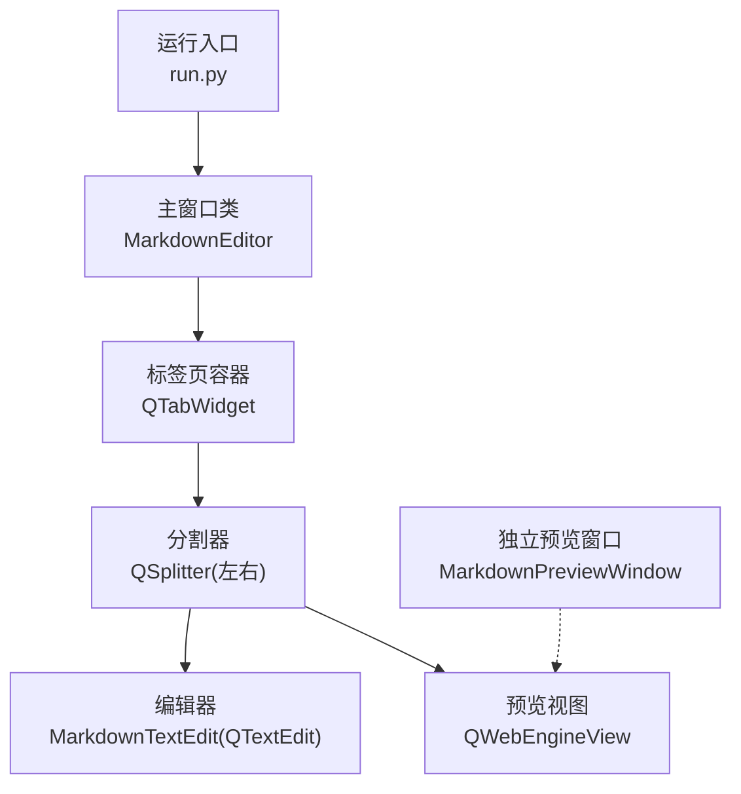
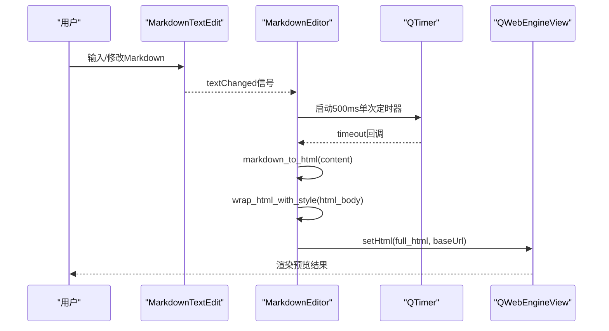
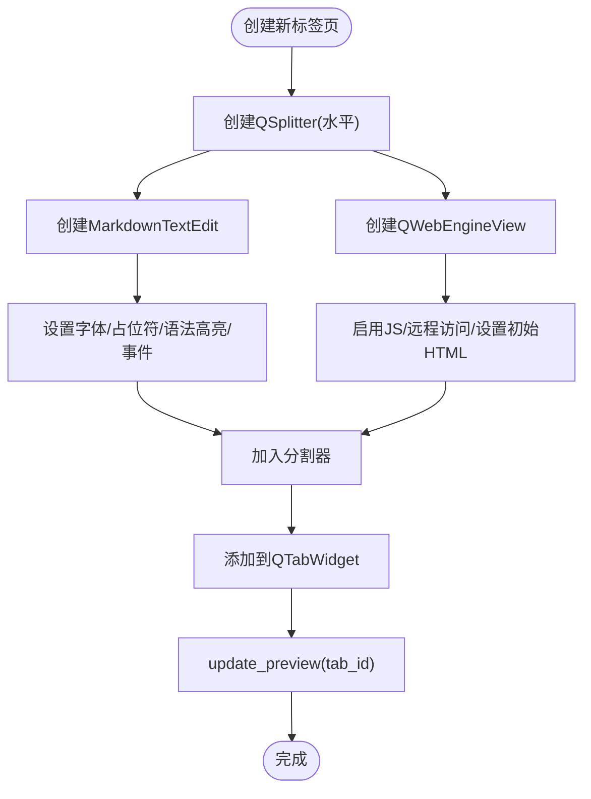
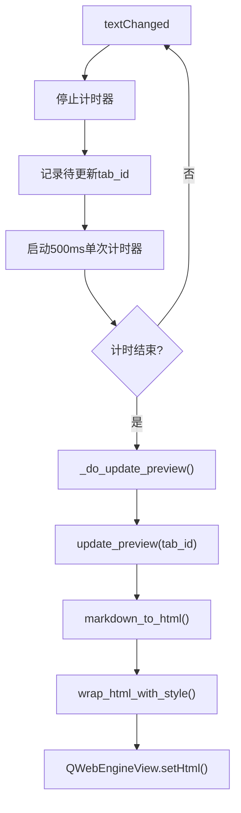
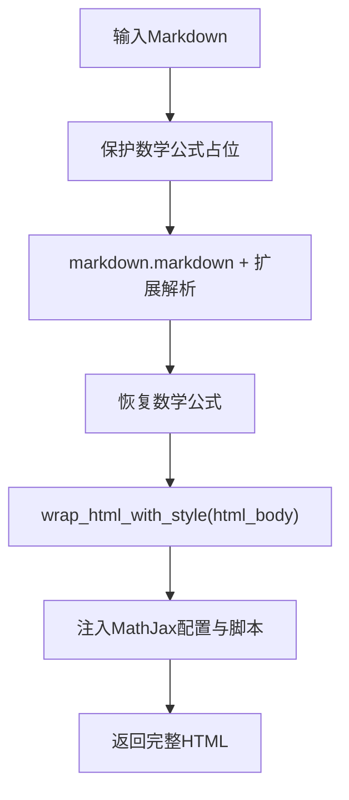
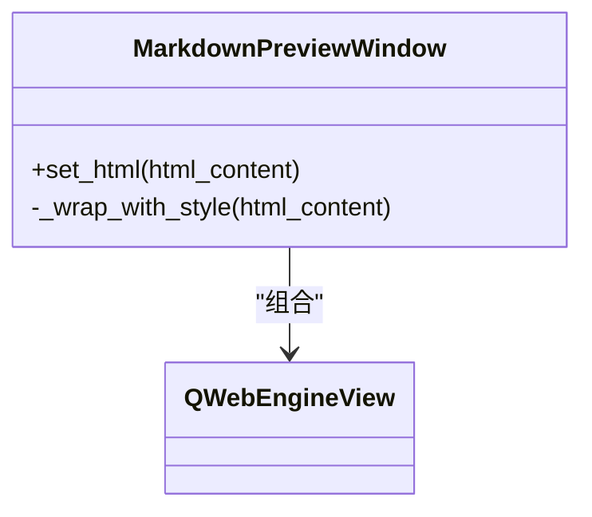
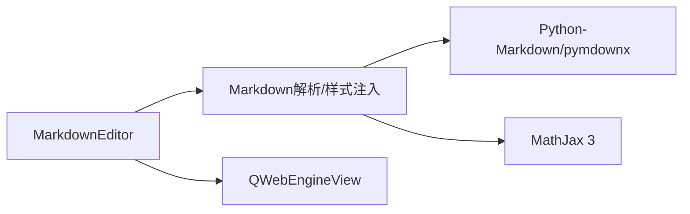

# 实时预览

<cite>
**本文引用的文件**
- [main.py](file://main.py)
- [pyqt_webview.py](file://pyqt_webview.py)
- [run.py](file://run.py)
- [structue_intro.txt](file://structue_intro.txt)
</cite>

## 目录
1. [简介](#简介)
2. [项目结构](#项目结构)
3. [核心组件](#核心组件)
4. [架构总览](#架构总览)
5. [详细组件分析](#详细组件分析)
6. [依赖关系分析](#依赖关系分析)
7. [性能考量](#性能考量)
8. [故障排查指南](#故障排查指南)
9. [结论](#结论)

## 简介
本文件围绕“实时预览”功能展开，系统性阐述从用户输入到预览更新的完整数据流：用户输入 → MarkdownTextEdit → textChanged信号 → 500ms防抖定时器 → markdown_to_html函数解析 → wrap_html_with_style函数添加样式 → QWebEngineView渲染。同时说明如何通过QWebEngineView实现左右分屏布局，以及如何在独立窗口中复用预览能力；最后给出CSS样式冲突、JavaScript/MathJax加载失败等常见问题的解决方案与性能优化建议。

## 项目结构
- 主程序入口负责创建主窗口、菜单栏、工具栏、标签页与分割器，以及实时预览的核心逻辑。
- 独立预览窗口模块提供一个可复用的QWebEngineView预览界面，便于扩展到外部场景。
- 运行脚本提供便捷启动方式。
- 结构说明文档补充了技术栈与预览链路要点。

图表来源
- [main.py](file://main.py#L1860-L2163)
- [pyqt_webview.py](file://pyqt_webview.py#L1-L120)

章节来源
- [run.py](file://run.py#L1-L11)
- [structue_intro.txt](file://structue_intro.txt#L73-L93)

## 核心组件
- MarkdownEditor：主窗口类，负责UI组织、标签页管理、实时预览调度与Markdown解析。
- MarkdownTextEdit：自定义编辑器，增强列表续写、Tab自动补全等交互体验。
- QWebEngineView：预览渲染引擎，承载HTML内容并支持MathJax渲染。
- MarkdownPreviewWindow：独立预览窗口，封装样式注入与MathJax配置，便于复用。

章节来源
- [main.py](file://main.py#L1860-L2163)
- [pyqt_webview.py](file://pyqt_webview.py#L1-L120)

## 架构总览
实时预览的端到端流程如下：
- 用户在左侧编辑器输入/修改Markdown。
- 编辑器发出textChanged信号。
- 主窗口使用单次触发的QTimer进行500ms防抖，合并高频变更。
- 防抖结束后调用markdown_to_html进行解析，再由wrap_html_with_style注入完整HTML文档结构与样式，并挂载MathJax脚本。
- 最终通过QWebEngineView.setHtml渲染到右侧预览区。

图表来源
- [main.py](file://main.py#L2172-L2207)

章节来源
- [main.py](file://main.py#L2172-L2207)

## 详细组件分析

### 左右分屏布局与预览初始化
- 分割器：使用QSplitter横向分割，左侧为MarkdownTextEdit，右侧为QWebEngineView。
- 编辑器：启用语法高亮、上下文菜单、悬浮工具栏联动。
- 预览：启用JavaScript、允许本地访问远程资源、设置初始HTML。
- 初始渲染：创建标签页后立即执行一次预览更新，确保空白文档有提示内容。

图表来源
- [main.py](file://main.py#L2106-L2163)

章节来源
- [main.py](file://main.py#L2106-L2163)

### 防抖机制与性能平衡
- 触发点：编辑器textChanged信号。
- 防抖策略：使用QTimer.setSingleShot(True)，每次变更重置计时器，仅在最后一次变更后触发timeout。
- 时间阈值：默认500ms，兼顾流畅度与渲染压力。
- 作用：避免频繁解析与setHtml导致的卡顿，提升长文本编辑体验。

图表来源
- [main.py](file://main.py#L2172-L2191)

章节来源
- [main.py](file://main.py#L2172-L2191)

### Markdown解析与样式注入
- 解析流程：保护数学公式（避免被Markdown解析器破坏）→ 使用python-markdown与pymdownx扩展生成HTML → 恢复公式 → 注入完整HTML文档结构与样式。
- 样式注入：wrap_html_with_style提供统一的排版、表格、代码块、引用、链接、图片等样式；同时内嵌MathJax配置与脚本，支持行内与块级公式渲染。
- 错误兜底：解析异常时回退到纯文本包裹的预格式化HTML，保证界面稳定。

图表来源
- [main.py](file://main.py#L2208-L2375)

章节来源
- [main.py](file://main.py#L2208-L2375)

### 独立预览窗口的可扩展性
- 独立窗口：MarkdownPreviewWindow基于QMainWindow与QWebEngineView，提供set_html接口，内部同样进行样式包装与MathJax注入。
- 复用价值：可在其他场景（如外部工具集成）直接创建该窗口并传入HTML内容，快速展示预览。
- 注意事项：独立窗口需自行管理QApplication生命周期，模块内提供get_qt_app以兼容已有实例。

图表来源
- [pyqt_webview.py](file://pyqt_webview.py#L1-L120)

章节来源
- [pyqt_webview.py](file://pyqt_webview.py#L1-L120)

## 依赖关系分析
- 组件耦合
  - MarkdownEditor与QWebEngineView：通过setHtml进行数据绑定，耦合点清晰。
  - MarkdownEditor与MarkdownTextEdit：通过信号槽连接textChanged，低耦合高内聚。
  - MarkdownEditor与解析层：通过markdown_to_html/wrap_html_with_style解耦，便于替换解析器或样式方案。
- 外部依赖
  - Python-Markdown + pymdownx扩展：提供Markdown解析与高级语法支持。
  - MathJax 3：提供TeX公式渲染。
  - PyQt6：GUI框架与Web渲染引擎。

图表来源
- [main.py](file://main.py#L2208-L2375)

章节来源
- [main.py](file://main.py#L2208-L2375)

## 性能考量
- 防抖时间选择
  - 默认500ms在大多数场景下平衡了响应性与渲染频率；对于超长文档或低端设备，可适当增大至700–1000ms。
- 渲染粒度控制
  - 仅在防抖结束时执行解析与setHtml，避免逐字符渲染。
- 样式与脚本
  - 样式一次性注入，避免重复DOM操作；MathJax按需加载，注意网络状况下的加载时延。
- 大量图片/表格
  - 预览区滚动性能受内容规模影响，建议分段编辑或拆分大文档。
- 事件过滤与悬浮工具栏
  - 通过事件过滤器与延迟隐藏，减少不必要的UI刷新。

章节来源
- [main.py](file://main.py#L2172-L2207)
- [main.py](file://main.py#L2822-L2860)

## 故障排查指南
- 预览区CSS样式冲突
  - 现象：预览样式与应用主题不一致或元素样式异常。
  - 排查：确认wrap_html_with_style是否正确注入；检查应用主题样式是否覆盖了QWebEngineView的背景或字体。
  - 建议：在独立预览窗口中也采用同样的样式注入策略，保持一致性。
- JavaScript/MathJax加载失败
  - 现象：公式未渲染或控制台报错。
  - 排查：确认网络可达；检查MathJax脚本URL与CDN可用性；确保QWebEngineView启用了JavaScript且允许本地访问远程资源。
  - 建议：在网络受限环境下，考虑将MathJax静态资源内嵌或缓存到本地。
- 预览区空白或闪烁
  - 现象：输入后短暂空白或闪烁。
  - 排查：确认防抖计时器是否正常工作；检查update_preview是否被调用；确认QWebEngineView.setHtml的baseUrl是否正确。
- 频繁卡顿
  - 现象：输入时明显卡顿。
  - 排查：检查防抖是否生效；确认解析耗时是否过高；减少一次性大量内容的输入。
- 独立预览窗口无法显示
  - 现象：独立窗口不显示或崩溃。
  - 排查：确认QApplication实例存在；调用get_qt_app获取或创建实例；确保set_html在窗口显示后再调用。

章节来源
- [main.py](file://main.py#L2133-L2140)
- [main.py](file://main.py#L2208-L2375)
- [pyqt_webview.py](file://pyqt_webview.py#L1-L120)

## 结论
本项目通过QWebEngineView实现了高质量的实时预览，结合Markdown解析与样式注入，提供了接近原生浏览器的渲染效果。防抖机制有效降低了频繁渲染带来的性能压力，兼顾了响应性与稳定性。通过独立预览窗口的设计，预览能力具备良好的可扩展性，可复用于其他场景。针对常见问题（样式冲突、MathJax加载失败等），建议从网络、脚本注入与样式隔离三方面入手排查，并根据设备性能调整防抖阈值以获得最佳体验。