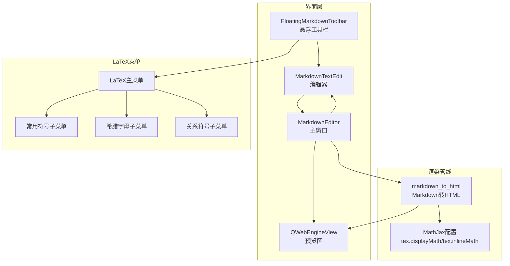
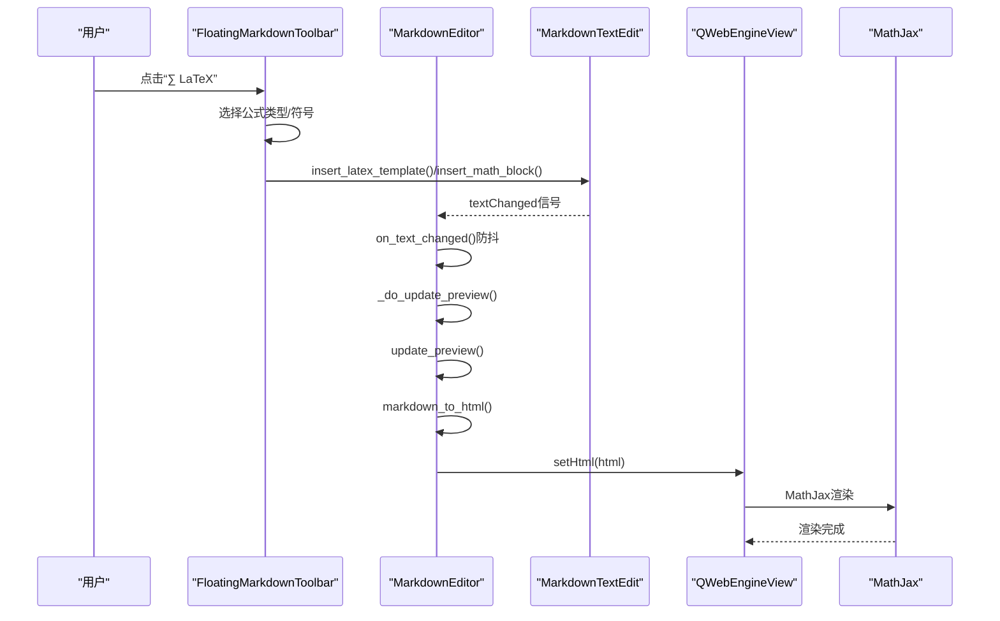
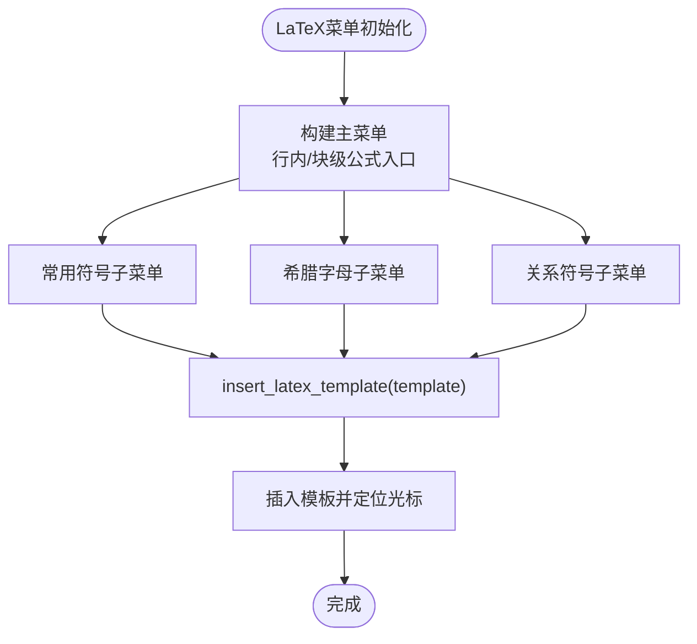
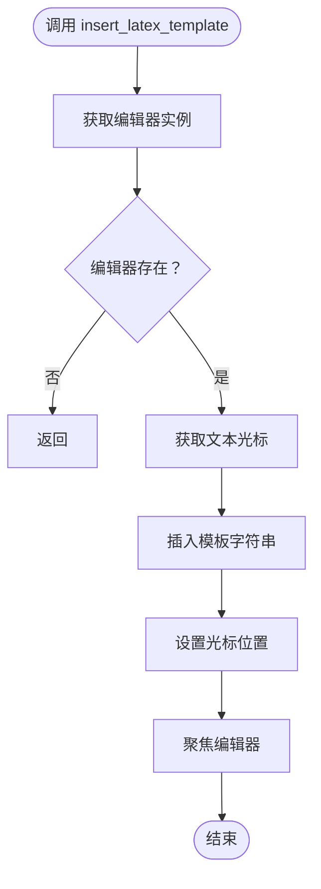
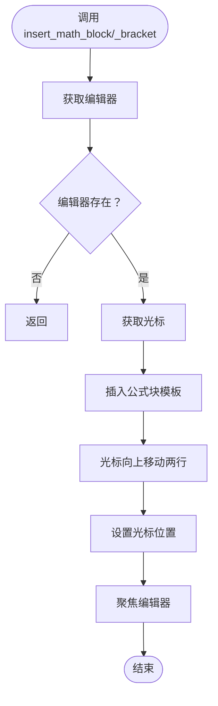
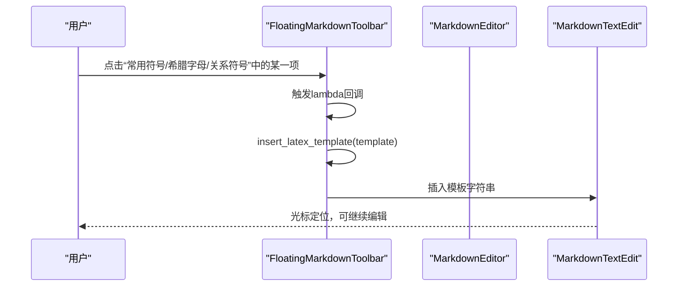
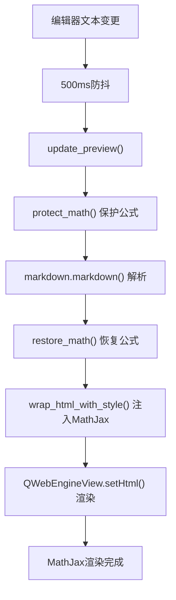
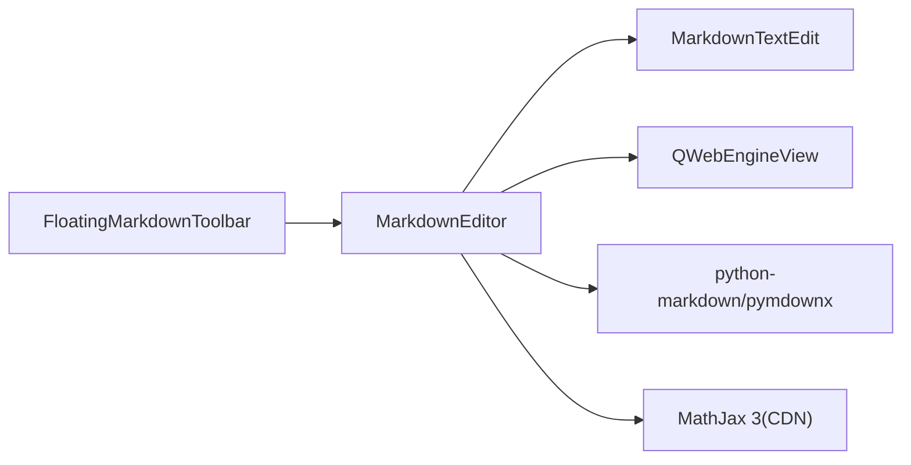

# LaTeX公式

<cite>
**本文引用的文件**
- [main.py](file://main.py)
- [structue_intro.txt](file://structue_intro.txt)
</cite>

## 目录
1. [简介](#简介)
2. [项目结构](#项目结构)
3. [核心组件](#核心组件)
4. [架构总览](#架构总览)
5. [详细组件分析](#详细组件分析)
6. [依赖分析](#依赖分析)
7. [性能考虑](#性能考虑)
8. [故障排查指南](#故障排查指南)
9. [结论](#结论)
10. [附录](#附录)

## 简介
本文件系统性解析悬浮工具栏中的LaTeX公式功能实现机制，围绕“∑ LaTeX”菜单展开，重点说明：
- 如何通过LaTeX菜单插入行内公式、公式块（$$ 和 \[...\]）以及各类数学符号；
- 结合 main.py 中 init_ui 方法内 latex_menu 的构建过程，分析公式类型主菜单与常用符号、希腊字母、关系符号等子菜单的层级结构；
- 深入阐述 insert_latex_template 作为核心处理函数，如何将预设的LaTeX模板插入到编辑器中；
- 解释 insert_math_block 与 insert_math_block_bracket 对公式块的特殊处理（包括换行与光标定位）；
- 说明符号模板（如 \sum、\alpha）的定义方式与用户选择交互流程；
- 解决公式语法正确性与预览显示问题，并提供添加新符号类别或数学模板的扩展方案。

## 项目结构
本项目的LaTeX公式功能主要由以下部分组成：
- 悬浮工具栏 FloatingMarkdownToolbar：负责LaTeX菜单的构建与交互；
- MarkdownEditor：负责预览渲染，包含Markdown到HTML的转换逻辑及MathJax配置；
- MarkdownHighlighter：负责Markdown语法高亮，其中包含数学公式高亮规则；
- 结构图概览与技术栈说明见文档结构说明。

图表来源
- [main.py](file://main.py#L1322-L1600)
- [main.py](file://main.py#L2197-L2405)
- [structue_intro.txt](file://structue_intro.txt#L28-L93)

章节来源
- [main.py](file://main.py#L1322-L1600)
- [main.py](file://main.py#L2197-L2405)
- [structue_intro.txt](file://structue_intro.txt#L28-L93)

## 核心组件
- 悬浮工具栏 FloatingMarkdownToolbar：在 init_ui 中构建“∑ LaTeX”菜单，包含公式类型、常用符号、希腊字母、关系符号等子菜单；提供 insert_latex_template、insert_math_block、insert_math_block_bracket 等插入方法。
- MarkdownEditor：维护标签页、编辑器与预览区，负责将编辑器内容转换为HTML并通过 QWebEngineView 实时预览；其 markdown_to_html 方法对LaTeX公式进行保护与恢复，并注入MathJax配置。
- MarkdownHighlighter：提供Markdown语法高亮，包含数学公式高亮规则，便于编辑时识别公式。

章节来源
- [main.py](file://main.py#L1322-L1600)
- [main.py](file://main.py#L2197-L2405)
- [main.py](file://main.py#L523-L648)

## 架构总览
LaTeX公式功能的端到端流程如下：
- 用户在悬浮工具栏中选择LaTeX菜单项；
- 工具栏调用相应的插入方法（insert_latex_template、insert_math_block、insert_math_block_bracket）；
- 编辑器内容变更触发预览更新；
- MarkdownEditor的markdown_to_html方法保护公式、解析Markdown、恢复公式，并注入MathJax配置；
- 预览区通过QWebEngineView加载HTML并渲染LaTeX。

图表来源
- [main.py](file://main.py#L1322-L1600)
- [main.py](file://main.py#L2173-L2208)
- [main.py](file://main.py#L2197-L2405)

## 详细组件分析

### 悬浮工具栏LaTeX菜单构建与交互
- 主菜单“∑ LaTeX”由 FloatingMarkdownToolbar.init_ui 构建，包含三类入口：
  - 行内公式：通过 insert_format 包裹插入；
  - 公式块：insert_math_block 插入 $$...$$，insert_math_block_bracket 插入 \[...\]；
- 子菜单：
  - 常用符号：包含求和、连乘、积分、根号、分数、上标、下标等模板；
  - 希腊字母：包含 α、β、γ、δ、ε、θ、λ、μ、π、σ、φ、ω 等模板；
  - 关系符号：包含 ≠、≈、≤、≥、≪、≫、∝、∞ 等模板；
- 所有符号均通过 insert_latex_template 将模板插入到编辑器光标处。

图表来源
- [main.py](file://main.py#L1515-L1572)

章节来源
- [main.py](file://main.py#L1515-L1572)

### insert_latex_template 核心处理函数
- 作用：将传入的LaTeX模板字符串插入到编辑器光标位置，并保持光标在插入后的位置，便于用户继续编辑。
- 关键点：
  - 获取当前编辑器与光标；
  - 使用光标插入文本；
  - 更新光标位置并聚焦编辑器。

图表来源
- [main.py](file://main.py#L1604-L1616)

章节来源
- [main.py](file://main.py#L1604-L1616)

### insert_math_block 与 insert_math_block_bracket 的特殊处理
- 两者均在插入公式块后，将光标移动到块内部的合适位置，便于用户直接输入公式内容。
- $$ 公式块：插入“\n$$\n\n$$\n”，然后向上移动两行，使光标位于两个$$之间；
- \[...\] 公式块：插入“\n\\[\n\n\\]\n”，同样向上移动两行，使光标位于方括号内部。

图表来源
- [main.py](file://main.py#L1813-L1835)

章节来源
- [main.py](file://main.py#L1813-L1835)

### 符号模板定义与用户选择交互
- 符号模板来源于三个子菜单的数据源：
  - 常用符号：包含求和、连乘、积分、根号、分数、上标、下标等；
  - 希腊字母：包含 α、β、γ、δ、ε、θ、λ、μ、π、σ、φ、ω 等；
  - 关系符号：包含 ≠、≈、≤、≥、≪、≫、∝、∞ 等；
- 用户点击任一符号动作时，触发 lambda 回调，将对应模板传入 insert_latex_template，从而完成插入。

图表来源
- [main.py](file://main.py#L1526-L1571)

章节来源
- [main.py](file://main.py#L1526-L1571)

### 预览与LaTeX渲染（语法正确性与显示）
- 预览更新流程：
  - 文本变更触发 on_text_changed，使用定时器防抖；
  - _do_update_preview 调用 update_preview；
  - update_preview 调用 markdown_to_html；
- 公式保护与恢复：
  - markdown_to_html 使用正则保护 $$、\[...\]、\(...\)、$...$ 等公式，避免被Markdown解析器破坏；
  - 解析完成后，再将占位符替换回原始公式；
- MathJax配置：
  - wrap_html_with_style 注入MathJax脚本与配置；
  - MathJax配置包含 inlineMath 与 displayMath，分别对应 $...$ 与 $$...$$、\[...\]；
  - 预览区启用JavaScript与远程资源访问，确保MathJax正常加载。

图表来源
- [main.py](file://main.py#L2173-L2208)
- [main.py](file://main.py#L2197-L2405)

章节来源
- [main.py](file://main.py#L2173-L2208)
- [main.py](file://main.py#L2197-L2405)

### 扩展方案：添加新符号类别或数学模板
- 新增符号类别：
  - 在 FloatingMarkdownToolbar.init_ui 中新增一个子菜单（addMenu），并将符号项逐个 addAction；
  - 为每个动作绑定 lambda 回调，调用 insert_latex_template(template)；
- 新增数学模板：
  - 若需要新增公式类型（例如新的块级公式形式），可在“公式类型”主菜单中添加新动作，并绑定新的插入方法（参考 insert_math_block 与 insert_math_block_bracket 的实现思路）；
  - 在 markdown_to_html 中相应增加保护与恢复逻辑，确保新模板被正确渲染。

章节来源
- [main.py](file://main.py#L1515-L1572)
- [main.py](file://main.py#L2197-L2405)

## 依赖分析
- 组件耦合关系：
  - FloatingMarkdownToolbar 依赖 MarkdownEditor 的编辑器实例与插入方法；
  - MarkdownEditor 依赖 QWebEngineView 进行预览渲染；
  - MarkdownEditor 依赖 markdown 与 pymdownx 扩展进行Markdown解析；
  - MarkdownEditor 依赖 MathJax 配置进行LaTeX渲染；
- 外部依赖：
  - MathJax 3 通过 CDN 加载；
  - Python-markdown 与 pymdownx 扩展；
  - PyQt6 GUI框架。

图表来源
- [main.py](file://main.py#L2197-L2405)
- [structue_intro.txt](file://structue_intro.txt#L73-L93)

章节来源
- [main.py](file://main.py#L2197-L2405)
- [structue_intro.txt](file://structue_intro.txt#L73-L93)

## 性能考虑
- 预览更新采用500ms防抖，减少频繁渲染带来的性能压力；
- 公式保护与恢复采用占位符策略，避免正则多次替换造成的开销；
- 预览区启用JavaScript与远程资源访问，确保MathJax加载顺畅；
- 建议：
  - 对超长文档，可进一步优化正则匹配范围；
  - 对复杂公式，尽量使用块级公式以提升渲染稳定性。

[本节为通用建议，无需列出具体文件来源]

## 故障排查指南
- 公式未显示或显示异常：
  - 检查预览区是否启用JavaScript与远程资源访问；
  - 确认MathJax配置是否正确注入；
  - 检查公式是否被正确保护与恢复。
- 公式语法错误：
  - 确保使用正确的LaTeX语法（如 \sum、\alpha、\neq 等）；
  - 行内公式使用 $...$，块级公式使用 $$...$$ 或 \[...\]；
  - 避免在公式中混用Markdown语法导致解析冲突。
- 插入后光标位置不正确：
  - 确认 insert_math_block 与 insert_math_block_bracket 是否正确移动光标；
  - 确认 insert_latex_template 是否更新了光标位置。

章节来源
- [main.py](file://main.py#L2197-L2405)
- [main.py](file://main.py#L1813-L1835)
- [main.py](file://main.py#L1604-L1616)

## 结论
本实现通过悬浮工具栏提供直观的LaTeX公式插入体验，结合编辑器的实时预览与MathJax渲染，实现了良好的公式语法正确性与可视化反馈。核心在于：
- 以 insert_latex_template 为核心插入函数，统一处理模板插入与光标定位；
- 以 insert_math_block 与 insert_math_block_bracket 处理块级公式的特殊布局与光标移动；
- 以 markdown_to_html 的公式保护与恢复机制，保证LaTeX语法在Markdown解析过程中不被破坏；
- 通过MathJax配置实现行内与块级公式的稳定渲染。

[本节为总结，无需列出具体文件来源]

## 附录
- 相关文件与路径：
  - 悬浮工具栏LaTeX菜单构建：[main.py](file://main.py#L1515-L1572)
  - 核心插入函数 insert_latex_template：[main.py](file://main.py#L1604-L1616)
  - 块级公式插入 insert_math_block / insert_math_block_bracket：[main.py](file://main.py#L1813-L1835)
  - 预览与LaTeX渲染 markdown_to_html / wrap_html_with_style：[main.py](file://main.py#L2197-L2405)
  - Markdown语法高亮（含数学公式高亮）：[main.py](file://main.py#L523-L648)
  - 文档结构与技术栈说明：[structue_intro.txt](file://structue_intro.txt#L28-L93)