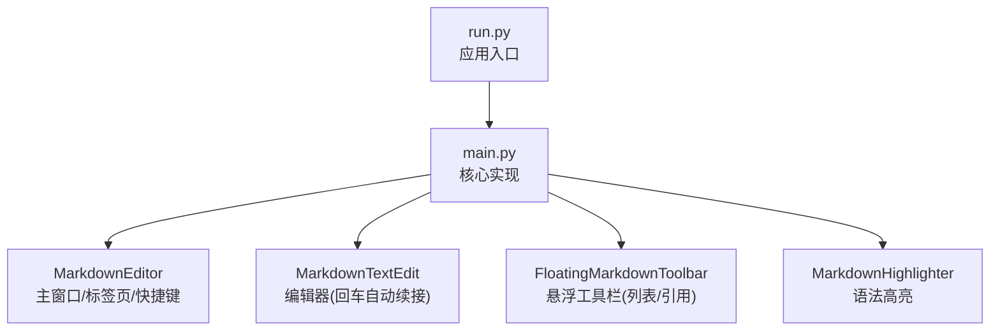
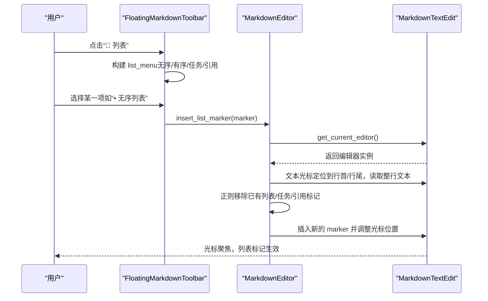
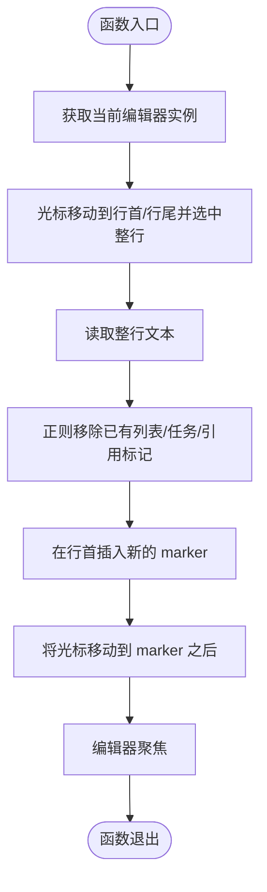
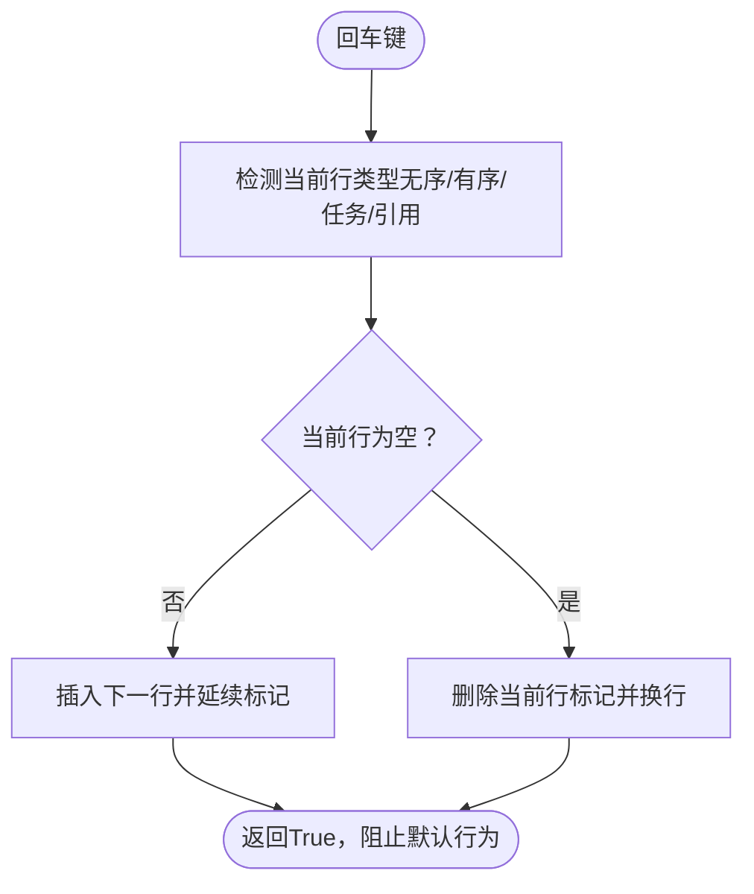
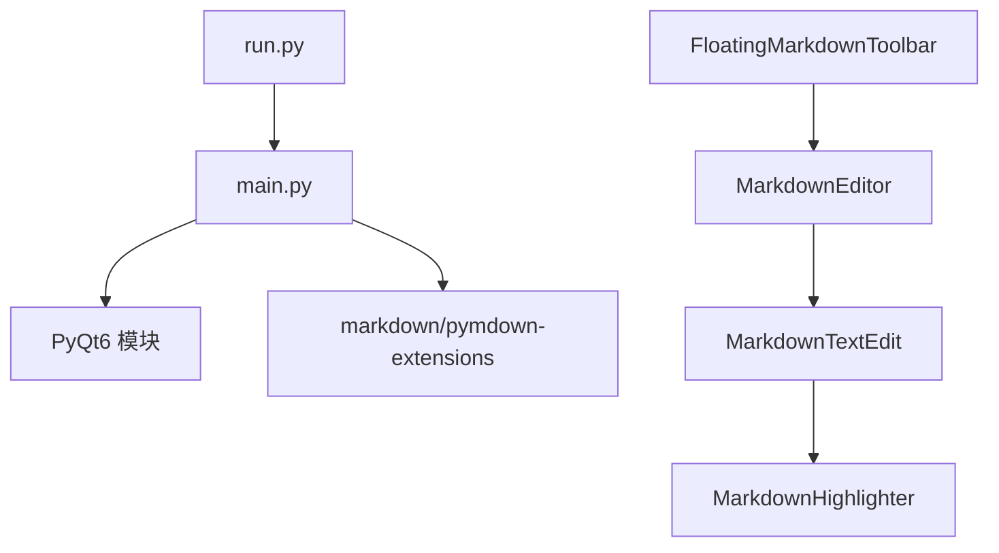

# 列表引用

<cite>
**本文引用的文件**
- [main.py](file://main.py)
- [run.py](file://run.py)
- [requirements.txt](file://requirements.txt)
- [structue_intro.txt](file://structue_intro.txt)
</cite>

## 目录
1. [简介](#简介)
2. [项目结构](#项目结构)
3. [核心组件](#核心组件)
4. [架构总览](#架构总览)
5. [详细组件分析](#详细组件分析)
6. [依赖关系分析](#依赖关系分析)
7. [性能考量](#性能考量)
8. [故障排查指南](#故障排查指南)
9. [结论](#结论)
10. [附录](#附录)

## 简介
本文件围绕“悬浮工具栏中的列表引用”功能展开，目标是：
- 解释如何通过“📝 列表”菜单插入无序列表、有序列表、任务列表以及各级引用。
- 基于 main.py 中 FloatingMarkdownToolbar 的 init_ui 方法，梳理 list_menu 的构建过程、列表标记（如 -、1.、- [ ]）的定义与事件绑定机制。
- 深入解析 insert_list_marker 方法如何获取当前编辑器实例、操作文本光标并智能处理已有列表标记的替换逻辑。
- 说明菜单中分隔符的布局作用与用户操作流程。
- 解决列表缩进处理、引用层级控制等常见问题，并提供自定义列表样式或添加新列表类型的扩展指南。

## 项目结构
- 应用入口与运行方式：通过 run.py 启动主程序；requirements.txt 定义依赖；structue_intro.txt 提供整体结构说明。
- 核心实现集中在 main.py，其中包含：
  - Markdown 编辑器与语法高亮（MarkdownTextEdit、MarkdownHighlighter）
  - 悬浮工具栏（FloatingMarkdownToolbar）
  - 主窗口与标签页管理（MarkdownEditor）

图表来源
- [run.py](file://run.py#L1-L11)
- [main.py](file://main.py#L1861-L2398)
- [structue_intro.txt](file://structue_intro.txt#L28-L75)

章节来源
- [run.py](file://run.py#L1-L11)
- [requirements.txt](file://requirements.txt#L1-L5)
- [structue_intro.txt](file://structue_intro.txt#L28-L75)

## 核心组件
- 悬浮工具栏 FloatingMarkdownToolbar
  - 负责构建“📝 列表”菜单，包含无序列表、有序列表、任务列表、各级引用等项。
  - 通过 insert_list_marker 统一插入/替换列表标记。
- MarkdownEditor
  - 提供快捷键支持（如 Ctrl+L 插入无序列表、Ctrl+Shift+L 插入有序列表）。
  - 管理悬浮工具栏显示与位置更新。
- MarkdownTextEdit
  - 处理回车键的列表自动续接，支持无序列表、有序列表、任务列表与引用的延续与结束。

章节来源
- [main.py](file://main.py#L1322-L1730)
- [main.py](file://main.py#L1861-L2398)

## 架构总览
悬浮工具栏与编辑器之间的交互如下：

图表来源
- [main.py](file://main.py#L1466-L1492)
- [main.py](file://main.py#L1710-L1729)
- [main.py](file://main.py#L2127-L2131)

## 详细组件分析

### 列表引用菜单构建与事件绑定
- “📝 列表”菜单由 FloatingMarkdownToolbar.init_ui 构建，包含：
  - 列表项：无序列表（- ）、有序列表（1. ）、任务列表（- [ ] ）、已完成（- [x] ）
  - 引用项：一级（> ）、二级（>> ）、三级（>>> ）
- 每个菜单项通过 QAction 触发，绑定到 insert_list_marker(marker)。该方法负责统一处理插入与替换逻辑。

章节来源
- [main.py](file://main.py#L1466-L1492)

### insert_list_marker 的工作原理
- 获取当前编辑器：通过 get_editor() 从父组件 MarkdownEditor 获取当前标签页的编辑器实例。
- 光标定位与读取：将光标移动到当前行首与行尾，选中整行文本，读取 line_text。
- 标记替换：使用正则表达式移除已有列表/任务/引用标记，然后在行首插入新的 marker。
- 光标调整：插入完成后，将光标移动到 marker 之后，保持编辑器聚焦，便于继续输入。

图表来源
- [main.py](file://main.py#L1710-L1729)

章节来源
- [main.py](file://main.py#L1628-L1633)
- [main.py](file://main.py#L1710-L1729)

### MarkdownTextEdit 的回车自动续接
- 当用户在无序列表、有序列表、任务列表或引用行回车时，handle_list_continuation 会：
  - 识别当前行是否为上述类型；
  - 若当前行为空，则结束该列表/引用；
  - 若当前行非空，则插入下一行并自动延续标记（如有序列表自动编号、任务列表默认未完成、引用延续层级）。

图表来源
- [main.py](file://main.py#L730-L825)

章节来源
- [main.py](file://main.py#L730-L825)

### 分隔符的布局作用与用户操作流程
- 列表菜单中的分隔符用于视觉分组，将“列表项”与“引用项”清晰分开，提升可读性与易用性。
- 用户操作流程：
  1) 在编辑器中定位到需要插入列表/引用的行；
  2) 按下 Ctrl+M 或点击“✨ Markdown工具”唤出悬浮工具栏；
  3) 点击“📝 列表”，在弹出菜单中选择所需类型；
  4) insert_list_marker 执行插入/替换，光标自动定位到标记后，继续输入内容。

章节来源
- [main.py](file://main.py#L1466-L1492)
- [main.py](file://main.py#L2578-L2590)

### 常见问题与解决方案
- 列表缩进处理
  - insert_list_marker 仅对当前行首进行标记替换，不修改缩进。若需缩进，请在插入后手动调整或在后续输入中使用 Tab/Shift+Tab。
- 引用层级控制
  - 引用标记以“>”数量表示层级。insert_list_marker 会保留现有缩进，仅替换引用标记。若要提升/降低层级，可在插入后调整“>”数量或使用编辑器的缩进功能。
- 已有标记的智能替换
  - insert_list_marker 使用正则一次性移除已有列表/任务/引用标记，确保同一行仅保留一个最新标记，避免重复标记叠加。

章节来源
- [main.py](file://main.py#L1710-L1729)

### 扩展指南：自定义列表样式与新增类型
- 新增列表类型
  - 在 FloatingMarkdownToolbar.init_ui 的 list_menu 中添加新的 QAction，并绑定到 insert_list_marker(marker)。
  - 确保 marker 符合 Markdown 语法（如 - 、1. 、- [ ] 、> ）。
- 自定义样式
  - 若希望改变列表/引用的渲染样式，可在 MarkdownEditor.markdown_to_html 的 HTML 样式段落中调整相关 CSS（如 ul/li、blockquote 等）。
- 自动续接扩展
  - 如需支持更多类型（例如带编号的嵌套列表、自定义任务列表图标），可在 MarkdownTextEdit.handle_list_continuation 中增加相应正则与分支逻辑。

章节来源
- [main.py](file://main.py#L1466-L1492)
- [main.py](file://main.py#L730-L825)
- [main.py](file://main.py#L2210-L2398)

## 依赖关系分析
- 模块依赖
  - run.py 依赖 main.py 的 main 函数入口。
  - main.py 内部依赖 PyQt6（QApplication、QMainWindow、QTextEdit、QWebEngineView 等）与 markdown/pymdown-extensions。
- 组件耦合
  - FloatingMarkdownToolbar 依赖 MarkdownEditor 获取当前编辑器实例。
  - MarkdownEditor 依赖 MarkdownTextEdit 的光标事件与文本变更事件，以控制悬浮工具栏的显示与位置。
  - MarkdownHighlighter 依赖正则表达式对列表/引用进行高亮。

图表来源
- [run.py](file://run.py#L1-L11)
- [requirements.txt](file://requirements.txt#L1-L5)
- [main.py](file://main.py#L1861-L2398)

章节来源
- [run.py](file://run.py#L1-L11)
- [requirements.txt](file://requirements.txt#L1-L5)
- [main.py](file://main.py#L1861-L2398)

## 性能考量
- 预览渲染防抖：MarkdownEditor 对文本变更采用 500ms 定时器延迟更新，减少频繁渲染带来的性能压力。
- 列表自动续接：仅在回车键触发时进行正则匹配与插入，逻辑简单，开销较低。
- 悬浮工具栏显示：通过光标位置计算与屏幕边界检查，避免过度重绘。

章节来源
- [main.py](file://main.py#L2173-L2191)
- [main.py](file://main.py#L1634-L1668)

## 故障排查指南
- 悬浮工具栏未显示
  - 确认已启用“Ctrl+M”或设置的悬浮工具栏快捷键。
  - 检查 MarkdownEditor 是否正确创建并显示悬浮工具栏。
- 列表标记未生效
  - 确认当前光标位于需要插入的行首。
  - 检查 insert_list_marker 是否被调用（可通过日志或断点验证）。
- 回车未自动续接
  - 确认当前行符合无序/有序/任务/引用的正则模式。
  - 检查 MarkdownTextEdit 的 keyPressEvent 是否被拦截（Tab 行为已被覆盖）。

章节来源
- [main.py](file://main.py#L1982-L1985)
- [main.py](file://main.py#L2578-L2590)
- [main.py](file://main.py#L653-L667)
- [main.py](file://main.py#L730-L825)

## 结论
- 悬浮工具栏的“📝 列表”菜单通过统一的 insert_list_marker 实现了对无序列表、有序列表、任务列表与各级引用的一致化插入与替换。
- MarkdownTextEdit 的回车自动续接进一步提升了列表/引用的编写效率。
- 通过正则与光标操作，系统实现了对已有标记的智能替换与光标精确定位，保证用户体验流畅。
- 若需扩展，可在悬浮工具栏菜单与编辑器逻辑中按需增加新类型与样式。

## 附录
- 快捷键参考
  - Ctrl+L：插入无序列表
  - Ctrl+Shift+L：插入有序列表
  - Ctrl+Q：插入引用
  - Ctrl+M：显示/隐藏悬浮工具栏

章节来源
- [main.py](file://main.py#L1931-L1985)