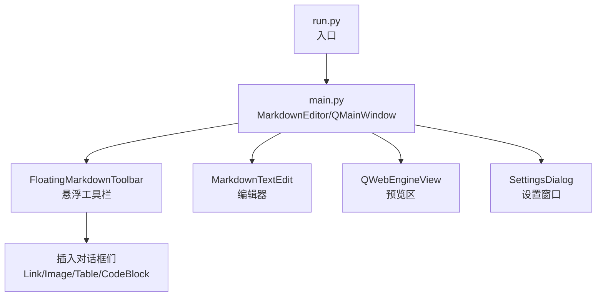
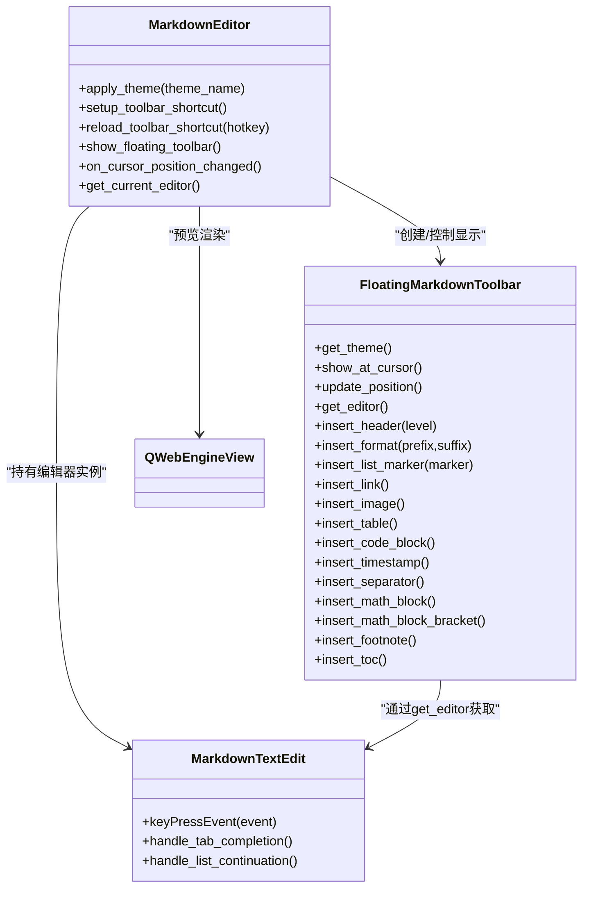
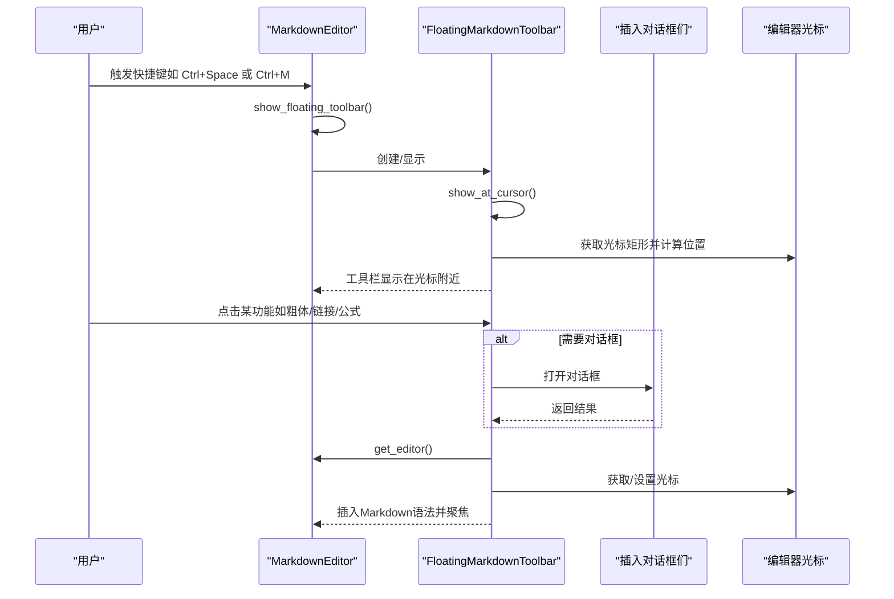
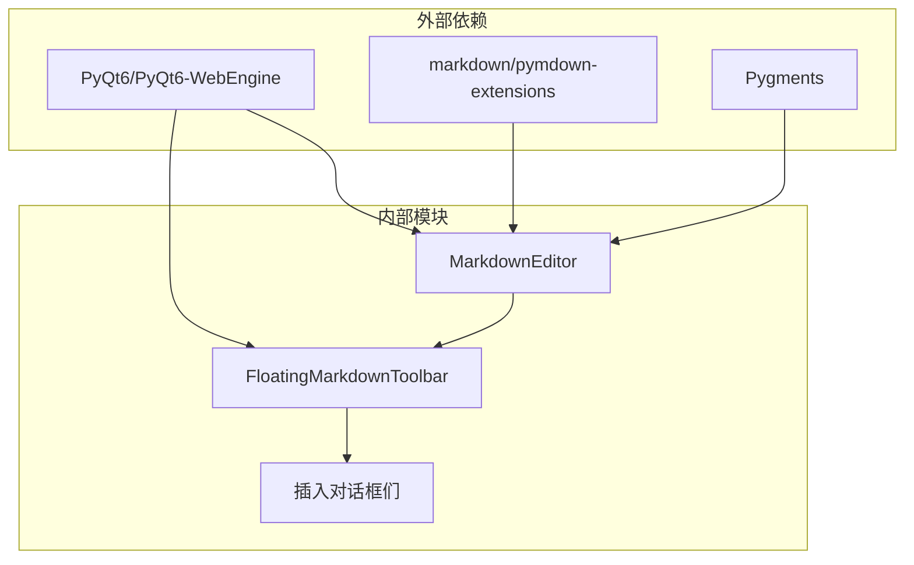

# 悬浮工具栏

<cite>
**本文引用的文件**
- [main.py](file://main.py)
- [requirements.txt](file://requirements.txt)
- [run.py](file://run.py)
- [structue_intro.txt](file://structue_intro.txt)
</cite>

## 目录
1. [简介](#简介)
2. [项目结构](#项目结构)
3. [核心组件](#核心组件)
4. [架构总览](#架构总览)
5. [详细组件分析](#详细组件分析)
6. [依赖关系分析](#依赖关系分析)
7. [性能考量](#性能考量)
8. [故障排查指南](#故障排查指南)
9. [结论](#结论)
10. [附录](#附录)

## 简介
本节面向“悬浮工具栏（FloatingMarkdownToolbar）”的全面解析，重点说明其通过快捷键（如 Ctrl+Space、Ctrl+M）唤出的方式，以及四大功能模块（基础格式、列表引用、插入元素、LaTeX 公式）的组织方式。结合 main.py 中 FloatingMarkdownToolbar 类的实现，详细描述其折叠菜单式 UI 设计、透明背景、不获取焦点等特性；解释工具栏如何通过 get_editor 方法获取当前编辑器实例，并调用 insert_header、insert_format 等方法插入 Markdown 语法；涵盖工具栏的定位逻辑（show_at_cursor 方法）和主题适配（get_theme 方法）。最后给出解决位置偏移、快捷键冲突等问题的建议，并提供添加新功能按钮的扩展指南。

## 项目结构
- 项目入口与主程序：
  - 入口文件：run.py
  - 主程序：main.py（包含 MarkdownEditor、FloatingMarkdownToolbar、主题系统、设置对话框、插入对话框等）
- 依赖与运行：
  - requirements.txt：PyQt6、PyQt6-WebEngine、markdown、Pygments、pymdown-extensions
- 架构说明：
  - structue_intro.txt 对核心类结构、辅助类、数据流与技术栈进行了概览性说明，有助于理解悬浮工具栏在整个应用中的角色。

图表来源
- [run.py](file://run.py#L1-L11)
- [main.py](file://main.py#L1861-L2895)
- [structue_intro.txt](file://structue_intro.txt#L1-L93)

章节来源
- [run.py](file://run.py#L1-L11)
- [requirements.txt](file://requirements.txt#L1-L5)
- [structue_intro.txt](file://structue_intro.txt#L1-L93)

## 核心组件
- 悬浮工具栏（FloatingMarkdownToolbar）
  - 折叠菜单式 UI：四个主菜单（基础、列表、插入、LaTeX），每个菜单下进一步细分子菜单或动作项。
  - 特性：透明背景、不接受焦点、显示时不激活目标控件。
  - 主题适配：根据当前主题动态生成样式，支持黑夜/白天两种风格。
  - 定位逻辑：基于当前编辑器光标位置计算显示坐标，自动避障（屏幕边缘检测与回退策略）。
  - 功能入口：提供 insert_header、insert_format、insert_list_marker、insert_link、insert_image、insert_table、insert_code_block、insert_timestamp、insert_separator、insert_math_block、insert_math_block_bracket、insert_footnote、insert_toc 等方法。
- MarkdownEditor（主窗口）
  - 快捷键系统：包括 Ctrl+Space、Ctrl+M 等用于显示/隐藏悬浮工具栏。
  - 自动显示/隐藏：可配置“光标在编辑区时自动显示悬浮工具栏”，并配合事件过滤器实现。
  - 预览与渲染：将 Markdown 转 HTML 并通过 QWebEngineView 实时预览，支持 MathJax 渲染公式。
  - 工具栏快捷键重载：从设置中读取并动态绑定悬浮工具栏快捷键。

章节来源
- [main.py](file://main.py#L1322-L1860)
- [main.py](file://main.py#L1861-L2895)

## 架构总览
悬浮工具栏与主窗口、编辑器、预览区的关系如下：

图表来源
- [main.py](file://main.py#L1322-L1860)
- [main.py](file://main.py#L1861-L2895)

## 详细组件分析

### 悬浮工具栏（FloatingMarkdownToolbar）类
- 折叠菜单式 UI 设计
  - 四个主菜单按钮：基础、列表、插入、LaTeX，均采用 InstantPopup 模式，菜单项通过 addAction 添加，触发时调用相应插入方法。
  - 基础格式：标题（H1-H6）、粗体、斜体、删除线、高亮、行内代码等。
  - 列表引用：无序/有序/任务列表，以及多级引用（>、>>、>>>）。
  - 插入元素：链接、图片、表格、代码块、分割线、时间戳、脚注、目录等。
  - LaTeX 公式：行内公式、块级公式（$$、\[...\]）、常用符号、希腊字母、关系符号等。
- 透明背景与不获取焦点
  - 通过窗口属性设置实现：透明背景、不接受焦点、显示时不激活目标控件。
  - 菜单按钮与菜单项均设置为不获取焦点，确保工具栏不会抢夺编辑器焦点。
- 主题适配（get_theme）
  - 优先从父编辑器获取当前主题，否则回退至默认深色主题。
  - 根据主题名称生成不同颜色方案（背景、按钮、菜单、悬停等），保证在黑夜/白天模式下视觉一致。
- 定位逻辑（show_at_cursor）
  - 基于编辑器光标矩形计算全局坐标，工具栏显示在光标下方，左侧对齐。
  - 屏幕边界检测：若右侧溢出则左移，若下方溢出则显示在光标上方，同时限制最小坐标，避免超出屏幕。
  - 显示后提升到顶层，保证覆盖其他控件。
- 功能实现要点
  - get_editor：通过父编辑器的 get_current_editor 获取当前编辑器实例，避免直接依赖全局状态。
  - insert_header：移除已有标题标记后插入新的标题语法，保持行首对齐。
  - insert_format：根据是否选中文本决定包裹逻辑，未选中时插入占位符并回退光标到中间。
  - insert_list_marker：移除已有列表/任务/引用标记后插入新的标记，保持行首对齐。
  - 插入对话框：链接、图片、表格、代码块通过独立对话框收集参数，再插入到编辑器。
  - update_position：光标变化时自动更新工具栏位置，保持与光标同步。

图表来源
- [main.py](file://main.py#L1322-L1860)
- [main.py](file://main.py#L1861-L2895)

章节来源
- [main.py](file://main.py#L1322-L1860)

### 快捷键与自动显示机制
- 快捷键
  - Ctrl+Space：默认显示/隐藏悬浮工具栏（来自设置窗口的热键配置）。
  - Ctrl+M：备用快捷键，用于显示/隐藏悬浮工具栏。
- 自动显示/隐藏
  - 可在设置中开启“光标在编辑区时自动显示悬浮工具栏”。
  - 通过事件过滤器监听编辑器焦点变化，焦点进入时显示，焦点离开时延时隐藏，避免误关闭。

章节来源
- [main.py](file://main.py#L1861-L2895)
- [main.py](file://main.py#L160-L210)

### 位置偏移与避障策略
- 偏移原因
  - 编辑器滚动、窗口大小变化、多显示器、缩放比例差异等。
- 解决策略
  - show_at_cursor 中使用屏幕几何信息进行边界检测，自动调整 X/Y 坐标，避免超出屏幕。
  - 若下方溢出，自动切换到光标上方显示，确保工具栏始终可见。
  - 光标变化时调用 update_position，持续跟随光标移动。

章节来源
- [main.py](file://main.py#L1634-L1673)

### 主题适配与样式
- get_theme：从父编辑器读取当前主题，若不可用则回退到默认深色主题。
- 样式生成：根据主题动态生成背景、按钮、菜单、悬停等颜色，保证在黑夜/白天模式下一致体验。
- 透明背景：通过窗口属性设置，使工具栏在预览区上方呈现半透明效果。

章节来源
- [main.py](file://main.py#L23-L158)
- [main.py](file://main.py#L1335-L1433)

### 功能模块详解
- 基础格式
  - 标题：H1-H6，自动清理已有标题标记，插入新的标题语法。
  - 文本格式：粗体、斜体、删除线、高亮、行内代码，支持选中文本包裹与占位符回退。
- 列表引用
  - 无序/有序/任务列表，支持多级引用（>、>>、>>>），自动清理已有标记。
- 插入元素
  - 链接：弹出对话框，支持选中文本作为默认链接文本。
  - 图片：弹出对话框，支持本地文件与网络链接。
  - 表格：弹出对话框，设置行列数与是否包含表头。
  - 代码块：弹出对话框，选择语言，插入代码块并移动光标到内部。
  - 其他：分割线、时间戳、脚注、目录。
- LaTeX 公式
  - 行内公式、块级公式（$$、\[...\]）。
  - 常用符号、希腊字母、关系符号等模板，一键插入占位符。

章节来源
- [main.py](file://main.py#L1440-L1573)
- [main.py](file://main.py#L1604-L1860)

## 依赖关系分析
- 外部依赖
  - PyQt6/PyQt6-WebEngine：GUI 与 Web 预览。
  - markdown/pymdown-extensions：Markdown 解析与扩展。
  - Pygments：语法高亮（在高亮器中使用）。
- 内部依赖
  - MarkdownEditor 持有 FloatingMarkdownToolbar 实例，负责快捷键绑定与显示控制。
  - FloatingMarkdownToolbar 通过 get_editor 获取当前编辑器，避免耦合全局状态。
  - 插入对话框与工具栏解耦，通过对话框返回值插入编辑器。

图表来源
- [requirements.txt](file://requirements.txt#L1-L5)
- [main.py](file://main.py#L1861-L2895)

章节来源
- [requirements.txt](file://requirements.txt#L1-L5)
- [main.py](file://main.py#L1861-L2895)

## 性能考量
- 工具栏显示/隐藏
  - 通过事件过滤器与延时隐藏，避免频繁切换导致的闪烁与资源消耗。
- 预览渲染
  - 文本变更采用定时器防抖（约 500ms），减少预览更新频率，提高整体流畅度。
- 插入操作
  - 插入对话框在后台收集参数，插入时一次性写入，避免多次光标移动带来的性能损耗。

章节来源
- [main.py](file://main.py#L2173-L2208)
- [main.py](file://main.py#L2822-L2860)

## 故障排查指南
- 快捷键无效
  - 检查设置窗口中的“显示/隐藏快捷键”是否正确保存，确认已调用 reload_toolbar_shortcut 生效。
  - 确认未与其他系统或第三方软件冲突（例如某些输入法或全局快捷键工具）。
- 工具栏位置异常
  - 确认多显示器缩放比例一致；工具栏已内置边界检测与回退策略，若仍异常，尝试手动移动窗口或重启应用。
- 工具栏遮挡编辑器
  - 工具栏设置为不接受焦点且显示时不激活目标控件，若仍出现焦点问题，检查父编辑器的焦点策略或临时隐藏工具栏。
- 插入对话框无法输入
  - 确认对话框样式已根据主题正确应用；若界面颜色过浅导致可视性差，可在设置中切换主题。
- LaTeX 公式不渲染
  - 预览区依赖 MathJax，需网络访问；若离线或网络受限，预览可能不显示公式，可在联网后刷新页面。

章节来源
- [main.py](file://main.py#L160-L210)
- [main.py](file://main.py#L1634-L1673)
- [main.py](file://main.py#L2209-L2375)

## 结论
FloatingMarkdownToolbar 通过折叠菜单式 UI、透明背景与不获取焦点的设计，实现了对编辑器的低侵入式增强。其定位逻辑与主题适配保障了在不同环境下的一致体验；四大功能模块覆盖了 Markdown 的常见需求。结合 MarkdownEditor 的快捷键与自动显示机制，用户可以高效地在光标附近快速插入所需语法。对于位置偏移与快捷键冲突等问题，可通过设置重载与边界检测策略进行缓解。扩展新功能时，遵循现有插入方法的模式（get_editor、插入占位符、聚焦）与对话框交互方式，可快速集成更多元素。

## 附录

### 快捷键与功能对照
- Ctrl+Space：显示/隐藏悬浮工具栏（默认）
- Ctrl+M：显示/隐藏悬浮工具栏（备用）
- Ctrl+B：粗体
- Ctrl+I：斜体
- Ctrl+K：插入链接
- Ctrl+`：行内代码
- Ctrl+Shift+K：插入代码块
- Ctrl+Q：插入引用
- Ctrl+L：插入无序列表
- Ctrl+Shift+L：插入有序列表
- Ctrl+D：删除线
- Ctrl+H：高亮
- Ctrl+1~6：标题1~6

章节来源
- [main.py](file://main.py#L1931-L2001)
- [main.py](file://main.py#L2650-L2811)

### 扩展指南：添加新功能按钮
- 在 FloatingMarkdownToolbar 的 init_ui 中：
  - 为“插入元素”或“LaTeX”菜单新增一个动作项，绑定到新方法。
  - 新方法中调用 get_editor 获取编辑器，插入语法或打开对话框，最后设置焦点。
- 在 MarkdownEditor 中：
  - 如需快捷键，可在 setup_shortcuts 中添加 QShortcut，并绑定到插入方法。
  - 如需自动显示/隐藏联动，可结合事件过滤器与 show_floating_toolbar。
- 注意事项：
  - 保持不获取焦点的 UI 策略，避免影响编辑器输入。
  - 使用占位符与光标回退逻辑，提升用户体验。
  - 主题适配：在样式中统一使用 Theme 提供的颜色变量，确保黑夜/白天一致。

章节来源
- [main.py](file://main.py#L1322-L1860)
- [main.py](file://main.py#L1861-L2895)