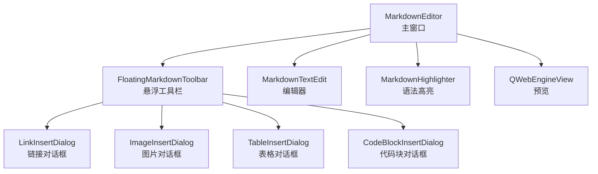
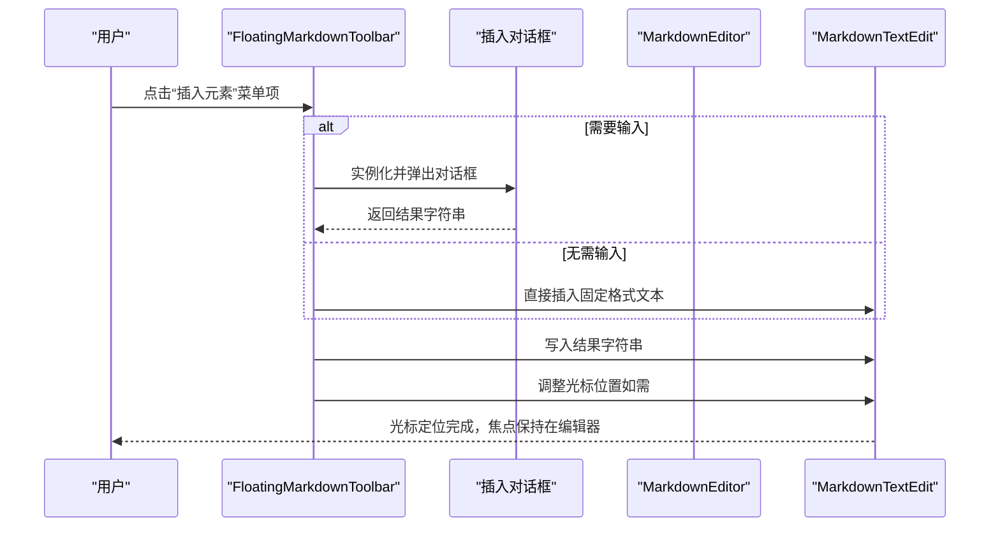
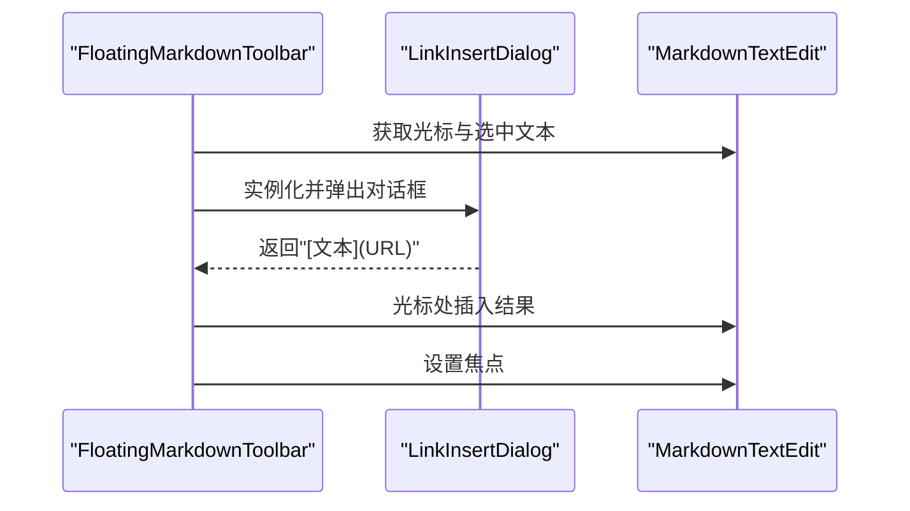
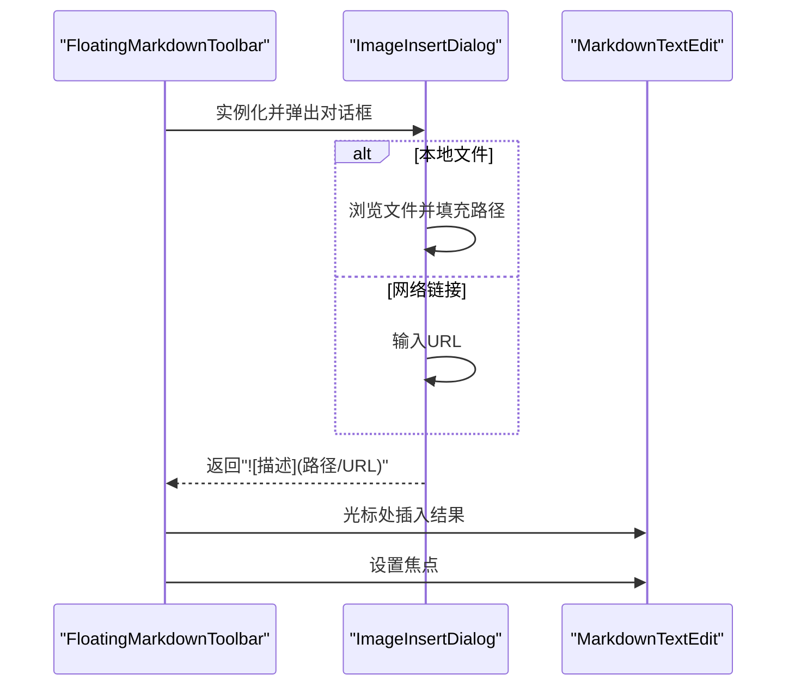
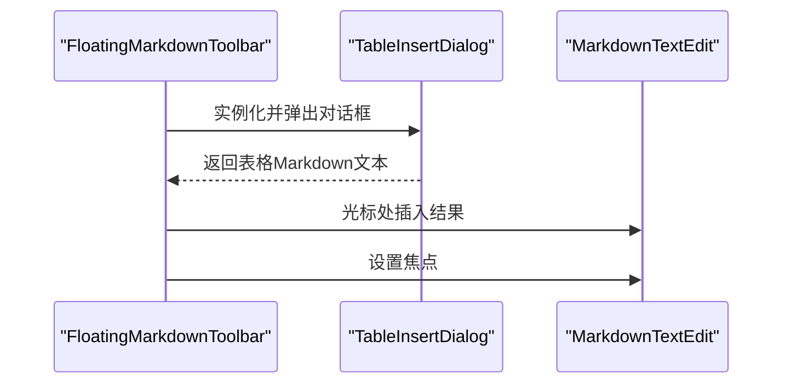
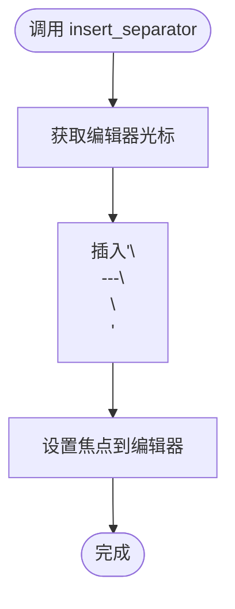
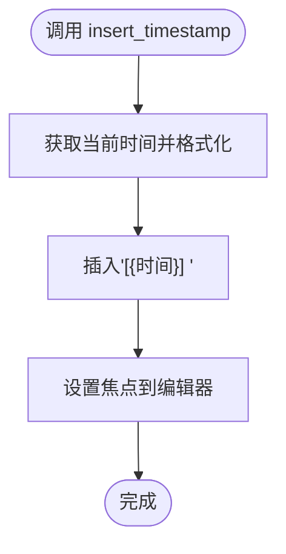
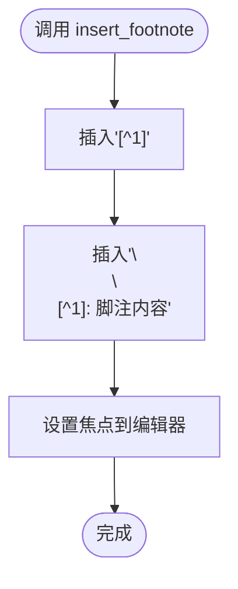
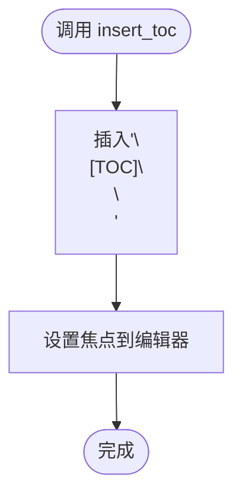
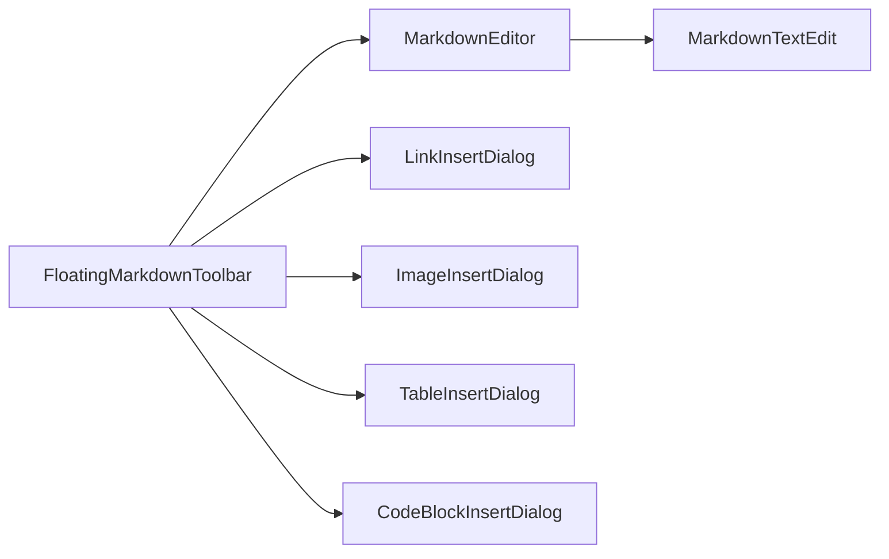

# 插入元素

<cite>
**本文引用的文件**
- [main.py](file://main.py)
</cite>

## 目录
1. [简介](#简介)
2. [项目结构](#项目结构)
3. [核心组件](#核心组件)
4. [架构总览](#架构总览)
5. [详细组件分析](#详细组件分析)
6. [依赖关系分析](#依赖关系分析)
7. [性能考量](#性能考量)
8. [故障排查指南](#故障排查指南)
9. [结论](#结论)
10. [附录](#附录)

## 简介
本节聚焦“悬浮工具栏”中“插入元素”菜单的完整实现，围绕“➕ 插入”菜单项展开，系统说明如何通过该菜单插入链接、图片、表格、代码块、分割线、时间戳、脚注和目录等 Markdown 元素。文档将结合 main.py 中 FloatingMarkdownToolbar 的 init_ui 方法内 insert_menu 的创建逻辑，阐述每个插入功能对应的对话框类（如 LinkInsertDialog、ImageInsertDialog、TableInsertDialog、CodeBlockInsertDialog）的调用流程；详解 insert_link、insert_image、insert_table 等方法如何实例化相应对话框并处理用户输入结果；解释 insert_timestamp 和 insert_separator 等无需对话框的操作实现方式；并覆盖插入后光标定位的用户体验优化（例如 insert_code_block 中将光标移至代码块内部）。同时给出扩展新插入元素类型的实践建议。

## 项目结构
- 本项目采用单文件主程序结构，核心逻辑集中在 main.py 中，包括：
  - 主窗口与标签页管理：MarkdownEditor 类
  - 悬浮工具栏：FloatingMarkdownToolbar 类
  - 插入对话框：LinkInsertDialog、ImageInsertDialog、TableInsertDialog、CodeBlockInsertDialog
  - 主题与样式：Theme 类
  - 编辑器增强：MarkdownTextEdit 类（支持列表自动接续、Tab 补全等）
  - 预览与渲染：Markdown 到 HTML 的转换与 MathJax 渲染



图表来源
- [main.py](file://main.py#L1322-L1860)
- [main.py](file://main.py#L1861-L2590)
- [main.py](file://main.py#L2590-L2924)

章节来源
- [main.py](file://main.py#L1322-L1860)
- [main.py](file://main.py#L1861-L2590)
- [main.py](file://main.py#L2590-L2924)

## 核心组件
- 悬浮工具栏（FloatingMarkdownToolbar）
  - 负责创建“插入元素”菜单（insert_menu），并将菜单项与具体插入方法绑定（insert_link、insert_image、insert_table、insert_code_block、insert_hr、insert_timestamp、insert_footnote、insert_toc）。
  - 提供 show_at_cursor 机制，使工具栏在光标附近显示，并根据屏幕边界自动调整位置。
- 插入对话框（Dialog）
  - LinkInsertDialog：用于插入链接，支持“链接文本”和“链接地址”的输入。
  - ImageInsertDialog：用于插入图片，支持“本地文件”和“网络链接”两种来源，提供文件选择与路径输入。
  - TableInsertDialog：用于插入表格，支持行数、列数与是否包含表头的选择。
  - CodeBlockInsertDialog：用于插入代码块，支持选择编程语言。
- 主窗口（MarkdownEditor）
  - 提供 insert_markdown、insert_markdown_wrapper 等通用插入与包裹方法，以及 show_floating_toolbar 控制悬浮工具栏显示。
  - 维护标签页、预览、快捷键、主题等全局状态。

章节来源
- [main.py](file://main.py#L1322-L1860)
- [main.py](file://main.py#L1861-L2590)
- [main.py](file://main.py#L2590-L2924)

## 架构总览
“插入元素”菜单的调用链路如下：
- 用户点击“悬浮工具栏 ➕ 插入”菜单项
- 对应的插入方法（如 insert_link）被触发
- 若需要用户输入（链接、图片、表格、代码块），则弹出相应对话框
- 对话框返回结果字符串，插入方法将结果写入编辑器光标处
- 对于无需对话框的元素（时间戳、分割线、脚注、目录），直接在光标处插入固定格式文本
- 插入完成后，适当移动光标以优化用户体验（如将光标置于代码块内部）



图表来源
- [main.py](file://main.py#L1494-L1513)
- [main.py](file://main.py#L1731-L1791)
- [main.py](file://main.py#L1792-L1812)
- [main.py](file://main.py#L1837-L1859)
- [main.py](file://main.py#L2567-L2577)

## 详细组件分析

### 悬浮工具栏“插入元素”菜单
- 菜单创建逻辑
  - 在 FloatingMarkdownToolbar.init_ui 中，通过 _create_menu_button 与 _create_menu 创建“插入元素”按钮与菜单。
  - insert_menu 中逐项添加“链接”“图片”“表格”“代码块”“分割线”“时间戳”“脚注”“目录”，并将每个菜单项与对应插入方法绑定。
- 调用流程
  - 当用户点击某菜单项时，触发绑定的方法（如 insert_link），由该方法负责后续的对话框弹出与结果写入。

章节来源
- [main.py](file://main.py#L1494-L1513)

### 链接插入（insert_link）
- 功能要点
  - 获取当前编辑器与光标，若存在选中文本则默认作为链接文本。
  - 实例化 LinkInsertDialog，传入选中文本作为默认值。
  - 对话框返回形如“[文本](URL)”的结果字符串，插入到光标处。
  - 保持焦点在编辑器上。
- 对话框交互
  - LinkInsertDialog 提供“链接文本”和“链接地址”输入框，点击“插入”后返回结果字符串。
- 光标定位
  - 由于链接插入为一次性文本写入，无需额外光标移动。



图表来源
- [main.py](file://main.py#L1731-L1747)
- [main.py](file://main.py#L1118-L1217)

章节来源
- [main.py](file://main.py#L1731-L1747)
- [main.py](file://main.py#L1118-L1217)

### 图片插入（insert_image）
- 功能要点
  - 实例化 ImageInsertDialog，支持“本地文件”和“网络链接”两种来源。
  - 本地来源通过文件对话框选择图片路径；网络来源直接输入 URL。
  - 对话框返回形如“”的结果字符串，插入到光标处。
- 文件路径处理
  - 本地来源使用 QFileDialog.getOpenFileName 获取绝对路径，确保路径可用。
- 光标定位
  - 与链接类似，插入后保持焦点在编辑器。



图表来源
- [main.py](file://main.py#L1748-L1761)
- [main.py](file://main.py#L828-L982)

章节来源
- [main.py](file://main.py#L1748-L1761)
- [main.py](file://main.py#L828-L982)

### 表格插入（insert_table）
- 功能要点
  - 实例化 TableInsertDialog，支持设置行数、列数与是否包含表头。
  - 对话框生成符合 Markdown 规范的表格文本（含表头与分隔行），插入到光标处。
- 表格生成逻辑
  - 若勾选“包含表头”，先输出表头行与分隔行，再输出数据行。
  - 若不包含表头，直接输出数据行。
- 光标定位
  - 插入后保持焦点在编辑器。



图表来源
- [main.py](file://main.py#L1762-L1775)
- [main.py](file://main.py#L983-L1117)

章节来源
- [main.py](file://main.py#L1762-L1775)
- [main.py](file://main.py#L983-L1117)

### 代码块插入（insert_code_block）
- 功能要点
  - 实例化 CodeBlockInsertDialog，支持选择编程语言（或“（无）”）。
  - 对话框返回形如“```语言\n\n```\n”的结果字符串，插入到光标处。
- 光标定位优化
  - 插入后将光标向上移动两行，使光标位于两个反引号之间，便于用户直接输入代码内容。
- 光标移动逻辑
  - 使用 QTextCursor 的 MoveOperation.Up 并指定行数，随后 setTextCursor 重新定位。

```mermaid
sequenceDiagram
participant FTB as "FloatingMarkdownToolbar"
participant CBLD as "CodeBlockInsertDialog"
participant E as "MarkdownTextEdit"
FTB->>CBLD : 实例化并弹出对话框
CBLD-->>FTB : 返回"
```语言\n\n```\n"
    FTB->>E: 光标处插入结果
    FTB->>E: 光标向上移动两行
    FTB->>E: 设置焦点
```

图表来源
- [main.py](file://main.py#L1776-L1791)
- [main.py](file://main.py#L1218-L1321)

章节来源
- [main.py](file://main.py#L1776-L1791)
- [main.py](file://main.py#L1218-L1321)

### 分割线插入（insert_separator）
- 功能要点
  - 无需对话框，直接在光标处插入“---”并前后添加换行，形成标准 Markdown 分割线。
- 实现方式
  - 使用 QTextCursor.insertText 写入固定文本，随后设置焦点。



图表来源
- [main.py](file://main.py#L1803-L1812)

章节来源
- [main.py](file://main.py#L1803-L1812)

### 时间戳插入（insert_timestamp）
- 功能要点
  - 无需对话框，使用当前系统时间生成“YYYY-MM-DD HH:MM:SS”格式的时间戳文本，并在末尾追加一个空格，便于后续输入。
- 实现方式
  - 使用 datetime.now().strftime 格式化时间，插入到光标处并设置焦点。



图表来源
- [main.py](file://main.py#L1792-L1802)

章节来源
- [main.py](file://main.py#L1792-L1802)

### 脚注插入（insert_footnote）
- 功能要点
  - 无需对话框，插入“[^1]”引用与“[^1]: 脚注内容”两段文本，便于用户继续编辑脚注内容。
- 实现方式
  - 使用 QTextCursor.insertText 写入固定文本，随后设置焦点。



图表来源
- [main.py](file://main.py#L1837-L1848)

章节来源
- [main.py](file://main.py#L1837-L1848)

### 目录插入（insert_toc）
- 功能要点
  - 无需对话框，插入“[TOC]”并前后添加换行，用于生成目录。
- 实现方式
  - 使用 QTextCursor.insertText 写入固定文本，随后设置焦点。



图表来源
- [main.py](file://main.py#L1849-L1859)

章节来源
- [main.py](file://main.py#L1849-L1859)

### 对话框类一览与职责
- LinkInsertDialog
  - 负责链接文本与链接地址的输入，返回“[文本](URL)”格式字符串。
- ImageInsertDialog
  - 负责图片描述与来源（本地/URL）选择，返回“”格式字符串。
- TableInsertDialog
  - 负责行数、列数与表头选项，返回完整的表格 Markdown 文本。
- CodeBlockInsertDialog
  - 负责编程语言选择，返回“```语言\n\n```\n”格式字符串。

章节来源
- [main.py](file://main.py#L828-L982)
- [main.py](file://main.py#L983-L1117)
- [main.py](file://main.py#L1118-L1217)
- [main.py](file://main.py#L1218-L1321)

## 依赖关系分析
- 组件耦合
  - FloatingMarkdownToolbar 依赖 MarkdownEditor 获取当前编辑器与光标上下文。
  - 插入对话框依赖父编辑器传递的主题与当前编辑器实例，以便统一样式与回填结果。
- 调用链
  - “插入元素”菜单项 -> 对应插入方法 -> 对话框（可选）-> 结果字符串 -> 写入编辑器 -> 光标定位 -> 焦点保持
- 可能的循环依赖
  - 无直接循环依赖，FloatingMarkdownToolbar 与对话框之间为单向调用关系。



图表来源
- [main.py](file://main.py#L1322-L1860)
- [main.py](file://main.py#L1861-L2590)

章节来源
- [main.py](file://main.py#L1322-L1860)
- [main.py](file://main.py#L1861-L2590)

## 性能考量
- 对话框弹出成本低，插入操作为轻量文本写入，整体性能开销较小。
- 预览渲染采用延迟更新策略（定时器），避免频繁重绘导致卡顿，但插入元素本身不触发预览更新。
- 建议
  - 对于大量表格或长代码块，尽量在插入后立即编辑，减少不必要的预览刷新。
  - 保持对话框输入字段的最小化交互，避免额外计算。

[本节为通用指导，不涉及具体文件分析]

## 故障排查指南
- 插入后光标未定位到预期位置
  - 代码块插入会自动将光标移至代码块内部，若未生效，请检查插入方法中的光标移动逻辑。
  - 参考路径：[main.py](file://main.py#L1776-L1791)
- 本地图片路径无法识别
  - 确认通过文件对话框正确选择了图片路径；若手动输入路径，请确保为绝对路径且文件存在。
  - 参考路径：[main.py](file://main.py#L967-L975)
- 链接对话框未返回结果
  - 确认点击了“插入”而非“取消”；检查对话框的 get_result 是否被正确调用。
  - 参考路径：[main.py](file://main.py#L1118-L1217)
- 分割线/脚注/目录插入无效
  - 确认插入方法被正确触发；检查 QTextCursor.insertText 的调用与焦点设置。
  - 参考路径：[main.py](file://main.py#L1803-L1812), [main.py](file://main.py#L1837-L1848), [main.py](file://main.py#L1849-L1859)

章节来源
- [main.py](file://main.py#L1776-L1791)
- [main.py](file://main.py#L967-L975)
- [main.py](file://main.py#L1118-L1217)
- [main.py](file://main.py#L1803-L1812)
- [main.py](file://main.py#L1837-L1848)
- [main.py](file://main.py#L1849-L1859)

## 结论
“悬浮工具栏”中的“插入元素”菜单通过清晰的菜单绑定与对话框协作，实现了对常见 Markdown 元素的一站式插入体验。对于需要用户输入的元素（链接、图片、表格、代码块），采用对话框收集参数并生成规范化的 Markdown 字符串；对于无需输入的元素（时间戳、分割线、脚注、目录），直接在光标处写入固定格式文本。在用户体验方面，代码块插入特别优化了光标定位，提升后续编辑效率。整体架构简洁、职责明确，易于扩展新的插入元素类型。

[本节为总结性内容，不涉及具体文件分析]

## 附录

### 扩展新插入元素类型的步骤
- 新增插入方法
  - 在 FloatingMarkdownToolbar 中新增 insert_xxx 方法，负责：
    - 获取当前编辑器与光标
    - 如需用户输入，实例化对话框并处理返回结果
    - 直接写入固定格式文本（如需）
    - 适当移动光标并设置焦点
  - 参考现有方法路径：
    - [main.py](file://main.py#L1731-L1747) 链接
    - [main.py](file://main.py#L1748-L1761) 图片
    - [main.py](file://main.py#L1762-L1775) 表格
    - [main.py](file://main.py#L1776-L1791) 代码块
    - [main.py](file://main.py#L1792-L1802) 时间戳
    - [main.py](file://main.py#L1803-L1812) 分割线
    - [main.py](file://main.py#L1837-L1848) 脚注
    - [main.py](file://main.py#L1849-L1859) 目录
- 新增对话框类（如需）
  - 在 main.py 中新增 Dialog 类，实现 init_ui 与 get_result，遵循现有对话框的样式与交互模式。
  - 参考现有对话框路径：
    - [main.py](file://main.py#L828-L982) 图片
    - [main.py](file://main.py#L983-L1117) 表格
    - [main.py](file://main.py#L1118-L1217) 链接
    - [main.py](file://main.py#L1218-L1321) 代码块
- 注册菜单项
  - 在 FloatingMarkdownToolbar.init_ui 的 insert_menu 中添加新菜单项，并绑定到新增的 insert_xxx 方法。
  - 参考路径：[main.py](file://main.py#L1494-L1513)
- 验证与优化
  - 在插入后验证光标定位与焦点状态
  - 如需，补充快捷键或右键菜单入口
  - 参考现有快捷键与菜单注册路径：
    - [main.py](file://main.py#L1931-L2001) 快捷键
    - [main.py](file://main.py#L2090-L2107) 主工具栏按钮
    - [main.py](file://main.py#L2590-L2624) 右键菜单