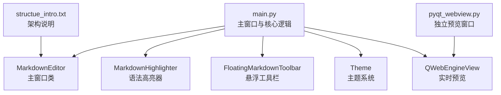
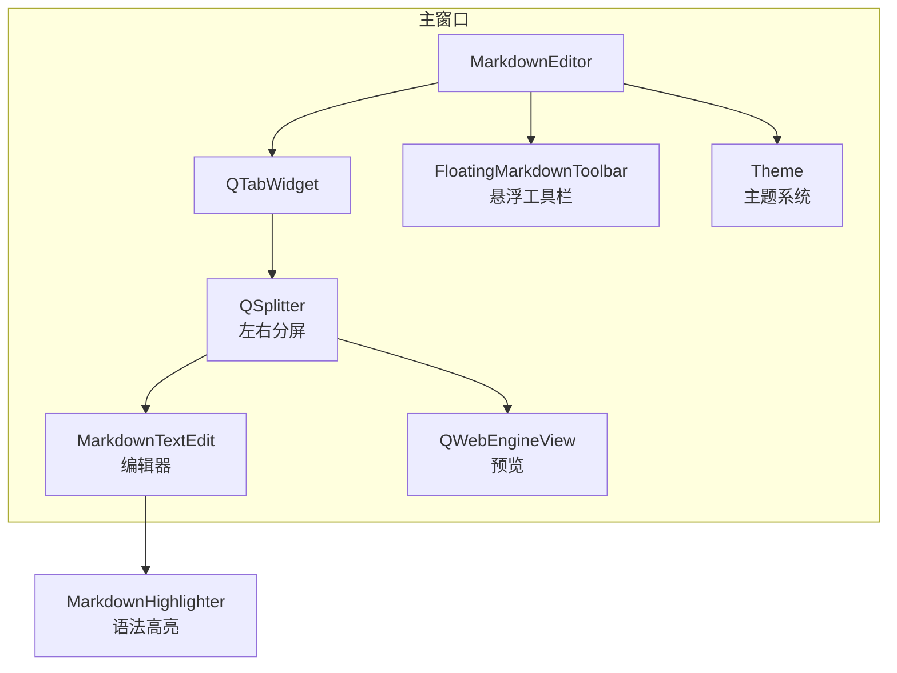
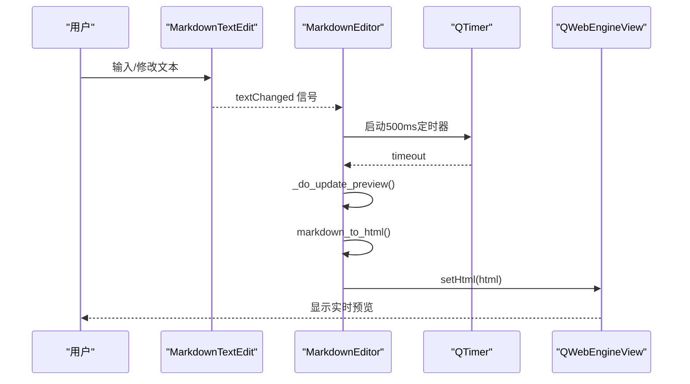
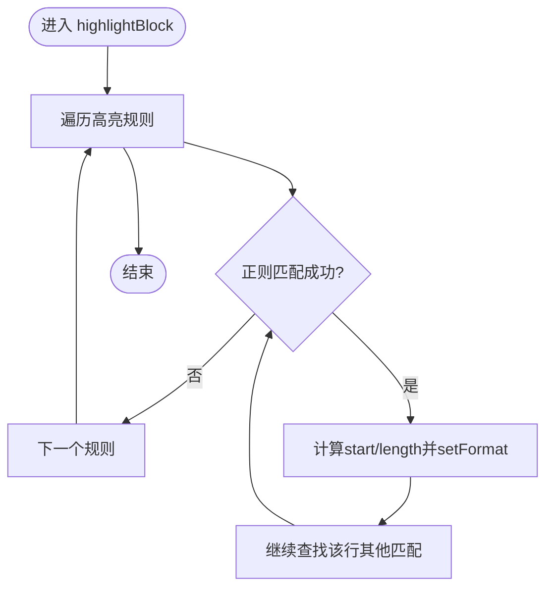
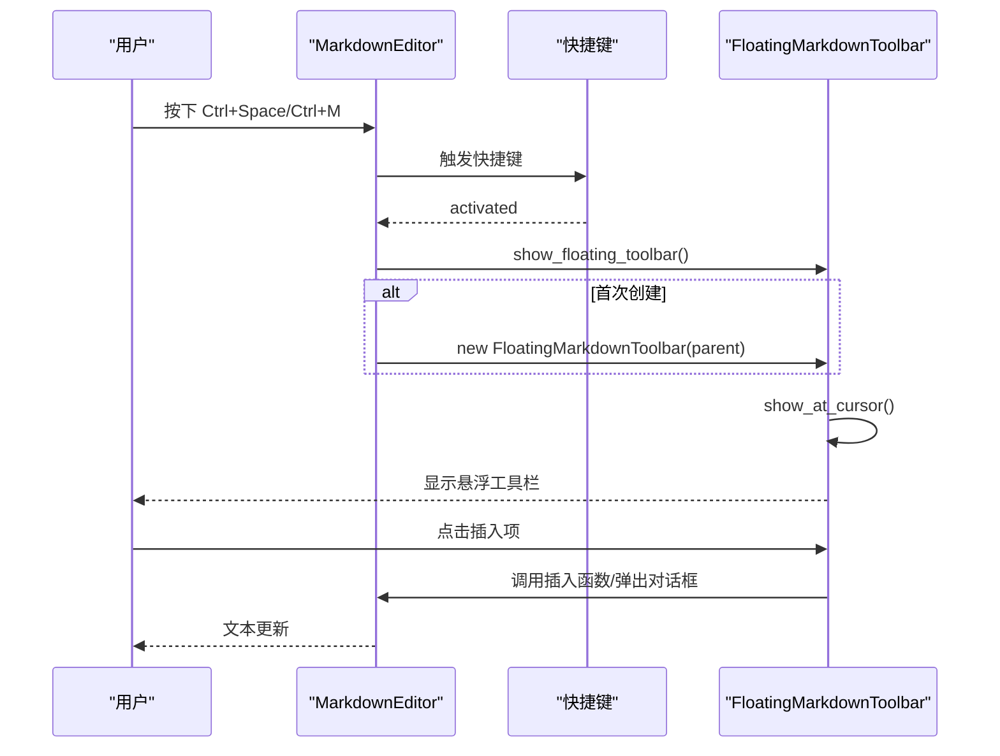
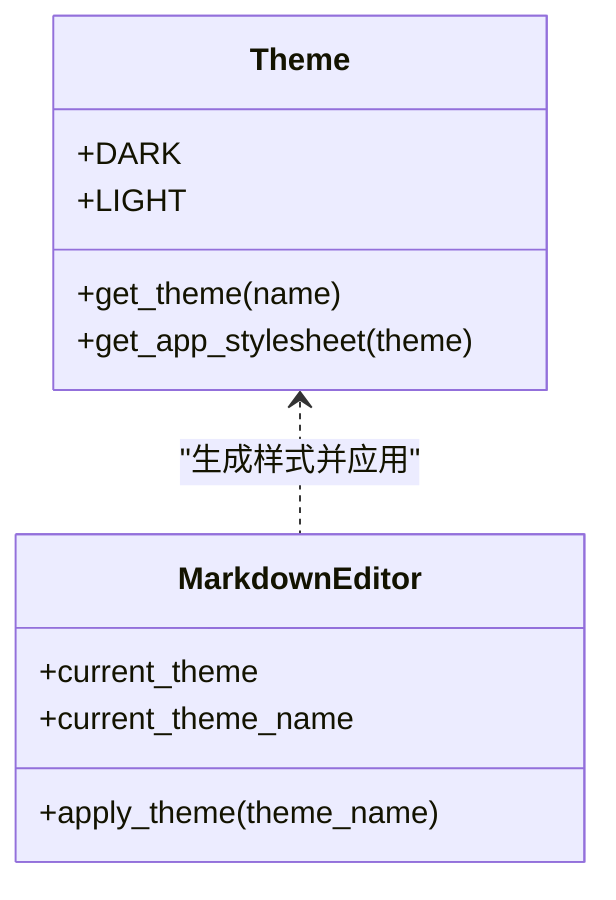
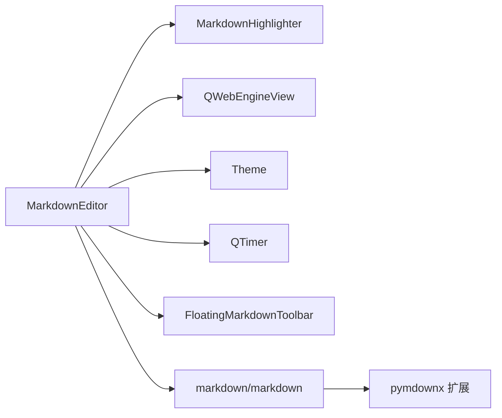

# 核心功能

<cite>
**本文引用的文件**
- [main.py](file://main.py)
- [pyqt_webview.py](file://pyqt_webview.py)
- [structue_intro.txt](file://structue_intro.txt)
</cite>

## 目录
1. [引言](#引言)
2. [项目结构](#项目结构)
3. [核心组件](#核心组件)
4. [架构总览](#架构总览)
5. [详细组件分析](#详细组件分析)
6. [依赖关系分析](#依赖关系分析)
7. [性能考量](#性能考量)
8. [故障排查指南](#故障排查指南)
9. [结论](#结论)

## 引言
本文件围绕编辑器的四大核心功能进行深入说明：实时预览、语法高亮、悬浮工具栏、主题切换。文档结合代码实现路径，解释各功能的架构设计、数据流与控制流程，并给出可视化图示以便读者快速理解。

## 项目结构
- 主程序入口与核心逻辑集中在 main.py，负责窗口、标签页、实时预览、语法高亮、悬浮工具栏、主题切换等。
- 预览窗口独立模块 pyqt_webview.py 提供独立的 QWebEngineView 预览窗口能力（用于对比理解，本项目主窗口内也集成 QWebEngineView）。
- 结构说明文档 structue_intro.txt 对技术栈与预览渲染链路进行了概览。

图表来源
- [main.py](file://main.py#L1861-L2895)
- [pyqt_webview.py](file://pyqt_webview.py#L1-L242)
- [structue_intro.txt](file://structue_intro.txt#L28-L40)

章节来源
- [main.py](file://main.py#L1-L200)
- [pyqt_webview.py](file://pyqt_webview.py#L1-L120)
- [structue_intro.txt](file://structue_intro.txt#L28-L40)

## 核心组件
- 实时预览：基于 QWebEngineView 的左右分屏布局，采用 500ms 防抖延迟渲染策略，平衡性能与响应性。
- 语法高亮：MarkdownHighlighter 通过正则表达式匹配与 QSyntaxHighlighter 实现标题、粗体、斜体、代码块、链接、列表、引用、删除线、高亮、分割线、数学公式、脚注、目录、上下标、表格、粗斜体等元素的视觉增强。
- 悬浮工具栏：FloatingMarkdownToolbar 通过快捷键（如 Ctrl+Space、Ctrl+M）唤出，支持插入链接、图片、表格、代码块、LaTeX 公式、分割线、时间戳、脚注、目录等。
- 主题切换：Theme 类管理黑夜/白天模式的样式表，动态应用到整个 UI。

章节来源
- [main.py](file://main.py#L23-L158)
- [main.py](file://main.py#L522-L648)
- [main.py](file://main.py#L1322-L1860)
- [main.py](file://main.py#L1861-L2199)

## 架构总览
编辑器采用“标签页 + 左右分屏”的布局：左侧为 Markdown 编辑器，右侧为 QWebEngineView 实时预览；编辑器内置语法高亮；悬浮工具栏提供快速插入；主题系统统一管理样式。

图表来源
- [main.py](file://main.py#L1861-L2199)
- [main.py](file://main.py#L522-L648)
- [main.py](file://main.py#L1322-L1860)
- [main.py](file://main.py#L23-L158)

## 详细组件分析

### 实时预览（基于 QWebEngineView）
- 左右分屏布局：每个标签页使用 QSplitter 水平分割，左侧为 MarkdownTextEdit，右侧为 QWebEngineView。
- Markdown 到 HTML 转换：使用 markdown 库与扩展（extra、codehilite、toc、pymdownx.tilde、pymdownx.caret、pymdownx.mark），并对数学公式进行保护/恢复，确保渲染正确。
- HTML 包装与样式：wrap_html_with_style 统一注入字体、段落、标题、代码、表格、引用、链接、图片、MathJax 配置等。
- 防抖延迟渲染：on_text_changed 使用单次触发的 QTimer，500ms 后执行 _do_update_preview，合并高频变更，降低渲染压力。
- 初始内容：get_initial_html 提供空白占位页面。

图表来源
- [main.py](file://main.py#L2173-L2191)
- [main.py](file://main.py#L2196-L2208)
- [main.py](file://main.py#L2209-L2376)

章节来源
- [main.py](file://main.py#L2112-L2163)
- [main.py](file://main.py#L2173-L2191)
- [main.py](file://main.py#L2196-L2208)
- [main.py](file://main.py#L2209-L2376)

### 语法高亮（MarkdownHighlighter）
- 继承 QSyntaxHighlighter，逐文本块匹配正则，对标题、粗体、斜体、行内代码、代码块、链接、列表、引用、删除线、高亮、分割线、数学公式、公式块、脚注、目录、上下标、表格、粗斜体等进行着色。
- highlightBlock 遍历规则列表，对每个匹配区间调用 setFormat 应用 QTextCharFormat。

图表来源
- [main.py](file://main.py#L522-L648)

章节来源
- [main.py](file://main.py#L522-L648)

### 悬浮工具栏（FloatingMarkdownToolbar）
- 快捷键唤出：默认 Ctrl+Space，支持在设置中重置为其他快捷键；另支持 Ctrl+M。
- 自动显示/隐藏：可通过设置启用“光标在编辑区时自动显示”，配合事件过滤器在焦点进入/离开时显示/隐藏。
- 位置跟随：根据编辑器光标位置计算工具栏坐标，考虑屏幕边界，避免溢出。
- 功能覆盖：基础格式（标题、粗体、斜体、删除线、高亮、行内代码）、列表/引用、插入（链接、图片、表格、代码块、分割线、时间戳、脚注、目录）、LaTeX 公式（行内、块级、常用符号与希腊字母、关系符号）。
- 对话框辅助：链接、图片、表格、代码块插入均使用对话框生成模板，提升易用性。

图表来源
- [main.py](file://main.py#L1986-L2001)
- [main.py](file://main.py#L2549-L2560)
- [main.py](file://main.py#L1634-L1668)
- [main.py](file://main.py#L1731-L1791)
- [main.py](file://main.py#L1792-L1859)

章节来源
- [main.py](file://main.py#L1986-L2001)
- [main.py](file://main.py#L2549-L2560)
- [main.py](file://main.py#L1634-L1668)
- [main.py](file://main.py#L1731-L1791)
- [main.py](file://main.py#L1792-L1859)

### 主题切换（Theme）
- 主题常量：Dark/Light 两套配色字典，包含背景、文本、强调色、边框、编辑器背景/文本、工具栏背景、状态栏背景/文本等。
- 应用样式：Theme.get_app_stylesheet 生成整站样式表，MarkdownEditor.apply_theme 将样式应用到主窗口。
- 设置联动：SettingsDialog 中可切换主题并保存，MarkdownEditor 接收通知后立即应用。

图表来源
- [main.py](file://main.py#L23-L158)
- [main.py](file://main.py#L1924-L1930)

章节来源
- [main.py](file://main.py#L23-L158)
- [main.py](file://main.py#L1924-L1930)

## 依赖关系分析
- MarkdownEditor 依赖：
  - QWebEngineView：用于实时预览。
  - MarkdownHighlighter：用于语法高亮。
  - FloatingMarkdownToolbar：用于悬浮工具栏。
  - Theme：用于主题样式。
  - QTimer：用于预览防抖。
- 预览渲染链路：
  - MarkdownEditor.markdown_to_html 负责保护/恢复数学公式、调用 markdown 库与扩展生成 HTML。
  - wrap_html_with_style 注入样式与 MathJax 配置，最终 setHtml 渲染到 QWebEngineView。

图表来源
- [main.py](file://main.py#L1861-L2376)
- [main.py](file://main.py#L522-L648)
- [main.py](file://main.py#L1322-L1860)
- [main.py](file://main.py#L23-L158)

章节来源
- [main.py](file://main.py#L1861-L2376)
- [main.py](file://main.py#L522-L648)
- [main.py](file://main.py#L1322-L1860)
- [main.py](file://main.py#L23-L158)

## 性能考量
- 预览防抖：on_text_changed 使用单次触发的 QTimer，500ms 合并多次变更，显著降低 QWebEngineView setHtml 调用频率，平衡流畅度与资源占用。
- 正则高亮：MarkdownHighlighter 遍历规则列表，逐行匹配；规则数量有限且正则相对简单，对大文档仍保持较好性能。
- 事件驱动：编辑器通过信号槽连接，避免轮询，提高响应效率。
- 建议：对于超长文档，可进一步考虑增量渲染或分段高亮策略（当前实现已满足大多数场景）。

章节来源
- [main.py](file://main.py#L2173-L2191)
- [main.py](file://main.py#L522-L648)

## 故障排查指南
- 预览不更新或卡顿
  - 检查是否频繁触发 on_text_changed 导致渲染堆积；确认 500ms 防抖生效。
  - 章节来源
    - [main.py](file://main.py#L2173-L2191)
- 数学公式渲染异常
  - 确认 markdown_to_html 中保护/恢复流程未被破坏；检查 wrap_html_with_style 是否包含 MathJax 脚本。
  - 章节来源
    - [main.py](file://main.py#L2209-L2376)
- 悬浮工具栏无法显示/定位异常
  - 检查快捷键设置是否正确；确认 show_at_cursor 的边界检测逻辑是否被覆盖。
  - 章节来源
    - [main.py](file://main.py#L1986-L2001)
    - [main.py](file://main.py#L1634-L1668)
- 主题切换无效
  - 确认 apply_theme 是否被调用；检查 Theme.get_app_stylesheet 输出是否正确。
  - 章节来源
    - [main.py](file://main.py#L1924-L1930)
    - [main.py](file://main.py#L23-L158)

## 结论
本编辑器通过清晰的模块划分与合理的架构设计，实现了高性能的实时预览、直观的语法高亮、便捷的悬浮工具栏以及灵活的主题切换。预览防抖策略有效平衡了性能与响应性；语法高亮覆盖广泛 Markdown 元素；悬浮工具栏提供丰富的插入能力；主题系统统一管理样式，整体体验良好。建议在超长文档场景下进一步优化渲染策略，以获得更佳性能表现。