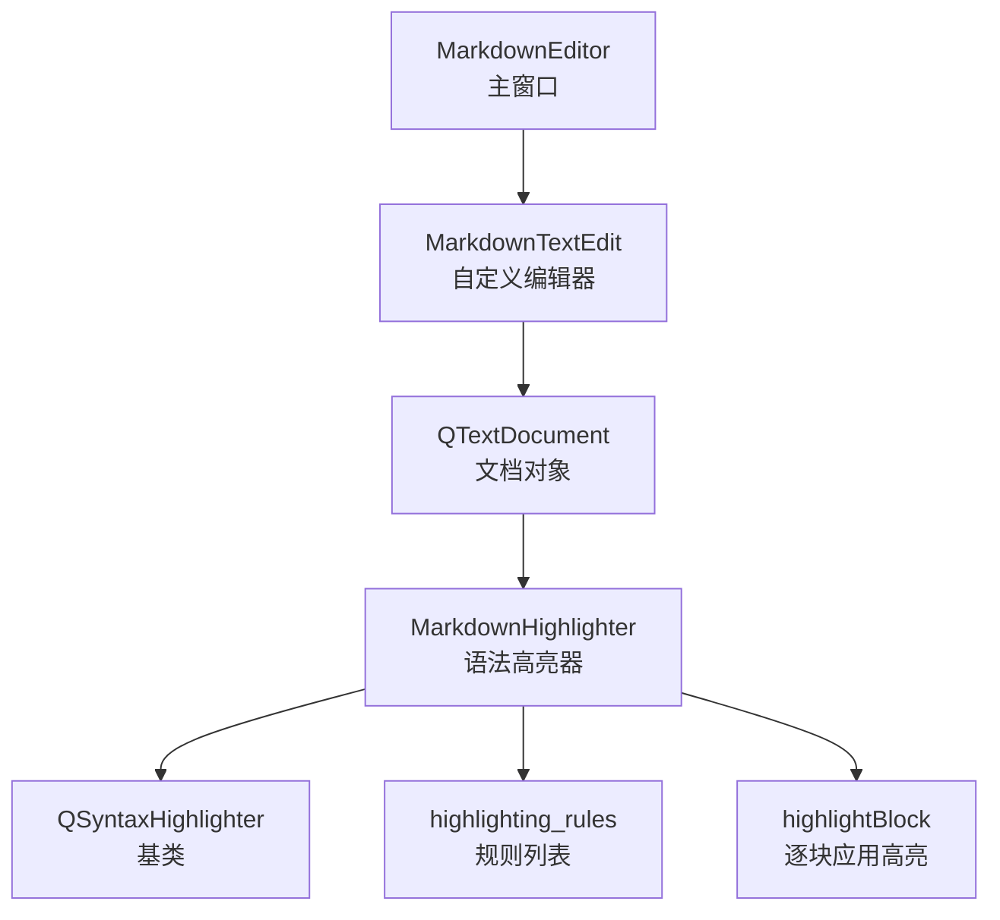
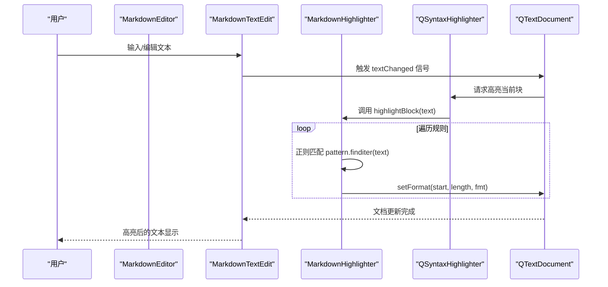
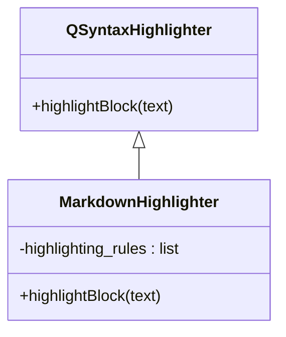
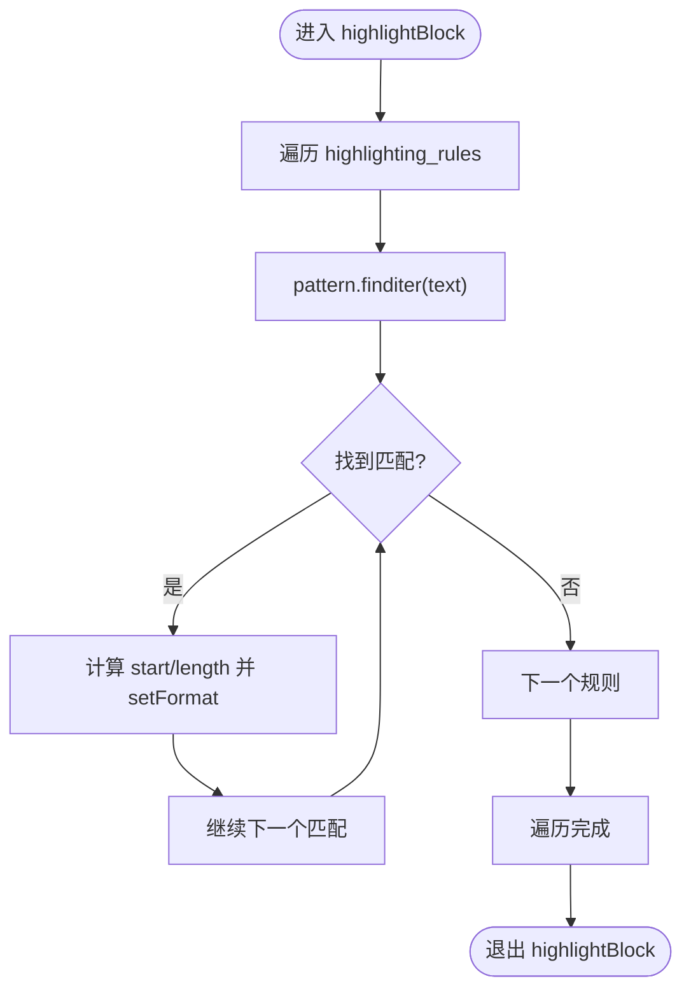
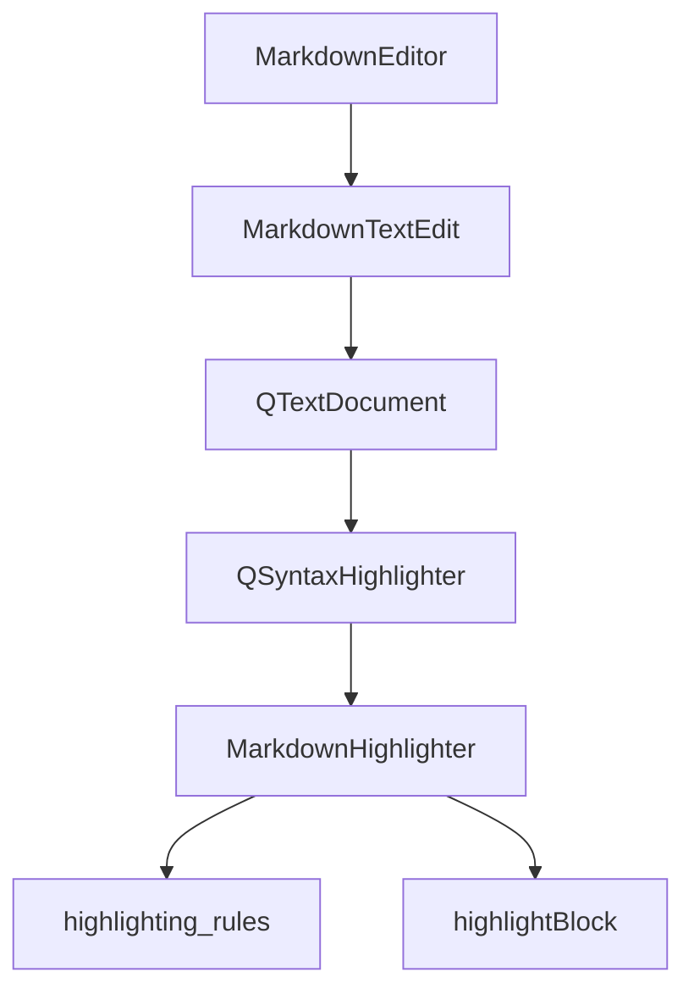

# 语法高亮

<cite>
**本文引用的文件**
- [main.py](file://main.py)
</cite>

## 目录
1. [简介](#简介)
2. [项目结构](#项目结构)
3. [核心组件](#核心组件)
4. [架构总览](#架构总览)
5. [组件详解](#组件详解)
6. [依赖关系分析](#依赖关系分析)
7. [性能考量](#性能考量)
8. [故障排查指南](#故障排查指南)
9. [结论](#结论)
10. [附录](#附录)

## 简介
本节聚焦于 Markdown 语法高亮功能的实现原理，围绕 MarkdownHighlighter 类展开，解释其如何继承 QSyntaxHighlighter，通过正则表达式匹配与 QTextCharFormat 为不同 Markdown 元素（标题、粗体、斜体、行内代码、代码块、链接、列表、引用、删除线、高亮、分隔线、数学公式、脚注、目录、上下标、表格、粗斜体等）应用颜色与字体样式；并结合 main.py 中的实现，分析 highlighting_rules 列表如何定义匹配模式与格式，highlightBlock 方法如何遍历规则并应用高亮；最后讨论高亮效果对编辑体验的提升、自定义高亮规则的扩展方法，以及正则表达式冲突与性能优化策略。

## 项目结构
Markdown 语法高亮功能位于主程序文件 main.py 中，核心类为 MarkdownHighlighter，它作为 QSyntaxHighlighter 的子类，挂载在每个 Markdown 编辑器的文档对象上，实现对文本块的增量高亮。

图表来源
- [main.py](file://main.py#L2107-L2122)
- [main.py](file://main.py#L523-L648)

章节来源
- [main.py](file://main.py#L2107-L2122)
- [main.py](file://main.py#L523-L648)

## 核心组件
- MarkdownHighlighter：继承 QSyntaxHighlighter，负责定义高亮规则与应用逻辑。
- highlighting_rules：一个由 (正则模式, QTextCharFormat) 元组组成的列表，覆盖多种 Markdown 元素。
- highlightBlock：对当前文本块进行遍历匹配并应用格式化。

章节来源
- [main.py](file://main.py#L523-L648)

## 架构总览
MarkdownHighlighter 的工作流程如下：
- 在 MarkdownEditor 创建新标签页时，为编辑器绑定 MarkdownHighlighter，并将其保存在 editor.highlighter 以避免被垃圾回收。
- 当用户输入或编辑时，QSyntaxHighlighter 会触发 highlightBlock 对当前文本块进行高亮处理。
- highlightBlock 遍历 highlighting_rules，对每个匹配项调用 setFormat(start, length, fmt) 应用颜色与字体样式。

图表来源
- [main.py](file://main.py#L2107-L2122)
- [main.py](file://main.py#L523-L648)

## 组件详解

### MarkdownHighlighter 类
- 继承关系：MarkdownHighlighter -> QSyntaxHighlighter
- 初始化阶段：构造函数中构建 highlighting_rules，为每种 Markdown 元素创建对应的 QTextCharFormat，并编译相应的正则模式。
- 高亮应用：highlightBlock 遍历 highlighting_rules，对每个匹配项调用 setFormat，实现颜色与字体样式的叠加。

图表来源
- [main.py](file://main.py#L523-L648)

章节来源
- [main.py](file://main.py#L523-L648)

### highlighting_rules 规则体系
highlighting_rules 列表包含大量针对不同 Markdown 元素的正则表达式与格式化对象，覆盖以下类别：
- 标题：以 1-6 个 # 开头的行，使用深灰蓝色并加粗。
- 粗体：双星号包围的内容，使用深棕色并加粗。
- 斜体：单星号包围的内容，使用深紫色并斜体。
- 行内代码：反引号包围的内容，使用深绿色。
- 代码块标记：以三个反引号开头的行，使用深灰绿色。
- 链接：方括号文本加圆括号 URL，使用深青色。
- 列表：无序列表标记（-、*、+）与有序列表（数字点），使用深橙色并加粗。
- 引用：以一个或多个 > 开头的行，使用深灰色。
- 删除线：波浪号包围的内容，使用灰色。
- 高亮：等号包围的内容，使用深黄色。
- 分割线：连续的 --- 或 ***，使用灰色。
- 数学公式：行内 $...$ 与 \(...\)，块级 $$...$$ 与 \[...\]，使用深蓝色。
- 脚注：形如 [^标识]，使用深青色。
- 目录：[TOC] 标记，使用深橙色并加粗。
- 上标：脱字符号包围的内容，使用深紫色。
- 下标：波浪号包围的内容，使用深青色。
- 表格：行首尾竖线与分隔行，使用深灰色。
- 粗斜体：三颗星号包围的内容，使用深棕色并加粗斜体。

章节来源
- [main.py](file://main.py#L523-L648)

### highlightBlock 执行流程
- 输入：当前文本块 text。
- 处理：遍历 highlighting_rules，对每个 (pattern, fmt)：
  - 使用 pattern.finditer(text) 查找所有匹配；
  - 对每个匹配项，计算起始位置与长度，调用 setFormat(start, length, fmt) 应用格式。
- 异常处理：在遍历过程中捕获异常并忽略，保证高亮过程稳定。

图表来源
- [main.py](file://main.py#L638-L648)

章节来源
- [main.py](file://main.py#L638-L648)

### 高亮对编辑体验的提升
- 结构可视化：标题、列表、引用、表格等元素通过颜色与字体样式清晰区分，便于快速识别文档结构。
- 内容语义化：粗体、斜体、删除线、高亮等强调样式帮助读者把握重点与语气。
- 数学公式与代码：行内代码与数学公式高亮，使技术内容更易辨识，减少阅读负担。
- 即时反馈：高亮随输入即时生效，降低拼写与格式错误的概率，提升写作效率。

### 自定义高亮规则的扩展方法
- 新增规则：在 MarkdownHighlighter 构造函数中追加新的 (re.compile(pattern), QTextCharFormat) 元组到 highlighting_rules。
- 格式定制：通过 QTextCharFormat 设置前景色、字体粗细、斜体等属性，确保与整体主题协调。
- 注意事项：
  - 优先级顺序：规则的先后顺序会影响最终高亮效果，建议将更具体的规则放在前面，避免被宽泛规则覆盖。
  - 性能考虑：尽量使用非贪婪匹配与锚点（如 ^、$），减少回溯。
  - 冲突规避：避免同一段文本被多个规则同时命中导致样式叠加混乱，必要时调整正则范围或拆分规则。

章节来源
- [main.py](file://main.py#L523-L648)

## 依赖关系分析
- MarkdownEditor 在创建新标签页时，实例化 MarkdownTextEdit，并为其文档对象绑定 MarkdownHighlighter，保存引用以防止被垃圾回收。
- MarkdownHighlighter 依赖 PyQt6 的 QSyntaxHighlighter 与 QTextCharFormat，以及 Python 的 re 模块进行正则匹配。

图表来源
- [main.py](file://main.py#L2107-L2122)
- [main.py](file://main.py#L523-L648)

章节来源
- [main.py](file://main.py#L2107-L2122)
- [main.py](file://main.py#L523-L648)

## 性能考量
- 匹配范围控制：使用锚点（^、$）限定行首/行尾，减少不必要的扫描。
- 非贪婪匹配：在允许的情况下使用非贪婪量词（如 .+?），避免过度匹配引发回溯。
- 规则顺序优化：将高频且精确的规则靠前放置，减少后续规则的匹配成本。
- 异常容错：highlightBlock 中对正则异常进行捕获并忽略，避免因个别规则异常导致整个高亮过程中断。
- 文档更新频率：配合 MarkdownEditor 的文本变更防抖机制，减少高亮触发频率，进一步降低 CPU 占用。

章节来源
- [main.py](file://main.py#L638-L648)
- [main.py](file://main.py#L2173-L2191)

## 故障排查指南
- 高亮不生效
  - 检查是否正确将 MarkdownHighlighter 绑定到编辑器文档对象，并保存引用。
  - 确认 highlightBlock 是否被调用（可通过日志或断点验证）。
- 样式冲突
  - 检查 highlighting_rules 的顺序，确保更具体规则在前。
  - 对可能重叠的规则（如粗体与粗斜体）进行范围细化或拆分。
- 正则性能问题
  - 使用更精确的锚点与量词，避免全局贪婪匹配。
  - 将复杂规则拆分为多个简单规则，减少回溯。
- 异常导致的中断
  - highlightBlock 已包含异常捕获，若仍出现中断，检查自定义扩展规则是否存在非法正则。

章节来源
- [main.py](file://main.py#L2107-L2122)
- [main.py](file://main.py#L523-L648)
- [main.py](file://main.py#L638-L648)

## 结论
MarkdownHighlighter 通过精心设计的正则规则与 QTextCharFormat，实现了对 Markdown 多种元素的精准高亮。其与 QSyntaxHighlighter 的集成使得高亮过程与文档更新紧密耦合，既保证了实时性，又通过异常容错与规则优化提升了稳定性与性能。对于扩展需求，只需在构造函数中追加规则并注意顺序与性能即可轻松增强高亮能力。

## 附录
- 相关实现位置
  - 高亮器定义与规则：[main.py](file://main.py#L523-L648)
  - 高亮器绑定与使用：[main.py](file://main.py#L2107-L2122)
  - 文本变更与预览更新（间接影响高亮体验）：[main.py](file://main.py#L2173-L2191)