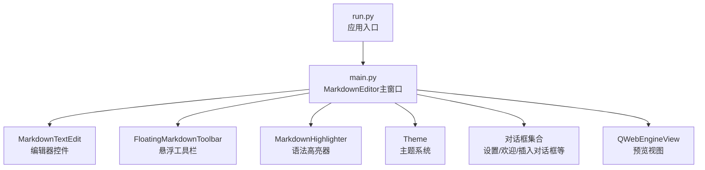
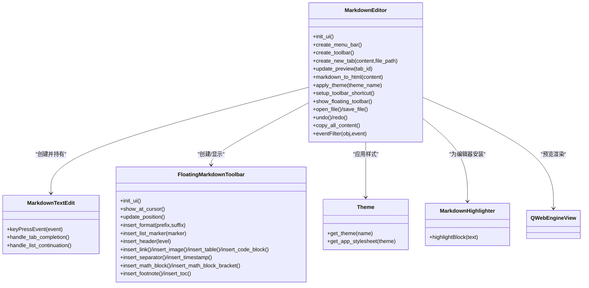
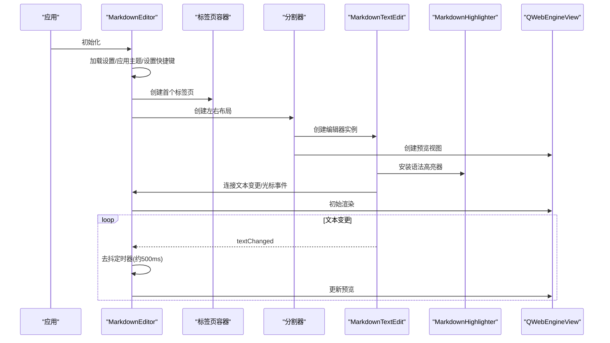
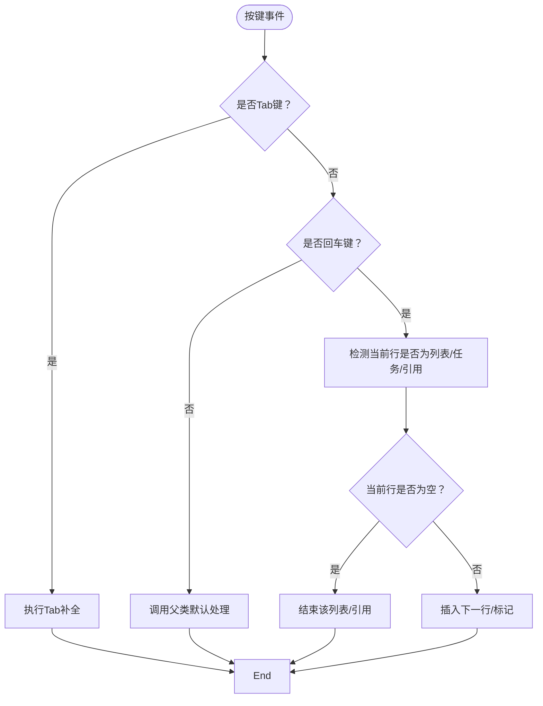
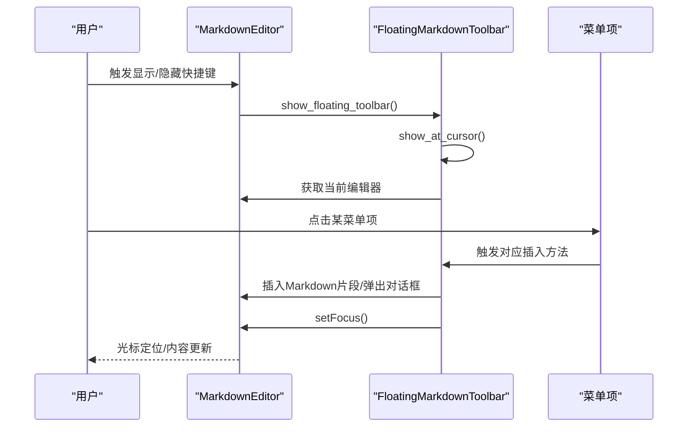
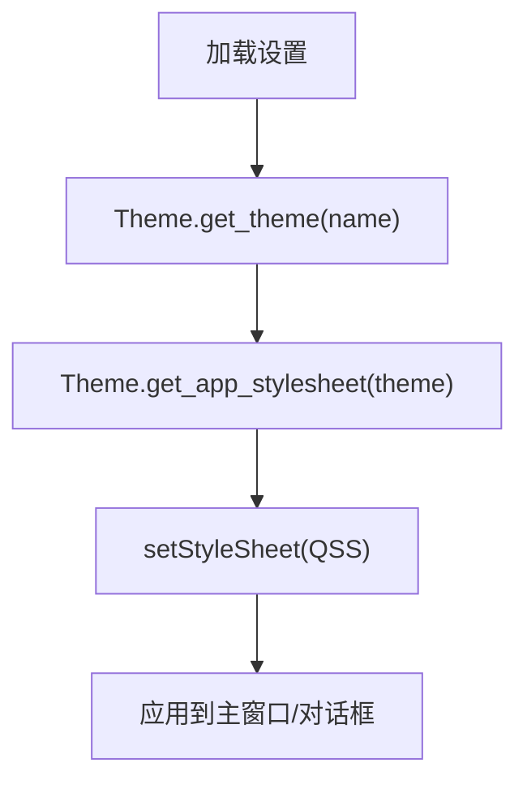
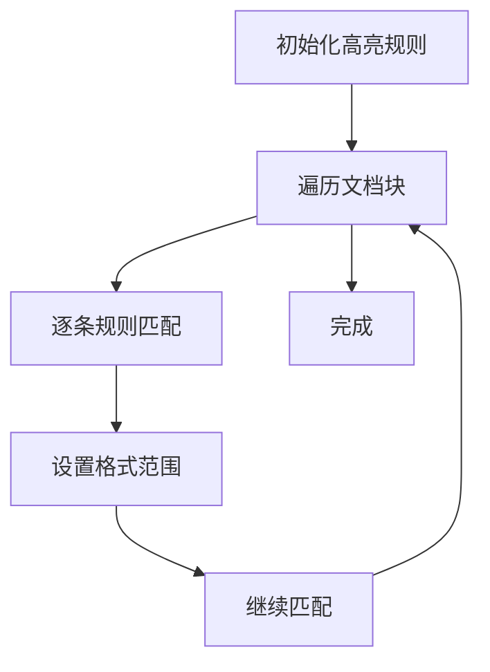
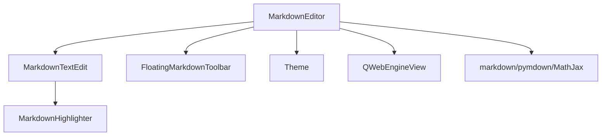

# 核心模块技术设计

<cite>
**本文引用的文件**
- [main.py](file://main.py)
- [run.py](file://run.py)
</cite>

## 目录
1. [引言](#引言)
2. [项目结构](#项目结构)
3. [核心组件](#核心组件)
4. [架构总览](#架构总览)
5. [详细组件分析](#详细组件分析)
6. [依赖关系分析](#依赖关系分析)
7. [性能考量](#性能考量)
8. [故障排查指南](#故障排查指南)
9. [结论](#结论)

## 引言
本文件聚焦于Markdo Markdown编辑器的关键代码模块，围绕以下目标展开：
- 对MarkdownEditor主窗口类进行深度剖析，解释其如何集成菜单栏、工具栏、多标签页和状态栏，并管理应用程序生命周期。
- 对MarkdownTextEdit进行深入分析，说明其继承QTextEdit并重写keyPressEvent以实现列表自动接续和Tab符号补全的细节。
- 对FloatingMarkdownToolbar进行设计解读，描述其分页设计（基础、列表、插入、LaTeX）和按钮事件绑定机制。
- 对Theme系统进行解析，展示其如何通过字典定义颜色方案，并生成QSS样式表动态应用。
- 对MarkdownHighlighter进行算法与实现分析，说明其如何利用QSyntaxHighlighter和正则表达式实现语法高亮。

## 项目结构
该项目采用单文件主程序组织方式，核心逻辑集中在main.py中，run.py负责入口启动。整体采用PyQt6构建桌面应用，结合QWebEngineView实现实时预览，使用pymdown扩展增强Markdown解析能力。

图表来源
- [run.py](file://run.py#L1-L11)
- [main.py](file://main.py#L1861-L2895)

章节来源
- [run.py](file://run.py#L1-L11)
- [main.py](file://main.py#L1-L120)

## 核心组件
本节概述四大核心模块的设计要点与职责边界：
- MarkdownEditor：主窗口控制器，负责菜单栏、工具栏、标签页、状态栏、快捷键、预览渲染、悬浮工具栏生命周期管理。
- MarkdownTextEdit：自定义编辑器，重写键盘事件以实现列表自动接续与Tab渐进补全。
- FloatingMarkdownToolbar：悬浮工具栏，提供折叠菜单式分页与按钮事件绑定。
- Theme：主题系统，集中定义颜色方案并通过QSS动态应用。

章节来源
- [main.py](file://main.py#L1861-L2895)

## 架构总览
MarkdownEditor作为顶层控制器，协调编辑器、预览、工具栏与对话框之间的交互；Theme贯穿全局样式；MarkdownHighlighter为编辑器提供语法高亮；FloatingMarkdownToolbar通过快捷键或右键菜单触发，插入Markdown片段。

图表来源
- [main.py](file://main.py#L1861-L2895)

## 详细组件分析

### MarkdownEditor主窗口类
- 职责与集成
  - 菜单栏：文件、编辑、帮助三段式菜单，提供新建、打开、保存、撤销/重做、设置、退出、关于等操作。
  - 工具栏：提供新建、打开、保存、悬浮工具栏、复制全文、清空等按钮。
  - 多标签页：QTabWidget承载左右分割器（编辑器+预览），支持可关闭与可移动。
  - 状态栏：显示主题切换、文件操作等提示信息。
  - 生命周期：构造时加载设置、应用主题、设置快捷键；首次启动显示欢迎对话框；退出时清理资源。
- 关键流程
  - 创建新标签页：创建分割器，左侧MarkdownTextEdit，右侧QWebEngineView，安装高亮器与上下文菜单，连接文本变更与光标事件。
  - 预览更新：使用定时器去抖（约500ms）减少渲染压力，将Markdown转换为HTML并注入MathJax配置。
  - 主题应用：通过Theme生成QSS并设置到主窗口，同时更新状态栏提示。
  - 悬浮工具栏：根据设置决定自动显示/隐藏，支持快捷键切换显示位置并随光标移动。
- 设计决策
  - 使用QSettings持久化用户偏好（主题、工具栏自动显示、快捷键）。
  - 预览渲染采用pymdown扩展增强语法支持，并对数学公式进行占位保护与恢复，确保MathJax正确渲染。
  - 事件过滤器用于自动显示/隐藏悬浮工具栏，避免误触关闭。

图表来源
- [main.py](file://main.py#L1861-L2399)

章节来源
- [main.py](file://main.py#L1861-L2399)

### MarkdownTextEdit编辑器控件
- 继承与重写
  - 继承QTextEdit，重写keyPressEvent以定制键盘行为。
- Tab符号补全（渐进式）
  - 识别光标前后文本，判断最近字符是否属于成对符号集（如*、_、~、=、`、[]、()、{}）。
  - 若光标位于成对符号中间且已存在闭合符号，计算当前层级并进行扩展（例如从*扩展到**，最多到上限）。
  - 若未闭合，普通补全：* -> *|*，链接特殊处理：[ ->  并将光标置于括号内。
- 列表自动接续
  - 回车时检测当前行是否为有序列表、无序列表、任务列表或引用。
  - 若当前行为空，结束该列表/引用；否则插入下一项（有序列表递增编号，无序列表/任务列表保持标记，引用保留缩进与引用符）。
- 设计决策
  - 将Tab补全与列表接续解耦，Tab优先处理补全，回车处理列表接续，避免冲突。
  - 通过正则匹配精确识别不同列表/引用形态，保证兼容性与一致性。

图表来源
- [main.py](file://main.py#L650-L826)

章节来源
- [main.py](file://main.py#L650-L826)

### FloatingMarkdownToolbar悬浮工具栏
- 分页设计
  - 基础格式：标题、粗体、斜体、删除线、高亮、行内代码。
  - 列表引用：无序/有序/任务列表与各级引用。
  - 插入元素：链接、图片、表格、代码块、分割线、时间戳、脚注、目录。
  - LaTeX公式：行内/块级公式与常用符号、希腊字母、关系符号。
- 事件绑定
  - 每个菜单项通过QAction绑定触发回调，调用工具栏内部插入方法。
  - 位置显示：根据当前编辑器光标位置计算屏幕坐标，考虑边界约束（右侧溢出左移、底部溢出显示在光标上方），并保持最小安全距离。
  - 自动更新：光标移动时若可见则跟随更新位置。
- 设计决策
  - 使用QToolButton+QMenu组合实现折叠式分页，兼顾易用性与空间占用。
  - 通过QDialog + Tool窗口类型实现“不抢焦点”的悬浮效果，避免打断编辑。
  - 采用QSS为按钮与菜单提供主题化样式，支持透明背景与悬停高亮。

图表来源
- [main.py](file://main.py#L1322-L1860)

章节来源
- [main.py](file://main.py#L1322-L1860)

### Theme主题系统
- 字典定义
  - DARK/LIGHT两套主题，分别包含背景、次级背景、文本、强调色、边框、编辑器背景/文本、工具栏/状态栏颜色等键值。
- 动态应用
  - 通过get_theme(name)获取主题字典，再由get_app_stylesheet(theme)生成QSS字符串，设置到主窗口样式表。
  - 设置窗口、欢迎窗口、快捷键帮助窗口等也按当前主题生成QSS，确保界面风格一致。
- 设计决策
  - 将颜色方案集中管理，便于统一调整与扩展。
  - 通过QSS覆盖标准控件样式（QMenuBar、QToolBar、QTabBar、QTextEdit、QStatusBar等），提升视觉一致性。

图表来源
- [main.py](file://main.py#L23-L158)

章节来源
- [main.py](file://main.py#L23-L158)

### MarkdownHighlighter语法高亮
- 继承与规则
  - 继承QSyntaxHighlighter，定义一系列正则规则与对应QTextCharFormat，覆盖标题、粗体、斜体、行内代码、代码块、链接、列表、引用、删除线、高亮、分割线、数学公式、公式块、脚注、目录、上/下标、表格、粗斜体等。
- 匹配策略
  - 遍历每条规则，对当前文本块进行迭代匹配，设置格式范围。
  - 对异常正则进行捕获，避免影响整体高亮性能。
- 设计决策
  - 使用柔和配色区分不同语法元素，提升可读性。
  - 通过规则顺序与正则原子化（如非贪婪）减少误匹配。
  - 与MarkdownEditor的预览渲染相辅相成，编辑时即时反馈，预览时保持一致风格。

图表来源
- [main.py](file://main.py#L523-L648)

章节来源
- [main.py](file://main.py#L523-L648)

## 依赖关系分析
- 组件耦合
  - MarkdownEditor与MarkdownTextEdit强耦合：前者持有编辑器实例，负责预览、快捷键、上下文菜单与悬浮工具栏。
  - MarkdownEditor与FloatingMarkdownToolbar弱耦合：通过show_floating_toolbar创建/显示，事件通过快捷键触发。
  - MarkdownEditor与Theme弱耦合：仅在应用主题时使用，不影响业务逻辑。
  - MarkdownHighlighter与MarkdownTextEdit弱耦合：通过document()安装，避免循环依赖。
- 外部依赖
  - PyQt6：UI框架与Web引擎。
  - markdown/pymdown扩展：Markdown解析与增强。
  - MathJax：LaTeX公式渲染。
- 潜在风险
  - 预览渲染的正则保护与恢复需保持严格顺序，避免公式被错误替换。
  - 事件过滤器与悬浮工具栏显示逻辑需谨慎处理焦点转移，避免误隐藏。

图表来源
- [main.py](file://main.py#L1861-L2895)

章节来源
- [main.py](file://main.py#L1861-L2895)

## 性能考量
- 预览渲染去抖：通过单次触发的定时器（约500ms）合并多次文本变更，显著降低渲染压力。
- 正则高亮：规则数量较多但均为简单匹配，且在块级别迭代，整体开销可控；异常捕获避免崩溃。
- Web预览：启用JavaScript与远程资源访问，确保公式渲染；注意网络与安全设置。
- 悬浮工具栏：仅在可见时更新位置，避免频繁重绘。

## 故障排查指南
- 预览不更新
  - 检查定时器是否被重复启动，确认_pending_tab_id与_update_timer状态。
  - 确认markdown_to_html未抛出异常，必要时查看日志输出。
- 数学公式不渲染
  - 确认保护与恢复顺序正确，占位符索引与原始公式列表一一对应。
  - 检查MathJax脚本加载与页面ready回调。
- 悬浮工具栏不显示/误隐藏
  - 检查auto_show_toolbar设置与eventFilter逻辑，确认焦点切换时机。
  - 确认show_at_cursor的边界计算与屏幕几何一致。
- Tab补全异常
  - 检查handle_tab_completion的成对符号映射与层级上限逻辑。
  - 注意链接特殊处理分支与光标位置修正。

章节来源
- [main.py](file://main.py#L2173-L2399)
- [main.py](file://main.py#L2549-L2860)

## 结论
本项目以清晰的模块划分与稳健的实现策略，构建了一个功能完备、体验友好的Markdown编辑器。MarkdownEditor作为核心控制器，有效整合了编辑、预览、工具栏与主题系统；MarkdownTextEdit与FloatingMarkdownToolbar在交互细节上提供了高效便捷的写作体验；Theme与MarkdownHighlighter则保障了界面一致性与可读性。建议后续可在以下方面持续优化：
- 将部分规则与配置参数抽象为可配置项，提升可扩展性。
- 对高亮规则进行性能基准测试，必要时引入更高效的匹配策略。
- 增加单元测试覆盖关键逻辑（如列表接续、公式保护/恢复、悬浮工具栏位置计算）。