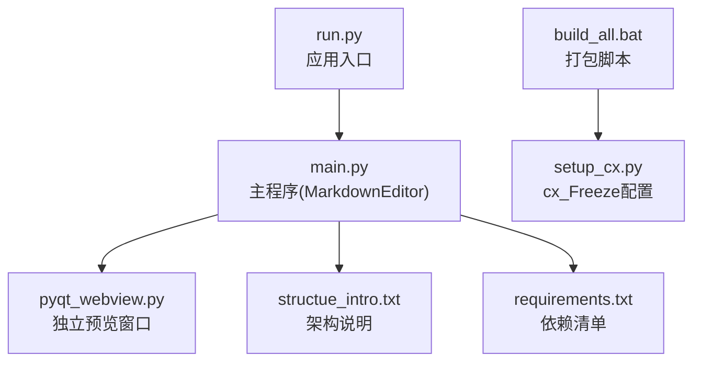
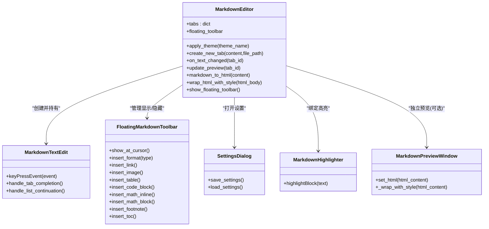
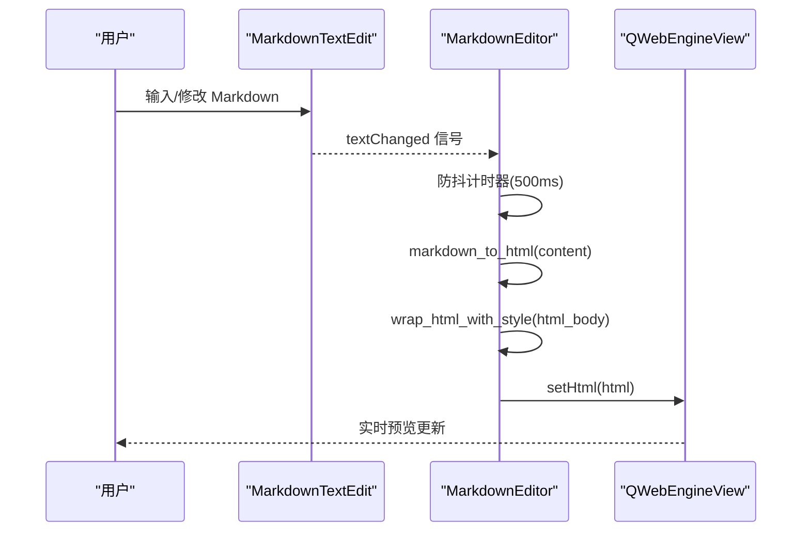
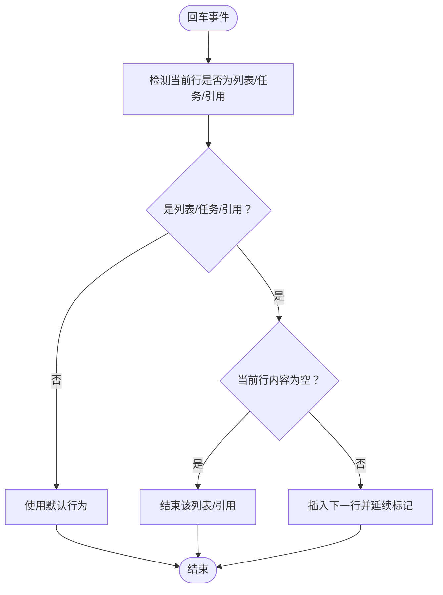
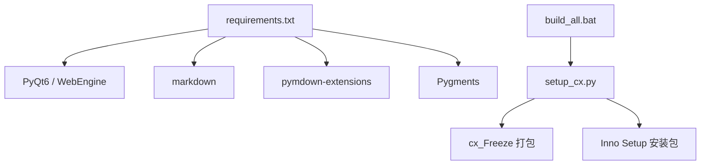

# 项目概述

<cite>
**本文引用的文件**
- [main.py](file://main.py)
- [pyqt_webview.py](file://pyqt_webview.py)
- [run.py](file://run.py)
- [requirements.txt](file://requirements.txt)
- [structue_intro.txt](file://structue_intro.txt)
- [build_all.bat](file://build_all.bat)
- [setup_cx.py](file://setup_cx.py)
</cite>

## 目录
1. [引言](#引言)
2. [项目结构](#项目结构)
3. [核心组件](#核心组件)
4. [架构总览](#架构总览)
5. [详细组件分析](#详细组件分析)
6. [依赖分析](#依赖分析)
7. [性能考虑](#性能考虑)
8. [故障排查指南](#故障排查指南)
9. [结论](#结论)
10. [附录](#附录)

## 引言
Markdo 是一款基于 PyQt6 的现代化桌面 Markdown 编辑器，核心目标是提供“实时预览、语法高亮、高效编辑”的一体化体验。它通过左右分屏布局，左侧为 Markdown 编辑器，右侧为 QWebEngineView 实时渲染的 HTML 预览区；内置悬浮工具栏、多标签页、主题系统与智能插入对话框，覆盖从入门到专业写作的多种场景。目标用户包括：
- 技术人员：撰写技术文档、API 说明、开发笔记，需要代码高亮与公式渲染
- 学术研究人员：撰写论文、报告，需要表格、公式、目录与脚注
- 内容创作者：博客、手册、教程，追求简洁高效的写作与预览流程

## 项目结构
仓库采用“入口脚本 + 主程序 + 独立预览模块 + 打包配置”的组织方式，便于模块化维护与分发。

图表来源
- [run.py](file://run.py#L1-L11)
- [main.py](file://main.py#L2867-L2894)
- [pyqt_webview.py](file://pyqt_webview.py#L1-L242)
- [structue_intro.txt](file://structue_intro.txt#L1-L93)
- [requirements.txt](file://requirements.txt#L1-L5)
- [build_all.bat](file://build_all.bat#L1-L53)
- [setup_cx.py](file://setup_cx.py#L1-L82)

章节来源
- [run.py](file://run.py#L1-L11)
- [structue_intro.txt](file://structue_intro.txt#L1-L93)

## 核心组件
- MarkdownEditor：主窗口，负责菜单栏、工具栏、多标签页、快捷键、主题与预览更新调度
- MarkdownTextEdit：自定义编辑器，增强 Tab 补全与列表自动续接
- MarkdownHighlighter：基于 QSyntaxHighlighter 的 Markdown 语法高亮
- FloatingMarkdownToolbar：悬浮工具栏，分页管理基础/列表/插入/LaTeX 功能
- SettingsDialog：设置窗口，支持主题切换与悬浮工具栏快捷键配置
- MarkdownPreviewWindow：独立预览窗口（供 tkinter 集成使用）

章节来源
- [main.py](file://main.py#L1860-L2894)
- [pyqt_webview.py](file://pyqt_webview.py#L1-L242)

## 架构总览
Markdo 采用 MVC 思想与事件驱动机制：
- 视图层：QMainWindow、QTextEdit、QWebEngineView、QDialog 等 UI 组件
- 控制器：MarkdownEditor 负责事件路由、状态管理与视图协调
- 模型：编辑器文本内容与标签页集合，预览 HTML 由 Markdown 转换生成
- 事件驱动：按键、光标、文本变更、快捷键、菜单项触发，统一由控制器响应

图表来源
- [main.py](file://main.py#L1860-L2894)
- [pyqt_webview.py](file://pyqt_webview.py#L1-L242)

## 详细组件分析

### MarkdownEditor（主窗口）
- 职责：菜单栏、工具栏、多标签页容器、快捷键、主题应用、预览更新调度
- 关键点：
  - 多标签页管理：使用 QTabWidget + QSplitter，每页包含 MarkdownTextEdit 与 QWebEngineView
  - 预览更新：文本变更后 500ms 防抖，统一调用 markdown_to_html 与 wrap_html_with_style
  - Markdown 解析：使用 python-markdown + pymdown-extensions，保护数学公式后再渲染
  - 主题系统：Theme 类生成样式表，应用到主窗口与对话框
  - 悬浮工具栏：支持快捷键显示/隐藏，自动跟随光标位置

章节来源
- [main.py](file://main.py#L1860-L2894)

### MarkdownTextEdit（自定义编辑器）
- 职责：提供更友好的编辑体验
- 关键点：
  - Tab 键补全：渐进式补全成对符号，支持链接、括号、代码等
  - 列表自动续接：有序/无序/任务列表在回车时自动延续
  - 语法高亮：通过 MarkdownHighlighter 实现

章节来源
- [main.py](file://main.py#L650-L826)

### MarkdownHighlighter（语法高亮）
- 覆盖语法：标题、粗体、斜体、行内代码、代码块、链接、列表、引用、删除线、高亮、分割线、数学公式、公式块、脚注、目录、上/下标、表格等
- 设计：基于正则规则与 QTextCharFormat，逐条规则匹配并着色

章节来源
- [main.py](file://main.py#L523-L648)

### FloatingMarkdownToolbar（悬浮工具栏）
- 职责：在光标附近弹出，提供快速插入 Markdown 格式与工具
- 分页：基础（标题/粗体/斜体等）、列表（引用/任务/有序/无序）、插入（链接/图片/表格/代码块/公式/脚注/目录）、LaTeX（行内/块级公式）
- 交互：支持快捷键唤起、自动显示/隐藏、跟随光标位置

章节来源
- [main.py](file://main.py#L1322-L1860)

### SettingsDialog（设置窗口）
- 职责：主题切换、悬浮工具栏自动显示/隐藏、快捷键配置
- 交互：保存后通知主窗口更新主题、工具栏设置与快捷键

章节来源
- [main.py](file://main.py#L160-L352)

### MarkdownPreviewWindow（独立预览窗口）
- 职责：在 tkinter 环境中显示 Markdown 预览，提供独立进程运行能力
- 特性：封装完整 HTML 文档结构与样式，支持背景色设置

章节来源
- [pyqt_webview.py](file://pyqt_webview.py#L1-L242)

### 预览渲染流程（序列图）

图表来源
- [main.py](file://main.py#L2172-L2207)
- [main.py](file://main.py#L2208-L2375)

### 列表自动续接（流程图）

图表来源
- [main.py](file://main.py#L730-L826)

## 依赖分析
- 运行时依赖：PyQt6、PyQt6-WebEngine、markdown、Pygments、pymdown-extensions
- 打包与分发：cx_Freeze + Inno Setup，批处理脚本一键完成图标生成、清理、打包与安装包制作

图表来源
- [requirements.txt](file://requirements.txt#L1-L5)
- [build_all.bat](file://build_all.bat#L1-L53)
- [setup_cx.py](file://setup_cx.py#L1-L82)

章节来源
- [requirements.txt](file://requirements.txt#L1-L5)
- [build_all.bat](file://build_all.bat#L1-L53)
- [setup_cx.py](file://setup_cx.py#L1-L82)

## 性能考虑
- 防抖更新：文本变更后 500ms 延迟渲染，降低频繁 setHtml 调用带来的开销
- 语法高亮：正则规则集中管理，避免复杂匹配导致卡顿
- 预览渲染：使用 QWebEngineView 渲染，支持 MathJax 公式，兼顾美观与兼容
- 主题切换：样式表一次性应用，避免逐控件重绘

## 故障排查指南
- 预览空白或样式异常
  - 检查 QWebEngineView 是否启用 JavaScript 与本地资源访问
  - 确认 wrap_html_with_style 返回的 HTML 结构完整
- 公式不渲染
  - 确保 MathJax 脚本加载成功，检查网络可达性
  - 确认公式保护与恢复逻辑未被破坏
- 悬浮工具栏不显示
  - 检查快捷键设置与事件过滤器
  - 确认工具栏可见性与光标位置更新逻辑
- 打包后图标缺失
  - 确认 Markdo.ico 生成脚本执行成功
  - 检查 cx_Freeze include_files 配置

章节来源
- [main.py](file://main.py#L2133-L2140)
- [main.py](file://main.py#L2208-L2375)
- [main.py](file://main.py#L2548-L2559)
- [build_all.bat](file://build_all.bat#L1-L53)
- [setup_cx.py](file://setup_cx.py#L1-L82)

## 结论
Markdo 以 PyQt6 为核心，结合 QWebEngineView 实现实时 HTML 预览，并通过自定义编辑器与悬浮工具栏提升编辑效率。其模块化设计与事件驱动机制使功能易于扩展，适合不同层次用户的写作需求。建议后续可引入更多 Markdown 扩展、主题商店与云同步能力，进一步完善生态。

## 附录
- 实际使用场景示例
  - 技术文档：利用悬浮工具栏快速插入代码块、表格与链接，配合主题切换在夜间写作
  - 含数学公式的论文：使用行内/块级公式插入，预览区即时渲染，支持目录与脚注
  - 多标签页协作：同时编辑多个文档，快速切换与对比